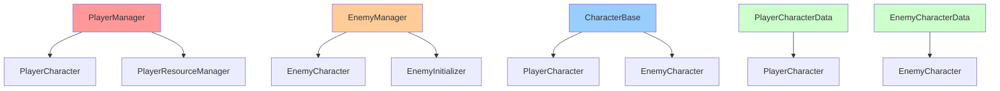
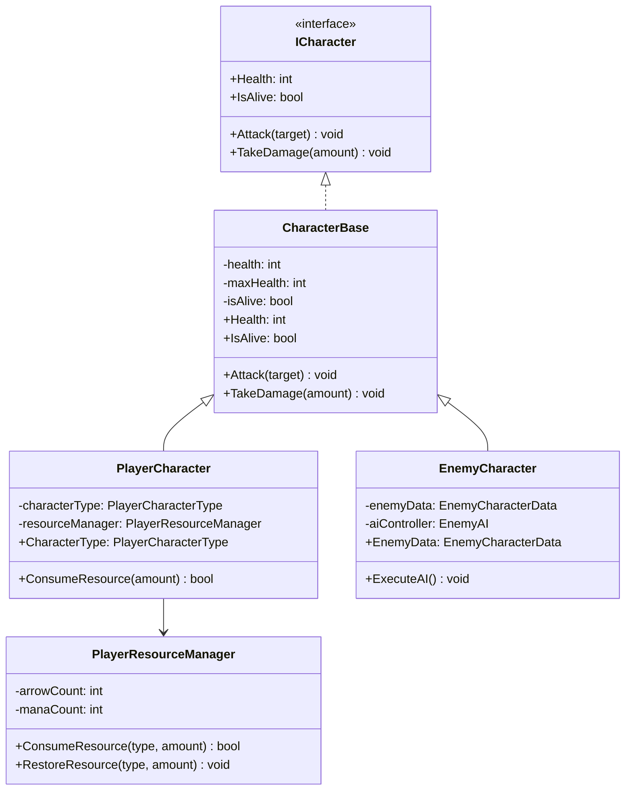
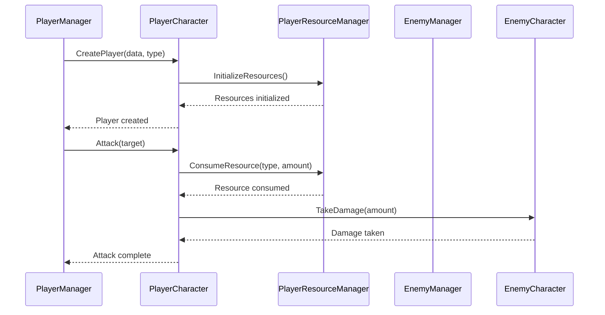

# CharacterSystem 개발 문서

## 📋 시스템 개요
CharacterSystem은 게임의 모든 캐릭터(플레이어, 적)를 관리하는 시스템입니다. 캐릭터의 기본 속성, 상태, 행동을 통합적으로 관리합니다.

## 🏗️ 폴더 구조
```
CharacterSystem/
├── Core/             # 캐릭터 핵심 로직 (4개 파일)
├── Data/             # 캐릭터 데이터 (4개 파일)
├── Interface/        # 캐릭터 인터페이스 (8개 파일)
├── Manager/          # 캐릭터 매니저 (3개 파일)
├── Intialization/    # 캐릭터 초기화 (6개 파일)
├── Slot/             # 캐릭터 슬롯 (1개 파일)
├── UI/               # 캐릭터 UI (2개 파일)
└── Utility/          # 캐릭터 유틸리티 (4개 파일)
```

## 📁 주요 컴포넌트

### Core 폴더 (4개 파일)
- **CharacterBase.cs**: 모든 캐릭터의 기본 클래스
- **PlayerCharacter.cs**: 플레이어 캐릭터 구현
- **EnemyCharacter.cs**: 적 캐릭터 구현
- **CharacterState.cs**: 캐릭터 상태 관리

### Data 폴더 (4개 파일)
- **PlayerCharacterData.cs**: 플레이어 캐릭터 데이터 (ScriptableObject)
- **EnemyCharacterData.cs**: 적 캐릭터 데이터 (ScriptableObject)
- **PlayerCharacterType.cs**: 플레이어 캐릭터 타입 열거형
- **PlayerCharacterTypeHelper.cs**: 플레이어 캐릭터 타입 헬퍼

### Interface 폴더 (8개 파일)
- **ICharacter.cs**: 캐릭터 기본 인터페이스
- **ICharacterData.cs**: 캐릭터 데이터 인터페이스
- **ICharacterState.cs**: 캐릭터 상태 인터페이스
- **ICharacterAction.cs**: 캐릭터 행동 인터페이스
- **ICharacterEffect.cs**: 캐릭터 효과 인터페이스
- **ICharacterUI.cs**: 캐릭터 UI 인터페이스
- **IPlayerResourceManager.cs**: 플레이어 리소스 관리 인터페이스
- **ICharacterDeathListener.cs**: 캐릭터 사망 리스너 인터페이스

### Manager 폴더 (3개 파일)
- **PlayerManager.cs**: 플레이어 캐릭터 매니저
- **EnemyManager.cs**: 적 캐릭터 매니저
- **PlayerResourceManager.cs**: 플레이어 리소스 관리 매니저

### Intialization 폴더 (6개 파일)
- **PlayerCharacterInitializer.cs**: 플레이어 캐릭터 초기화
- **EnemyCharacterInitializer.cs**: 적 캐릭터 초기화
- **EnemyHandInitializer.cs**: 적 핸드 초기화
- **HandInitializer.cs**: 핸드 초기화
- **PlayerSkillCardInitializer.cs**: 플레이어 스킬카드 초기화
- **EnemyInitializer.cs**: 적 초기화

### UI 폴더 (2개 파일)
- **CharacterSlotUI.cs**: 캐릭터 슬롯 UI
- **CharacterUIController.cs**: 캐릭터 UI 컨트롤러

### Utility 폴더 (4개 파일)
- **CharacterDeathHandler.cs**: 캐릭터 사망 처리
- **CardRegistrar.cs**: 카드 등록기
- **CardValidator.cs**: 카드 검증기
- **EnemySpawnResult.cs**: 적 스폰 결과

## 🎯 주요 기능

### 1. 캐릭터 기본 속성
- **체력 (Health)**: 캐릭터의 생명력
- **방어력 (Guard)**: 데미지 감소
- **공격력 (Attack)**: 기본 공격력
- **속도 (Speed)**: 행동 순서 결정

### 2. 플레이어 캐릭터 타입
- **검 (Sword)**: 근접 전투 특화
- **활 (Bow)**: 원거리 전투 특화, 화살 리소스 관리
- **지팡이 (Staff)**: 마법 전투 특화, 마나 리소스 관리

### 3. 상태 관리
- **생존 상태**: 살아있음/죽음
- **효과 상태**: 버프/디버프 효과

### 4. 행동 시스템
- **기본 공격**: 일반적인 공격 행동
- **스킬 사용**: 특수 능력 사용

### 5. 리소스 관리
- **화살 (Arrows)**: 활 캐릭터 전용 리소스
- **마나 (Mana)**: 지팡이 캐릭터 전용 리소스
- **리소스 소모**: 스킬 사용 시 리소스 소모

### 6. 초기화 시스템
- **자동 초기화**: 캐릭터 생성 시 자동 설정
- **스킬카드 초기화**: 캐릭터별 스킬카드 덱 설정

## 🔧 사용 방법

### 기본 사용법
```csharp
// 플레이어 캐릭터 생성 (타입 지정)
PlayerCharacter player = new PlayerCharacter(playerData, PlayerCharacterType.Sword);

// 적 캐릭터 생성
EnemyCharacter enemy = new EnemyCharacter(enemyData);

// 캐릭터 상태 확인
if (player.IsAlive)
{
    // 공격 실행
    player.Attack(enemy);
}

// 리소스 관리
PlayerResourceManager.Instance.ConsumeResource(PlayerCharacterType.Bow, 1); // 화살 소모
PlayerResourceManager.Instance.ConsumeResource(PlayerCharacterType.Staff, 2); // 마나 소모
```

## 🏗️ 아키텍처 패턴

### 1. 상속 구조
- **CharacterBase**: 모든 캐릭터의 공통 기능
- **PlayerCharacter**: 플레이어 전용 기능
- **EnemyCharacter**: 적 전용 기능

### 2. 인터페이스 분리
- **ICharacter**: 기본 캐릭터 기능
- **ICharacterData**: 데이터 관련 기능
- **ICharacterState**: 상태 관리 기능

### 3. 매니저 패턴
- **PlayerManager**: 플레이어 캐릭터 관리
- **EnemyManager**: 적 캐릭터 관리
- **PlayerResourceManager**: 플레이어 리소스 관리

## 🔧 기술적 구현 세부사항

### 성능 최적화
- **메모리 관리**: 캐릭터 객체 풀링을 통한 GC 압박 최소화
- **프레임 최적화**: 캐릭터 상태 업데이트 최적화
- **렌더링 최적화**: 캐릭터 UI 업데이트 빈도 최적화
- **로딩 최적화**: 캐릭터 데이터 사전 로딩 및 캐싱

### 스레드 안전성
- **동시성 제어**: 캐릭터 상태 변경 시 락을 통한 동시성 제어
- **비동기 처리**: 캐릭터 초기화 시 비동기 처리
- **이벤트 처리**: 스레드 안전한 캐릭터 이벤트 시스템
- **데이터 동기화**: 캐릭터 상태 데이터 동기화

### 메모리 관리
- **생명주기 관리**: 캐릭터 객체의 생성/소멸 관리
- **리소스 해제**: 캐릭터 제거 시 리소스 정리
- **메모리 누수 방지**: 이벤트 구독 해제, 캐릭터 참조 해제
- **프로파일링**: 캐릭터 시스템 메모리 사용량 모니터링

## 🏗️ 시스템 아키텍처

### 의존성 다이어그램


### 클래스 다이어그램


### 시퀀스 다이어그램


## 📚 참고 자료

### 관련 문서
- [Unity MonoBehaviour](https://docs.unity3d.com/Manual/class-MonoBehaviour.html)
- [ScriptableObject](https://docs.unity3d.com/Manual/class-ScriptableObject.html)
- [상속 구조](https://docs.microsoft.com/ko-kr/dotnet/csharp/programming-guide/classes-and-structs/inheritance)


