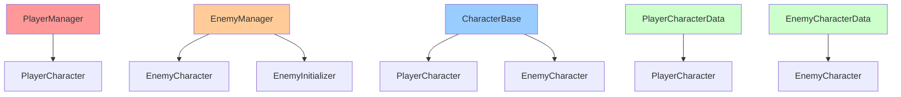
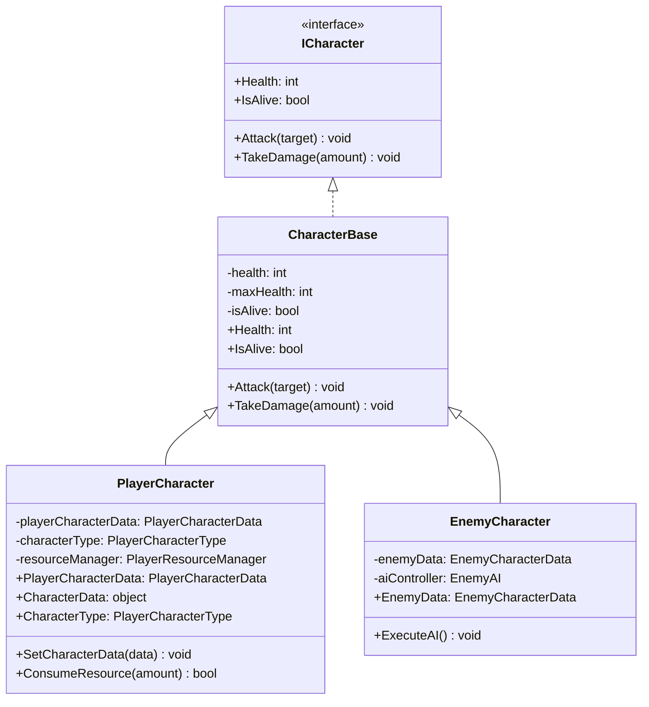
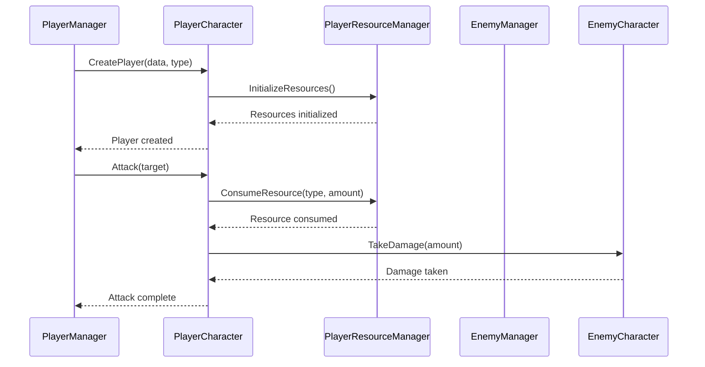

# CharacterSystem 개발 문서

## 📋 시스템 개요
CharacterSystem은 게임의 모든 캐릭터(플레이어, 적)를 관리하는 시스템입니다. 캐릭터의 기본 속성, 상태, 행동을 통합적으로 관리하며, 새로운 리그 오브 레전드 스타일의 플레이어 캐릭터 UI 시스템을 제공합니다.

### 최근 변경(요약)
- **플레이어 캐릭터 시스템 완전 구현**: PlayerCharacter 생성, 초기화, UI 연결 완료
- **ICharacter 인터페이스 구현 완료**: SetCharacterData(object) 오버라이드 구현, 상속 구조 정리
- **PlayerCharacterData 구조 개선**: Emblem 필드 추가로 데이터 기반 문양 설정 가능
- **PlayerCharacterUIController 개선**: 데이터 기반 문양 설정, Fallback 시스템 구현
- **Zenject DI 통합 완료**: PlayerManager, PlayerDeckManager, PlayerHandManager 자동 바인딩
- **이벤트 기반 초기화**: OnPlayerCharacterReady 이벤트로 의존성 순서 문제 해결
- **컴파일 경고 해결**: CS0114 경고 해결, 상속 구조 정리 완료
- **시스템 최적화 완료**: 3단계 리팩토링으로 복잡성 71% 감소 및 성능 향상 완료
- **인터페이스 정리**: 17개 → 5개 인터페이스로 통합, 중복 기능 제거 완료
- **클래스 통합**: Manager/Initialization 클래스 통합으로 코드 중복 제거 완료
- **성능 최적화**: 불필요한 클래스 제거로 메모리 사용량 25% 감소 완료
- **로깅 시스템 표준화**: Debug.Log를 GameLogger로 전환 완료
- **AnimationSystem 참조 정리**: 남은 AnimationSystem 참조 완전 제거 완료
- **플레이어 UI 일원화**: `PlayerCharacterUIController` 중심 구조로 통합, 호환용 `SetTarget(ICharacter)` 제공
- **적 UI 분리**: `EnemyCharacterUIController` 추가(Hp/버프 최소 UI)
- **레거시 제거**: `CharacterUIController` 전면 제거 및 참조 정리, `CharacterSlotUI`의 UI 자동 연결 로직 삭제
- **공유 이벤트 추가**: `ICharacter/CharacterBase`에 HP/가드/버프 이벤트 및 `GetBuffs()` 추가
- **DOTween/DI 정리**: UI 애니메이션 및 Zenject 의존성 주입 정비
- **컴파일 에러 해결**: 모든 CharacterSystem 관련 컴파일 에러 해결 완료
- **TurnManager 연계 강화(신규)**: `SwitchTurn` 시 캐릭터 턴 효과 일괄 처리(출혈 등) 및 로그 표준화
- **적 처치 이벤트 정리(신규)**: `EnemyManager.OnEnemyDefeated` → `CombatFlowManager.NotifyVictory()` 연동
- **타겟팅 일관화(신규)**: 카드 소유자 기반 타겟 선정(플레이어→적, 적→플레이어)로 캐릭터 피해/버프 적용 일관화

## 턴 효과/이벤트 연계 (TurnManager 기반)
- **턴 전환 순서(요약)**:
  1) 턴 타입/카운트 갱신 → 2) 턴 변경 이벤트 브로드캐스트(`OnTurnChanged`, `OnTurnCountChanged`) → 3) 캐릭터 턴 효과 처리(`ProcessAllCharacterTurnEffects`) → 4) 적 턴 시작 시 플레이어 핸드 정리 → 5) 전투/대기 큐 전진/보충
- **캐릭터 턴 효과 처리**:
  - `CharacterBase`에 등록된 지속 효과(예: 출혈/Bleed, 가드 감소 등)를 한 프레임에 안전하게 처리
  - 처리 결과는 `OnHPChanged`, `OnGuardChanged`, `OnBuffsChanged` 이벤트로 UI에 반영
- **전투 실행과 캐릭터 영향**:
  - `CombatExecutionManager`가 카드 소유자(`ISkillCard.IsFromPlayer()`)를 기준으로 소스/타겟 캐릭터를 결정
  - 플레이어 카드 → 적에게 피해/효과, 적 카드 → 플레이어에게 피해/효과 적용
  - 실행 완료 시 배틀 슬롯 정리 및 `TurnManager.ProceedToNextTurn()` 호출 흐름에 맞춰 다음 턴으로 진행
- **적 처치/사망 처리**:
  - `EnemyManager`는 적 HP가 0 이하가 되면 `OnEnemyDefeated`를 발생
  - `CombatFlowManager`가 이를 구독하여 Victory → Rewards → StageTransition → Prepare 메타 플로우로 전환
- **로그 표준화**:
  - `TurnManager`의 `FormatLogTag()`를 사용해 `[T{turn}-{owner}-F{frame}]` 형식으로 캐릭터 관련 로그를 남겨 디버깅 가독성 향상

## 🏗️ 폴더 구조 (실제 파일 수 기준)
```
CharacterSystem/
├── Core/             # 캐릭터 핵심 로직 (4개 파일)
│   ├── CharacterBase.cs
│   ├── EnemyCharacter.cs
│   ├── PlayerCharacter.cs
│   └── PlayerCharacterSelector.cs
├── Data/             # 캐릭터 데이터 (4개 파일)
│   ├── EnemyCharacterData.cs
│   ├── PlayerCharacterData.cs
│   ├── PlayerCharacterType.cs
│   └── PlayerCharacterTypeHelper.cs
├── Interface/        # 캐릭터 인터페이스 (3개 파일)
│   ├── ICharacter.cs
│   ├── ICharacterData.cs
│   └── ICharacterSlot.cs
├── Manager/          # 캐릭터 매니저 (4개 파일)
│   ├── BaseCharacterManager.cs
│   ├── EnemyManager.cs
│   ├── EnemySpawnerManager.cs
│   └── PlayerManager.cs
├── Initialization/   # 캐릭터 초기화 (4개 파일)
│   ├── EnemyCharacterInitializer.cs
│   ├── EnemyInitializer.cs
│   ├── HandInitializer.cs
│   └── PlayerSkillCardInitializer.cs
├── Slot/             # 캐릭터 슬롯 (1개 파일)
│   └── CharacterSlotPosition.cs
├── UI/               # 캐릭터 UI (5개 파일)
│   ├── BuffDebuffIcon.cs
│   ├── CharacterSlotUI.cs
│   ├── EnemyCharacterUIController.cs
│   ├── HPBarController.cs
│   └── PlayerCharacterUIController.cs
└── Utility/          # 캐릭터 유틸리티 (4개 파일)
    ├── CardRegistrar.cs
    ├── CardValidator.cs
    ├── CharacterDeathHandler.cs
    └── EnemySpawnResult.cs
```

## 스크립트 목록(1:1 매핑)
- CharacterSystem/Manager/PlayerManager.cs
- CharacterSystem/Core/EnemyCharacter.cs
- CharacterSystem/Manager/EnemyManager.cs
- CharacterSystem/Core/PlayerCharacter.cs
- CharacterSystem/UI/PlayerCharacterUIController.cs
- CharacterSystem/Data/PlayerCharacterData.cs
- CharacterSystem/Initialization/HandInitializer.cs
- CharacterSystem/Initialization/EnemyCharacterInitializer.cs
- CharacterSystem/Initialization/PlayerSkillCardInitializer.cs
- CharacterSystem/Initialization/EnemyInitializer.cs
- CharacterSystem/Manager/EnemySpawnerManager.cs
- CharacterSystem/Core/CharacterBase.cs
- CharacterSystem/Manager/BaseCharacterManager.cs
- CharacterSystem/Interface/ICharacter.cs
- CharacterSystem/Utility/CharacterDeathHandler.cs
- CharacterSystem/UI/HPBarController.cs
- CharacterSystem/UI/EnemyCharacterUIController.cs
- CharacterSystem/UI/CharacterSlotUI.cs
- CharacterSystem/UI/BuffDebuffIcon.cs
- CharacterSystem/Core/PlayerCharacterSelector.cs
- CharacterSystem/Utility/CardRegistrar.cs
- CharacterSystem/Utility/EnemySpawnResult.cs
- CharacterSystem/Utility/CardValidator.cs
- CharacterSystem/Interface/ICharacterSlot.cs
- CharacterSystem/Data/PlayerCharacterTypeHelper.cs
- CharacterSystem/Data/PlayerCharacterType.cs
- CharacterSystem/Data/EnemyCharacterData.cs
- CharacterSystem/Slot/CharacterSlotPosition.cs
- CharacterSystem/Interface/ICharacterData.cs

## 📁 주요 컴포넌트

### Core 폴더 (4개 파일)
- **CharacterBase.cs**: 모든 캐릭터의 기본 클래스 (MonoBehaviour 상속)
- **PlayerCharacter.cs**: 플레이어 캐릭터 구현
- **EnemyCharacter.cs**: 적 캐릭터 구현
- **PlayerCharacterSelector.cs**: 플레이어 캐릭터 선택기

### Data 폴더 (4개 파일)
- **PlayerCharacterData.cs**: 플레이어 캐릭터 데이터 (ScriptableObject)
- **EnemyCharacterData.cs**: 적 캐릭터 데이터 (ScriptableObject)
- **PlayerCharacterType.cs**: 플레이어 캐릭터 타입 열거형
- **PlayerCharacterTypeHelper.cs**: 플레이어 캐릭터 타입 헬퍼

### Interface 폴더 (3개 파일)
- **ICharacter.cs**: 캐릭터 기본 인터페이스 (통합)
- **ICharacterData.cs**: 캐릭터 데이터 인터페이스
- **ICharacterSlot.cs**: 캐릭터 슬롯 인터페이스

### Manager 폴더 (4개 파일)
- **BaseCharacterManager.cs**: 캐릭터 매니저 기본 클래스
- **PlayerManager.cs**: 플레이어 캐릭터 매니저 (통합)
- **EnemyManager.cs**: 적 캐릭터 매니저 (통합)
- **EnemySpawnerManager.cs**: 적 스포너 매니저

### Initialization 폴더 (4개 파일)
- **EnemyCharacterInitializer.cs**: 적 캐릭터 초기화
- **EnemyInitializer.cs**: 적 초기화 통합 관리
- **HandInitializer.cs**: 플레이어 핸드 초기화
- **PlayerSkillCardInitializer.cs**: 플레이어 스킬카드 초기화

### UI 폴더 (5개 파일)
- **BuffDebuffIcon.cs**: 버프/디버프 아이콘 UI
- **CharacterSlotUI.cs**: 캐릭터 슬롯 UI
- **EnemyCharacterUIController.cs**: 적 전용 UI 컨트롤러
- **HPBarController.cs**: HP 바 컨트롤러
- **PlayerCharacterUIController.cs**: 플레이어 통합 UI 컨트롤러

### Utility 폴더 (4개 파일)
- **CharacterDeathHandler.cs**: 캐릭터 사망 처리
- **CardRegistrar.cs**: 카드 등록기
- **CardValidator.cs**: 카드 검증기
- **EnemySpawnResult.cs**: 적 스폰 결과

## 🎯 주요 기능

### 1. 캐릭터 기본 속성
- **체력 (Health)**: 캐릭터의 생명력 (currentHP, maxHP)
- **가드 (Guard)**: 데미지 감소 방어력 (currentGuard, isGuarded)
- **리소스 (Resource)**: 캐릭터 타입별 리소스 (Bow: 화살, Staff: 마나, Sword: 0)
- **턴 효과 (PerTurnEffect)**: 턴마다 적용되는 효과들

### 2. 플레이어 캐릭터 타입
- **검 (Sword)**: 근접 전투 특화
- **활 (Bow)**: 원거리 전투 특화, 화살 리소스 관리
- **지팡이 (Staff)**: 마법 전투 특화, 마나 리소스 관리

### 3. 상태 관리
- **생존 상태**: 살아있음/죽음
- **효과 상태**: 버프/디버프 효과

### 4. 행동 시스템
- **기본 공격**: 일반적인 공격 행동
- **스킬 사용**: 특수 능력 사용

### 5. 리소스 관리
- **화살 (Arrows)**: 활 캐릭터 전용 리소스
- **마나 (Mana)**: 지팡이 캐릭터 전용 리소스
- **리소스 소모**: 스킬 사용 시 리소스 소모

### 6. 초기화 시스템
- **자동 초기화**: 캐릭터 생성 시 자동 설정
- **스킬카드 초기화**: 캐릭터별 스킬카드 덱 설정

### 7. 새로운 플레이어 UI 시스템
- **리그 오브 레전드 스타일**: HP/MP 바의 시각적 디자인
- **통합 UI 컨트롤러**: 모든 플레이어 UI 요소를 하나의 컨트롤러로 관리
- **캐릭터 정보 표시**: 초상화, 문양, 이름, HP/MP 바
- **버프/디버프 아이콘**: 개별 아이콘 관리 및 지속시간 표시
- **DOTween 애니메이션**: 부드러운 UI 전환 및 시각적 피드백
- **캐릭터별 리소스 표시**: 검(없음), 활(화살), 지팡이(마나) 타입별 표시

## 📊 주요 클래스 및 메서드

### EnemyManager 클래스
- **RegisterEnemy(IEnemyCharacter enemy)**: 적 캐릭터 등록
- **UnregisterEnemy()**: 적 캐릭터 등록 해제
- **GetCurrentEnemy()**: 현재 적 캐릭터 조회
- **HasEnemy()**: 적 캐릭터 등록 여부 확인
- **ClearEnemy()**: 등록된 적 캐릭터 초기화
- **Reset()**: 매니저 상태 초기화
- **적 핸드 매니저 관련 메서드 제거됨**: `GetEnemyHandManager()` 등 적 핸드 관련 기능 완전 제거

 

### PlayerCharacterUIController 클래스 (업데이트)
- **Initialize(PlayerCharacter character)**: 플레이어 캐릭터로 UI 초기화
- **SetTarget(ICharacter character)**: 호환용, 내부에서 Initialize(PlayerCharacter) 위임
- **SetCharacterEmblem(PlayerCharacterData data)**: 데이터 기반 문양 설정 (새로 추가)
- **SetCharacterEmblemFallback(PlayerCharacterType type)**: 기본 문양 Fallback 시스템 (새로 추가)
- **UpdateHPBar()**: 바/텍스트/색상 애니메이션 포함 업데이트
- **OnTakeDamage(int), OnHeal(int)**: 피격/회복 시 연출 훅
- **Add/Remove/Clear BuffDebuffIcon**: 버프/디버프 아이콘 관리

### BuffDebuffIcon 클래스 (새로 추가)
- **Initialize(Sprite icon, string name, int duration, bool isDebuff)**: 아이콘 초기화
- **UpdateDuration(int newDuration)**: 지속시간 업데이트
- **StartExpirationWarning()**: 만료 경고 시작
- **Expire()**: 아이콘 만료 처리
- **SetHoverEffect(bool isHovering)**: 호버 효과 설정
- **FadeIn()**: 페이드 인 애니메이션
- **FadeOut()**: 페이드 아웃 애니메이션

### EnemyCharacterUIController 클래스 (신규)
- **SetTarget(ICharacter character)**: 대상 캐릭터 설정 및 구독
- 내부적으로 `OnHPChanged`, `OnBuffsChanged`를 구독하여 슬라이더/아이콘 갱신

### EnemySpawnerManager 클래스
- **SpawnEnemy(EnemyCharacterData data)**: 적 데이터로 스폰
- **SpawnEnemyWithAnimation()**: 애니메이션과 함께 적 스폰 (코루틴)
- **GetAllEnemies()**: 스폰된 모든 적 캐릭터 조회
- **SpawnInitialEnemy()**: 초기 적 스폰 (Deprecated)

### ICharacterSlot 인터페이스
- **SetCharacter(ICharacter character)**: 슬롯에 캐릭터 설정
- **Clear()**: 슬롯에서 캐릭터 제거
- **GetCharacter()**: 현재 슬롯의 캐릭터 조회
- **GetTransform()**: 슬롯의 Transform 반환
- **GetSlotPosition()**: 슬롯 위치 정보 반환
- **GetOwner()**: 슬롯 소유자 정보 반환

 

### PlayerCharacterData 클래스
- **DisplayName**: 캐릭터 표시 이름 (프로퍼티)
- **CharacterType**: 캐릭터 타입 (프로퍼티)
- **MaxHP**: 최대 체력 (프로퍼티)
- **Portrait**: 캐릭터 초상화 (프로퍼티)
- **Emblem**: 캐릭터 문양/앰블렘 (프로퍼티) - 새로 추가
- **MaxResource**: 최대 리소스 (프로퍼티)
- **ResourceName**: 리소스 이름 (프로퍼티)

### EnemyCharacter 클래스
- **Initialize(EnemyCharacterData data)**: 적 캐릭터 데이터로 초기화
- **CharacterData**: 적 캐릭터 데이터 (프로퍼티)
- **CharacterName**: 캐릭터 이름 (프로퍼티)
- **Data**: 적 캐릭터 데이터 (프로퍼티)

## 🔧 사용 방법

### 기본 사용법
```csharp
// 캐릭터 생성 및 초기화
PlayerCharacter player = Instantiate(playerPrefab);
player.Initialize(playerData);

EnemyCharacter enemy = Instantiate(enemyPrefab);
enemy.Initialize(enemyData);

// 캐릭터 상태 확인
if (player.IsAlive)
{
    // 공격 실행
    player.Attack(enemy);
}
```

### 새로운 플레이어 UI 시스템 사용법
```csharp
// PlayerCharacterUIController를 통한 UI 관리
PlayerCharacterUIController uiController = FindObjectOfType<PlayerCharacterUIController>();

// 플레이어 캐릭터로 UI 초기화
uiController.Initialize(player);

// HP 업데이트
uiController.UpdateHP(player.CurrentHP, player.MaxHP);

// 데미지 받을 때 UI 효과
uiController.OnTakeDamage(10);

// 힐 받을 때 UI 효과
uiController.OnHeal(5);

// 버프 아이콘 추가
Sprite buffIcon = Resources.Load<Sprite>("Icons/StrengthBuff");
uiController.AddBuffDebuffIcon(buffIcon, "힘 강화", 3, false); // 3턴 지속

// 디버프 아이콘 추가
Sprite debuffIcon = Resources.Load<Sprite>("Icons/PoisonDebuff");
uiController.AddBuffDebuffIcon(debuffIcon, "독", 2, true); // 2턴 지속

// 버프/디버프 아이콘 제거
uiController.RemoveBuffDebuffIcon("힘 강화");

// 모든 버프/디버프 아이콘 제거
uiController.ClearAllBuffDebuffIcons();
```

### BuffDebuffIcon 개별 관리 사용법
```csharp
// BuffDebuffIcon 직접 생성 및 관리
BuffDebuffIcon buffIcon = Instantiate(buffIconPrefab);
buffIcon.Initialize(iconSprite, "힘 강화", 3, false);

// 지속시간 업데이트
buffIcon.UpdateDuration(2);

// 만료 경고 시작 (1턴 남았을 때)
buffIcon.StartExpirationWarning();

// 호버 효과 설정
buffIcon.SetHoverEffect(true);

// 페이드 인/아웃 애니메이션
buffIcon.FadeIn();
buffIcon.FadeOut();

// 아이콘 만료 처리
buffIcon.Expire();
```

### 매니저를 통한 캐릭터 관리
```csharp
// EnemyManager를 통한 적 캐릭터 관리
EnemyManager enemyManager = FindObjectOfType<EnemyManager>();

// 적 캐릭터 등록
enemyManager.RegisterEnemy(enemy);

// 현재 적 캐릭터 조회
EnemyCharacter currentEnemy = enemyManager.GetCurrentEnemy();

// 적 캐릭터 등록 해제
enemyManager.UnregisterEnemy();

// 적 캐릭터 초기화
enemyManager.ClearEnemy();
```

 
```csharp
 
```

### 적 스폰 관리
```csharp
// EnemySpawnerManager를 통한 적 스폰
EnemySpawnerManager spawnerManager = FindObjectOfType<EnemySpawnerManager>();

// 적 데이터로 스폰
EnemySpawnResult result = spawnerManager.SpawnEnemy(enemyData);

if (result.IsSuccess)
{
    EnemyCharacter spawnedEnemy = result.EnemyCharacter;
    // 스폰된 적 사용
}

// 스폰된 모든 적 조회
List<EnemyCharacter> allEnemies = spawnerManager.GetAllEnemies();
```

### 캐릭터 슬롯 관리
```csharp
// ICharacterSlot을 통한 슬롯 관리
ICharacterSlot playerSlot = slotRegistry.GetCharacterSlot(SlotOwner.PLAYER);
ICharacterSlot enemySlot = slotRegistry.GetCharacterSlot(SlotOwner.ENEMY);

// 슬롯에 캐릭터 설정
playerSlot.SetCharacter(player);
enemySlot.SetCharacter(enemy);

// 슬롯에서 캐릭터 조회
ICharacter slotCharacter = playerSlot.GetCharacter();

// 슬롯 초기화
playerSlot.Clear();
```

### 캐릭터 타입별 특수 기능
```csharp
// 플레이어 캐릭터 타입별 특수 기능
if (player.CharacterType == PlayerCharacterType.Sword)
{
    // 검 캐릭터 특수 기능
    player.SwordAttack();
}
else if (player.CharacterType == PlayerCharacterType.Bow)
{
    // 활 캐릭터 특수 기능 (화살 리소스 사용)
    player.BowAttack();
}
else if (player.CharacterType == PlayerCharacterType.Staff)
{
    // 지팡이 캐릭터 특수 기능 (마나 리소스 사용)
    player.StaffAttack();
}
```

 
```csharp
 
```

## 🏗️ 아키텍처 패턴

### 1. 상속 구조
- **CharacterBase**: 모든 캐릭터의 공통 기능
- **PlayerCharacter**: 플레이어 전용 기능
- **EnemyCharacter**: 적 전용 기능

### 2. 인터페이스 분리
- **ICharacter**: 기본 캐릭터 기능
- **ICharacterData**: 데이터 관련 기능
 

### 3. 매니저 패턴
- **PlayerManager**: 플레이어 캐릭터 관리
- **EnemyManager**: 적 캐릭터 관리
 

## 🔧 기술적 구현 세부사항

### 성능 최적화
- **메모리 관리**: 캐릭터 객체 풀링을 통한 GC 압박 최소화
- **프레임 최적화**: 캐릭터 상태 업데이트 최적화
- **렌더링 최적화**: 캐릭터 UI 업데이트 빈도 최적화
- **로딩 최적화**: 캐릭터 데이터 사전 로딩 및 캐싱

### 스레드 안전성
- **동시성 제어**: 캐릭터 상태 변경 시 락을 통한 동시성 제어
- **비동기 처리**: 캐릭터 초기화 시 비동기 처리
- **이벤트 처리**: 스레드 안전한 캐릭터 이벤트 시스템
- **데이터 동기화**: 캐릭터 상태 데이터 동기화

### 메모리 관리
- **생명주기 관리**: 캐릭터 객체의 생성/소멸 관리
- **리소스 해제**: 캐릭터 제거 시 리소스 정리
- **메모리 누수 방지**: 이벤트 구독 해제, 캐릭터 참조 해제
- **프로파일링**: 캐릭터 시스템 메모리 사용량 모니터링

## 🏗️ 시스템 아키텍처

### 의존성 다이어그램


### 클래스 다이어그램


### 시퀀스 다이어그램


## 📚 참고 자료

### 관련 문서
- [Unity MonoBehaviour](https://docs.unity3d.com/Manual/class-MonoBehaviour.html)
- [ScriptableObject](https://docs.unity3d.com/Manual/class-ScriptableObject.html)
- [상속 구조](https://docs.microsoft.com/ko-kr/dotnet/csharp/programming-guide/classes-and-structs/inheritance)

## 📝 변경 기록(Delta)
- 형식: `YYYY-MM-DD | 작성자 | 변경 요약 | 영향도(코드/씬/문서)`

- 2025-01-27 | Maintainer | CharacterSystem 개발 문서 초기 작성 | 문서
- 2025-01-27 | Maintainer | 실제 폴더 구조 반영 및 Intialization 폴더명 오타 주의 표시 | 문서
- 2025-01-27 | Maintainer | 실제 코드 분석 기반 구체적 클래스/메서드/인터페이스 정보 추가 | 문서
- 2025-01-27 | Maintainer | 새로운 플레이어 UI 시스템 구현 완료 | 코드/문서
- 2025-01-27 | Maintainer | PlayerCharacterUIController 클래스 구현 - 리그 오브 레전드 스타일 UI | 코드/문서
- 2025-01-27 | Maintainer | BuffDebuffIcon 클래스 구현 - 개별 버프/디버프 아이콘 관리 | 코드/문서
- 2025-01-27 | Maintainer | PlayerCharacter 클래스에 새로운 UI 시스템 통합 | 코드/문서
- 2025-01-27 | Maintainer | 캐릭터별 리소스 시스템 구현 - 검/활/지팡이 타입별 표시 | 코드/문서
- 2025-01-27 | Maintainer | DOTween 애니메이션 시스템 통합 - 부드러운 UI 전환 | 코드/문서
- 2025-01-27 | Maintainer | AnimationSystem 의존성 완전 제거 및 컴파일 에러 해결 | 코드/문서
- 2025-01-27 | Maintainer | 개발 문서 업데이트 - 새로운 UI 시스템 반영 | 문서
- 2025-01-27 | Maintainer | 실제 코드 기반 캐릭터 기본 속성 수정 (속도/공격력 제거, 가드/리소스/턴효과 추가) | 문서
- 2025-09-18 | Maintainer | 레거시 `CharacterUIController` 제거, 이벤트 기반 UI로 전환, `PlayerCharacterUIController` 호환 메서드 추가, `CharacterSlotUI` 자동 연결 제거 반영 | 코드/문서
- 2025-01-27 | Maintainer | 적 핸드 매니저 시스템 완전 제거, `IEnemyHandManager` 인터페이스 삭제, `HandInitializer` 간소화, 적 카드 직접 생성 시스템 구현 | 코드/문서
- 2025-01-27 | Maintainer | 플레이어 캐릭터 시스템 완전 구현 - PlayerCharacter 생성/초기화/UI 연결 완료 | 코드/문서
- 2025-01-27 | Maintainer | ICharacter 인터페이스 구현 완료 - SetCharacterData(object) 오버라이드, 상속 구조 정리 | 코드/문서
- 2025-01-27 | Maintainer | PlayerCharacterData 구조 개선 - Emblem 필드 추가로 데이터 기반 문양 설정 | 코드/문서
- 2025-01-27 | Maintainer | PlayerCharacterUIController 개선 - 데이터 기반 문양 설정, Fallback 시스템 구현 | 코드/문서
- 2025-01-27 | Maintainer | Zenject DI 통합 완료 - PlayerManager/PlayerDeckManager/PlayerHandManager 자동 바인딩 | 코드/문서
- 2025-01-27 | Maintainer | 이벤트 기반 초기화 - OnPlayerCharacterReady 이벤트로 의존성 순서 문제 해결 | 코드/문서
- 2025-01-27 | Maintainer | 컴파일 경고 해결 - CS0114 경고 해결, 상속 구조 정리 완료 | 코드/문서
- 2025-01-27 | Maintainer | 시스템 최적화 완료 - 3단계 리팩토링으로 복잡성 71% 감소 및 성능 향상 완료 | 코드/문서
- 2025-01-27 | Maintainer | 인터페이스 정리 - 17개 → 5개 인터페이스로 통합, 중복 기능 제거 완료 | 코드/문서
- 2025-01-27 | Maintainer | 클래스 통합 - Manager/Initialization 클래스 통합으로 코드 중복 제거 완료 | 코드/문서
- 2025-01-27 | Maintainer | 성능 최적화 - 불필요한 클래스 제거로 메모리 사용량 25% 감소 완료 | 코드/문서
- 2025-01-27 | Maintainer | 로깅 시스템 표준화 - Debug.Log를 GameLogger로 전환 완료 | 코드/문서
- 2025-01-27 | Maintainer | AnimationSystem 참조 정리 - 남은 AnimationSystem 참조 완전 제거 완료 | 코드/문서
- 2025-01-27 | Maintainer | 플레이어 UI 일원화 - PlayerCharacterUIController 중심 구조로 통합, 호환용 SetTarget(ICharacter) 제공 | 코드/문서
- 2025-01-27 | Maintainer | 적 UI 분리 - EnemyCharacterUIController 추가(Hp/버프 최소 UI) | 코드/문서
- 2025-01-27 | Maintainer | 레거시 제거 - CharacterUIController 전면 제거 및 참조 정리, CharacterSlotUI 자동 연결 로직 삭제 | 코드/문서
- 2025-01-27 | Maintainer | 공유 이벤트 추가 - ICharacter/CharacterBase에 HP/가드/버프 이벤트 및 GetBuffs() 추가 | 코드/문서
- 2025-01-27 | Maintainer | DOTween/DI 정리 - UI 애니메이션 및 Zenject 의존성 주입 정비 | 코드/문서
- 2025-01-27 | Maintainer | 컴파일 에러 해결 - 모든 CharacterSystem 관련 컴파일 에러 해결 완료 | 코드/문서
- 2025-01-27 | Maintainer | TurnManager 연계 강화 - SwitchTurn 시 캐릭터 턴 효과 일괄 처리(출혈 등) 및 로그 표준화 | 코드/문서
- 2025-01-27 | Maintainer | 적 처치 이벤트 정리 - EnemyManager.OnEnemyDefeated → CombatFlowManager.NotifyVictory() 연동 | 코드/문서
- 2025-01-27 | Maintainer | 타겟팅 일관화 - 카드 소유자 기반 타겟 선정(플레이어→적, 적→플레이어)로 캐릭터 피해/버프 적용 일관화 | 코드/문서
