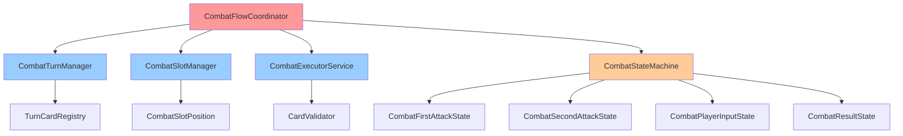
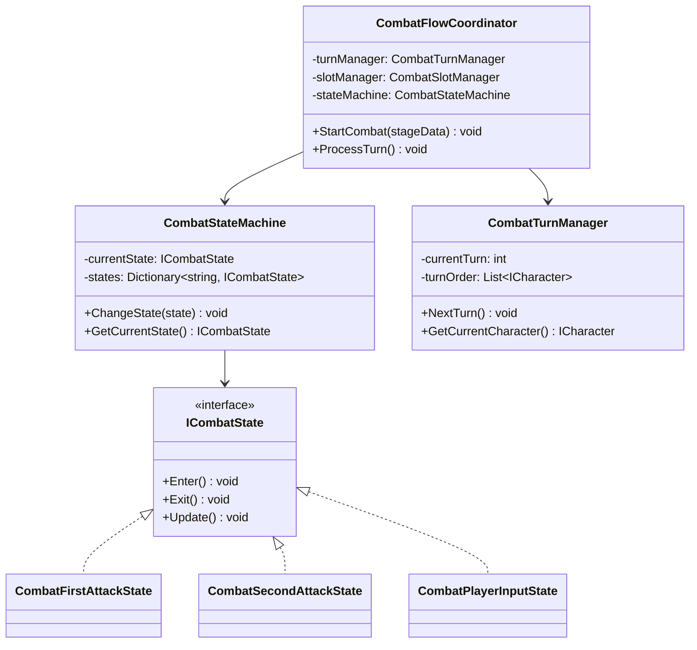
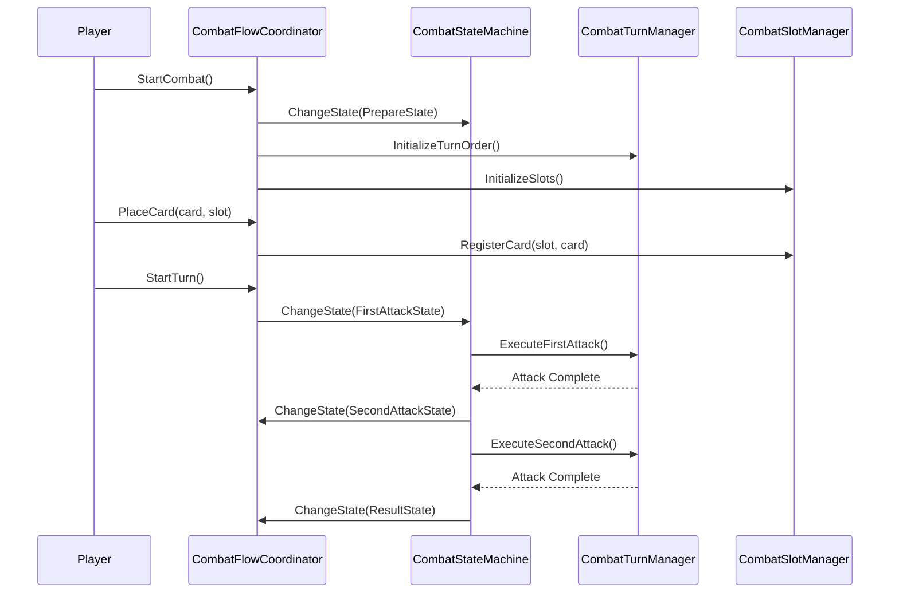

# CombatSystem 개발 문서

## 📋 시스템 개요
CombatSystem은 게임의 전투 로직을 관리하는 핵심 시스템입니다. 전투 상태, 턴 관리, 카드 드래그 앤 드롭, 슬롯 관리 등 다양한 기능을 통합적으로 관리합니다.

## 🏗️ 폴더 구조
```
CombatSystem/
├── Core/             # 핵심 로직 (2개 파일)
├── Manager/          # 매니저 클래스 (3개 파일)
├── Interface/        # 인터페이스 (8개 파일)
├── State/            # 상태 패턴 (6개 파일)
├── Service/          # 서비스 클래스 (3개 파일)
├── Data/             # 데이터 클래스 (1개 파일)
├── Event/            # 이벤트 시스템 (1개 파일)
├── Utility/          # 유틸리티 (2개 파일)
├── Context/          # 컨텍스트 (2개 파일)
└── UI/               # UI 관련 (1개 파일)
```

## 📁 주요 컴포넌트

### Core 폴더 (2개 파일)
- **CombatInstaller.cs**: 전투 시스템 의존성 주입 설정
- **CombatContext.cs**: 전투 컨텍스트

### Manager 폴더 (3개 파일)
- **CombatFlowCoordinator.cs**: 전투 플로우 조정
- **CombatTurnManager.cs**: 턴 매니저
- **CombatSlotManager.cs**: 전투 슬롯 매니저

### Interface 폴더 (8개 파일)
- **ICombatState.cs**: 전투 상태 인터페이스
- **ICombatAction.cs**: 전투 행동 인터페이스
- **ICombatEffect.cs**: 전투 효과 인터페이스
- **ICombatCard.cs**: 전투 카드 인터페이스
- **ICombatCharacter.cs**: 전투 캐릭터 인터페이스
- **ICombatUI.cs**: 전투 UI 인터페이스
- **ICombatValidator.cs**: 전투 검증 인터페이스
- **ICombatExecutor.cs**: 전투 실행 인터페이스

### State 폴더 (6개 파일)
- **CombatFirstAttackState.cs**: 첫 번째 공격 상태
- **CombatPlayerInputState.cs**: 플레이어 입력 상태
- **CombatPrepareState.cs**: 준비 상태
- **CombatResultState.cs**: 결과 상태
- **CombatSecondAttackState.cs**: 두 번째 공격 상태
- **CombatVictoryState.cs**: 승리 상태

### Service 폴더 (3개 파일)
- **CombatExecutorService.cs**: 전투 실행 서비스
- **CombatPreparationService.cs**: 전투 준비 서비스
- **TurnCardRegistry.cs**: 턴 카드 등록기

### Data 폴더 (1개 파일)
- **SlotOwner.cs**: 슬롯 소유자 열거형

### Event 폴더 (1개 파일)
- **CombatEventSystem.cs**: 전투 이벤트 시스템

### Utility 폴더 (2개 파일)
- **CardValidator.cs**: 카드 검증기
- **CharacterDeathHandler.cs**: 캐릭터 사망 핸들러

### Context 폴더 (2개 파일)
- **CombatContext.cs**: 전투 컨텍스트
- **TurnContext.cs**: 턴 컨텍스트

### UI 폴더 (1개 파일)
- **CombatUI.cs**: 전투 UI 컨트롤러

## 🎯 주요 기능

### 1. 전투 상태 관리
- **상태 패턴**: 다양한 전투 상태를 상태 패턴으로 관리
- **상태 전환**: 조건에 따른 자동 상태 전환

### 2. 턴 관리
- **턴 순서**: 캐릭터 속도에 따른 턴 순서 결정
- **턴 제한**: 턴당 행동 제한

### 3. 카드 시스템
- **카드 실행**: 카드 효과 실행
- **카드 검증**: 실행 가능 여부 검증

### 4. 전투 플로우
- **전투 준비**: 전투 시작 전 준비
- **입력 제어**: 플레이어 입력 처리

## 🔧 사용 방법

### 기본 사용법
```csharp
// 전투 시작
CombatFlowCoordinator.Instance.StartCombat(stageData);

// 턴 진행
CombatTurnManager.Instance.NextTurn();

// 카드 실행
CombatExecutorService.Instance.ExecuteCard(card, target);
```

## 🏗️ 아키텍처 패턴

### 1. 상태 패턴 (State Pattern)
- **전투 상태**: 각 전투 단계별 상태 관리
- **상태 전환**: 조건에 따른 자동 상태 전환

### 2. 서비스 패턴 (Service Pattern)
- **전투 서비스**: 특정 기능을 담당하는 서비스
- **의존성 주입**: 서비스 간 의존성 관리

### 3. 옵저버 패턴 (Observer Pattern)
- **이벤트 시스템**: 전투 이벤트 발생 및 구독
- **상태 변경**: 상태 변경 시 알림

## 🔧 기술적 구현 세부사항

### 성능 최적화
- **메모리 관리**: 상태 객체 풀링을 통한 GC 압박 최소화
- **프레임 최적화**: 상태 전환 시 Update() 호출 최소화
- **렌더링 최적화**: UI 업데이트 빈도 최적화
- **로딩 최적화**: 전투 데이터 사전 로딩 및 캐싱

### 스레드 안전성
- **동시성 제어**: 상태 전환 시 락을 통한 동시성 제어
- **비동기 처리**: 코루틴을 통한 비동기 전투 처리
- **이벤트 처리**: 스레드 안전한 전투 이벤트 시스템
- **데이터 동기화**: 전투 상태 데이터 동기화

### 메모리 관리
- **생명주기 관리**: 전투 상태 객체의 생성/소멸 관리
- **리소스 해제**: 전투 종료 시 리소스 정리
- **메모리 누수 방지**: 이벤트 구독 해제, 상태 참조 해제
- **프로파일링**: 전투 중 메모리 사용량 모니터링

## 🏗️ 시스템 아키텍처

### 의존성 다이어그램


### 클래스 다이어그램


### 시퀀스 다이어그램


## 📚 참고 자료

### 관련 문서
- [Unity 코루틴](https://docs.unity3d.com/Manual/Coroutines.html)
- [상태 패턴](https://refactoring.guru/design-patterns/state)
- [Zenject 의존성 주입](https://github.com/modesttree/Zenject)


