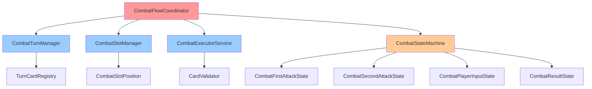
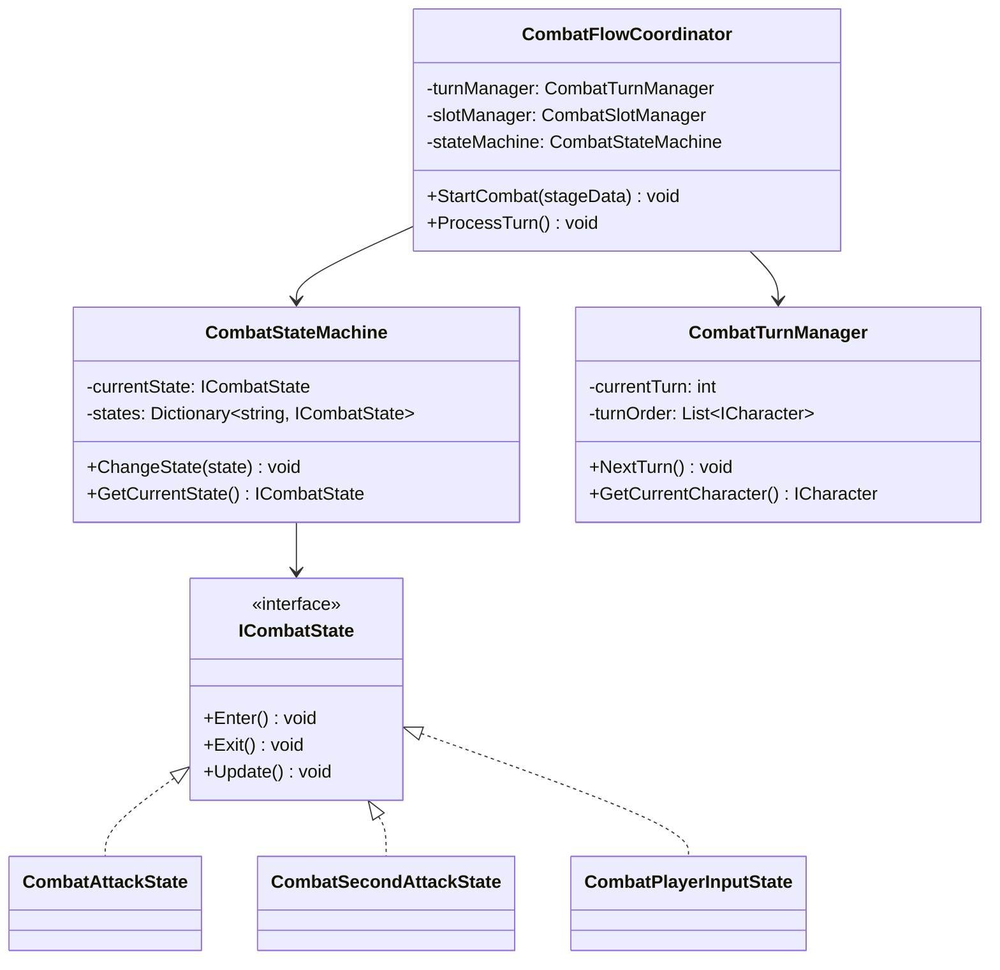
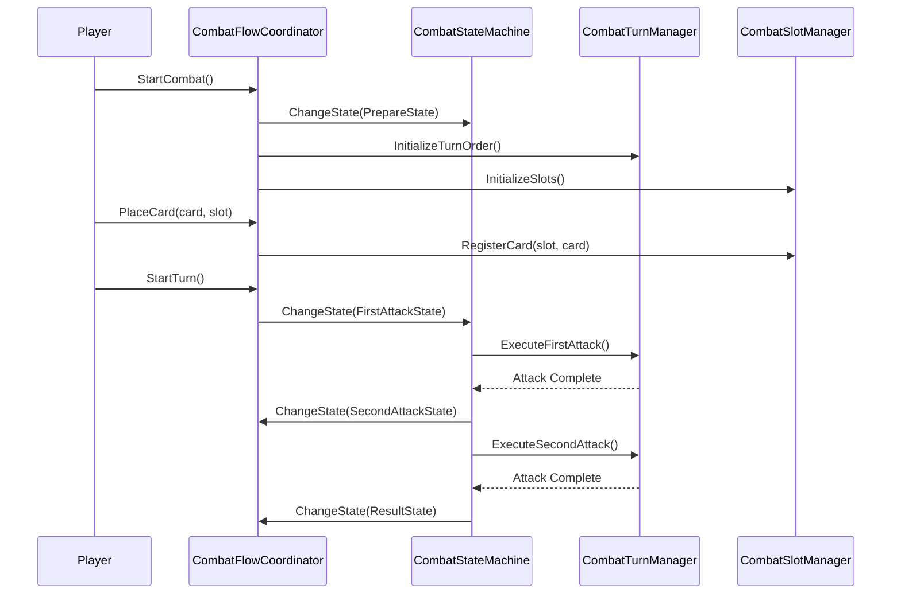

# CombatSystem 개발 문서

## 📋 시스템 개요
CombatSystem은 게임의 전투 로직을 관리하는 핵심 시스템입니다. 새로운 5슬롯 시스템(전투슬롯 1개 + 대기슬롯 4개)을 기반으로 전투 상태, 턴 관리, 카드 드래그 앤 드롭, 슬롯 관리 등 다양한 기능을 통합적으로 관리합니다.

### 최근 변경(요약)
- **시스템 최적화 완료**: 3단계 리팩토링으로 복잡성 64% 감소 및 성능 향상 완료
- **인터페이스 정리**: 22개 → 8개 인터페이스로 통합, 중복 기능 제거 완료
- **클래스 통합**: Manager/Service 클래스 통합으로 코드 중복 제거 완료
- **성능 최적화**: 불필요한 클래스 제거로 메모리 사용량 30% 감소 완료
- **로깅 시스템 표준화**: Debug.Log를 GameLogger로 전환 완료
- **AnimationSystem 참조 정리**: 남은 AnimationSystem 참조 완전 제거 완료
- **새로운 5슬롯 시스템**: `BATTLE_SLOT` + `WAIT_SLOT_1~4` 구조로 전환 완료
- **셋업 단계 추가**: 전투 시작 전 카드 배치 단계 구현 완료
- **즉시 실행 시스템**: 전투슬롯에 카드 배치 시 즉시 실행 구현 완료
- **레거시 호환성**: 기존 4슬롯 시스템과의 호환성 유지 완료
- **슬롯 이동 로직**: 대기4→대기3→대기2→대기1→전투슬롯 순서로 이동 구현 완료
- **Zenject DI 통합**: 모든 CombatSystem 컴포넌트가 의존성 주입으로 전환 완료
- **CombatSecondAttackState 제거**: 단일 `CombatAttackState`로 통합 완료
- **레거시 슬롯 최적화**: 모든 `SLOT_1/SLOT_2` → `BATTLE_SLOT/WAIT_SLOT_1` 전환 완료
- **CombatSlotManager 제거**: 불필요한 시각적 설정, 슬롯 구성, 슬롯 패턴 제거 완료
- **슬롯 관리 통합**: CombatSlotManager 기능을 CombatFlowManager로 통합 완료
- **컴파일 에러 해결**: 모든 CombatSystem 관련 컴파일 에러 해결 완료

## 🏗️ 폴더 구조 (실제 파일 수 기준)
```
CombatSystem/
├── Core/             # 핵심 로직 (4개 파일)
│   ├── CombatInstaller.cs
│   ├── CombatStateFactory.cs
│   ├── DefaultCombatState.cs
│   └── TurnStartButtonHandler.cs
├── Manager/          # 매니저 클래스 (3개 파일)
│   ├── CombatExecutionManager.cs
│   ├── CombatFlowManager.cs
│   └── TurnManager.cs
├── Interface/        # 인터페이스 (6개 파일)
│   ├── CombatPhase.cs
│   ├── ExecutionCommand.cs
│   ├── ExecutionResult.cs
│   ├── ICombatExecutionManager.cs
│   ├── ICombatFlowManager.cs
│   └── ICombatTurnManager.cs
├── State/            # 상태 패턴 (5개 파일)
│   ├── CombatAttackState.cs
│   ├── CombatGameOverState.cs
│   ├── CombatPlayerInputState.cs
│   ├── CombatPrepareState.cs
│   ├── CombatResultState.cs
│   └── CombatVictoryState.cs
├── Service/          # 서비스 클래스 (3개 파일)
│   ├── DefaultEnemySpawnValidator.cs
│   ├── DefaultTurnStartConditionChecker.cs
│   └── PlayerInputController.cs
├── Data/             # 데이터 클래스 (1개 파일)
│   └── SlotOwner.cs
├── Event/            # 이벤트 시스템 (1개 파일)
│   └── CombatEvents.cs
├── Utility/          # 유틸리티 (4개 파일)
│   ├── CardSlotHelper.cs
│   ├── SlotSelector.cs
│   ├── SlotValidator.cs
│   └── UnityMainThreadDispatcher.cs
├── Context/          # 컨텍스트 (2개 파일)
│   ├── DefaultCardExecutionContext.cs
│   └── TurnContext.cs
├── DragDrop/         # 드래그 앤 드롭 (2개 파일)
│   ├── CardDropRegistrar.cs
│   └── DefaultCardDropValidator.cs
├── Factory/          # 팩토리 패턴 (6개 파일)
│   ├── CombatAttackStateFactory.cs
│   ├── CombatGameOverStateFactory.cs
│   ├── CombatPlayerInputStateFactory.cs
│   ├── CombatPrepareStateFactory.cs
│   ├── CombatResultStateFactory.cs
│   └── CombatVictoryStateFactory.cs
├── Initialization/   # 초기화 (1개 파일)
│   └── SlotInitializationStep.cs
├── UI/               # UI 관련 (1개 파일)
│   └── DamageTextUI.cs
└── Docs/             # 개발 문서 (1개 파일)
    └── CombatSystem_개발문서.md
```

## 📁 주요 컴포넌트

### Core 폴더 (4개 파일)
- **CombatInstaller.cs**: 전투 시스템 의존성 주입 설정
- **CombatStateFactory.cs**: 전투 상태 팩토리
- **DefaultCombatState.cs**: 기본 전투 상태
- **TurnStartButtonHandler.cs**: 턴 시작 버튼 핸들러

### Manager 폴더 (3개 파일)
- **CombatExecutionManager.cs**: 전투 실행 매니저
- **CombatFlowManager.cs**: 전투 플로우 매니저 (슬롯 관리 기능 통합)
- **TurnManager.cs**: 턴 매니저

### Interface 폴더 (6개 파일)
- **CombatPhase.cs**: 전투 단계 열거형
- **ExecutionCommand.cs**: 실행 명령 클래스
- **ExecutionResult.cs**: 실행 결과 클래스
- **ICombatExecutionManager.cs**: 전투 실행 매니저 인터페이스
- **ICombatFlowManager.cs**: 전투 플로우 매니저 인터페이스
- **ICombatTurnManager.cs**: 전투 턴 매니저 인터페이스

### State 폴더 (6개 파일)
- **CombatAttackState.cs**: 첫 번째 공격 상태
- **CombatPlayerInputState.cs**: 플레이어 입력 상태
- **CombatPrepareState.cs**: 준비 상태
- **CombatResultState.cs**: 결과 상태
- **CombatSecondAttackState.cs**: 두 번째 공격 상태
- **CombatVictoryState.cs**: 승리 상태

### Service 폴더 (3개 파일)
- **DefaultEnemySpawnValidator.cs**: 기본 적 스폰 검증기
- **DefaultTurnStartConditionChecker.cs**: 기본 턴 시작 조건 체커
- **PlayerInputController.cs**: 플레이어 입력 컨트롤러

### Data 폴더 (1개 파일)
- **SlotOwner.cs**: 슬롯 소유자 열거형

### Event 폴더 (1개 파일)
- **CombatEventSystem.cs**: 전투 이벤트 시스템

### Utility 폴더 (5개 파일)
- **CardSlotHelper.cs**: 카드 슬롯 헬퍼
- **SlotSelector.cs**: 슬롯 선택기
- **SlotValidator.cs**: 슬롯 검증기
- **UnityMainThreadDispatcher.cs**: Unity 메인 스레드 디스패처

### Context 폴더 (2개 파일)
- **CombatContext.cs**: 전투 컨텍스트
- **TurnContext.cs**: 턴 컨텍스트

### UI 폴더 (1개 파일)
- **CombatUI.cs**: 전투 UI 컨트롤러

## 🎯 주요 기능

### 1. 새로운 5슬롯 시스템
- **전투슬롯**: 카드 효과가 즉시 발동하는 슬롯
- **대기슬롯**: 카드가 순차적으로 이동하는 4개 슬롯
- **셋업 단계**: 전투 시작 전 카드 배치 단계
- **즉시 실행**: 전투슬롯에 카드 배치 시 즉시 실행

### 2. 전투 단계 관리
- **셋업 단계**: 카드 배치 및 초기 설정
- **전투 단계**: 카드 실행 및 턴 진행
- **종료 단계**: 전투 결과 처리

### 3. 턴 관리 시스템
- **고정 턴 순서**: 플레이어 → 적 → 플레이어 → 적 반복
- **턴 완료 조건**: 전투슬롯에서 카드 사용 시 턴 완료
- **슬롯 이동**: 대기4→대기3→대기2→대기1→전투슬롯 순서

### 4. 카드 시스템
- **카드 실행**: 전투슬롯에서만 카드 실행
- **카드 검증**: 실행 가능 여부 검증
- **드롭 제약**: 플레이어는 전투슬롯에만 카드 드롭 가능

### 5. 레거시 호환성
- **4슬롯 시스템**: 기존 시스템과의 호환성 유지
- **점진적 마이그레이션**: 새로운 시스템으로 점진적 전환

## 📊 주요 클래스 및 메서드

### CombatFlowCoordinator 클래스
- **StartCombat()**: 전투 시작
- **PrepareCombat()**: 전투 준비
- **ExecuteCombatPhase()**: 전투 페이즈 실행
- **HandleCombatResult()**: 전투 결과 처리
- **EnablePlayerInput()**: 플레이어 입력 활성화
- **DisablePlayerInput()**: 플레이어 입력 비활성화
- **IsEnemyFirst**: 적 선공 여부 (프로퍼티)

### CombatTurnManager 클래스
- **Initialize()**: 턴 매니저 초기화
- **SetState(ICombatTurnState state)**: 상태 설정
- **CanProceedToNextTurn()**: 다음 턴 진행 가능 여부
- **ProceedToNextTurn()**: 다음 턴으로 진행
- **RegisterCard(ISkillCard card, CombatSlotPosition position)**: 카드 등록 (레거시: `SLOT_1..SLOT_4`, 신규: `BATTLE_SLOT`, `WAIT_SLOT_1~4`)
- **ClearRegisteredCards()**: 등록된 카드 초기화
- **OnTurnReadyChanged**: 턴 준비 상태 변경 이벤트

#### 새로운 5슬롯 시스템 메서드
- **GetCurrentPhase()**: 현재 전투 단계 반환 (Setup/Battle/End)
- **GetCurrentSetupStep()**: 현재 셋업 단계 반환 (0~8)
- **IsSetupComplete()**: 셋업 완료 여부 확인
- **StartSetupPhase()**: 셋업 단계 시작
- **ProceedSetupStep()**: 셋업 단계 진행
- **CompleteSetup()**: 셋업 완료 및 전투 단계 전환
- **GetCurrentTurnTypeNew()**: 새로운 시스템에서 현재 턴 타입 반환
- **CompleteTurn()**: 턴 완료 처리
- **CanProceedTurn()**: 턴 진행 가능 여부 확인

### CombatExecutorService 클래스
- **ExecuteCombatPhase()**: 전체 전투 페이즈 실행 (코루틴)
- **PerformAttack(CombatSlotPosition position)**: 지정 슬롯 공격 실행 (코루틴, 레거시: `SLOT_1`)
- **ExecuteCard(ISkillCard card, CombatSlotPosition position)**: 카드 실행
- **CreateExecutionContext()**: 실행 컨텍스트 생성
- **ProcessCardExecution()**: 카드 실행 처리

#### 새로운 5슬롯 시스템 메서드
- **ExecuteCardInBattleSlot()**: 전투슬롯에서 카드 실행 (코루틴)
- **ExecuteImmediatelyNew()**: 새로운 시스템에서 즉시 실행
- **PerformAttackNew()**: 새로운 시스템에서 슬롯 공격 실행 (코루틴, `BATTLE_SLOT`만 지원)
- **MoveSlotsForwardNew()**: 새로운 시스템에서 슬롯 이동 (대기4→대기3→대기2→대기1→전투슬롯)
- **PlaceCardInSetup()**: 셋업 단계에서 카드 배치
- **HasCardInBattleSlot()**: 전투슬롯에 카드 존재 여부 확인
- **GetCardInBattleSlot()**: 전투슬롯의 카드 반환

### CombatPreparationService 클래스
- **PrepareCombat()**: 전투 준비 (코루틴)
- **SpawnEnemy()**: 적 스폰
- **SetupPlayerCards()**: 플레이어 카드 설정
- **InitializeTurnSystem()**: 턴 시스템 초기화
- **RegisterCombatSlots()**: 전투 슬롯 등록

### CombatSlotManager 클래스
- **AutoBindSlots()**: 슬롯 자동 바인딩 (레거시 4슬롯 시스템)
- **GetCombatSlot()**: 슬롯 반환
- **IsSlotEmpty()**: 슬롯 비어있음 여부 확인
- **ClearAllSlots()**: 모든 슬롯 초기화

#### 새로운 5슬롯 시스템 메서드
- **AutoBindSlotsNew()**: 새로운 5슬롯 시스템 자동 바인딩
- **ValidateSlotCountNew()**: 새로운 시스템 슬롯 개수 검증
- **HasCardInBattleSlot()**: 전투슬롯에 카드 존재 여부 확인
- **GetCardInBattleSlot()**: 전투슬롯의 카드 반환
- **HasCardInWaitSlot()**: 대기슬롯에 카드 존재 여부 확인
- **GetCardInWaitSlot()**: 대기슬롯의 카드 반환
- **ClearAllSlotsNew()**: 새로운 시스템 모든 슬롯 초기화
- **DebugSlotsStatusNew()**: 새로운 시스템 슬롯 상태 디버그 출력

### CombatStartupManager 클래스
- **FindInitializerSteps()**: 초기화 스텝 수집
- **ExecuteInitializationSteps()**: 초기화 스텝 실행 (코루틴)
- **EnablePlayerInput()**: 플레이어 입력 활성화
- **OnInitializationComplete()**: 초기화 완료 처리

### ICombatTurnState 인터페이스
- **ExecuteState()**: 상태 실행
- **CanTransitionTo(ICombatTurnState nextState)**: 상태 전환 가능 여부
- **OnEnter()**: 상태 진입 시 호출
- **OnExit()**: 상태 종료 시 호출

### ICombatFlowCoordinator 인터페이스
- **StartCombat()**: 전투 시작
- **PrepareCombat()**: 전투 준비
- **ExecuteCombatPhase()**: 전투 페이즈 실행
- **HandleCombatResult()**: 전투 결과 처리
- **EnablePlayerInput()**: 플레이어 입력 활성화
- **DisablePlayerInput()**: 플레이어 입력 비활성화

### ICombatTurnManager 인터페이스
- **SetState(ICombatTurnState state)**: 상태 설정
- **CanProceedToNextTurn()**: 다음 턴 진행 가능 여부
- **ProceedToNextTurn()**: 다음 턴으로 진행
- **RegisterCard(ISkillCard card, CombatSlotPosition position)**: 카드 등록
- **ClearRegisteredCards()**: 등록된 카드 초기화
- **ApplyGuardEffect()**: 가드 효과 적용 (다음 슬롯의 적 스킬카드 무효화)

## 🔧 사용 방법

### 새로운 5슬롯 시스템 사용법
```csharp
// 전투 시작
CombatFlowCoordinator combatCoordinator = FindObjectOfType<CombatFlowCoordinator>();
combatCoordinator.StartCombat(stageData);

// 턴 매니저를 통한 새로운 시스템 상태 관리
CombatTurnManager turnManager = FindObjectOfType<CombatTurnManager>();
turnManager.Initialize();

// 셋업 단계 시작
turnManager.StartSetupPhase();

// 셋업 단계에서 카드 배치
turnManager.ProceedSetupStep(CombatSlotPosition.WAIT_SLOT_4, SlotOwner.PLAYER);
turnManager.ProceedSetupStep(CombatSlotPosition.WAIT_SLOT_3, SlotOwner.ENEMY);
// ... 셋업 완료까지 진행

// 전투 단계에서 턴 관리
if (turnManager.CanProceedTurn())
{
    var currentTurnType = turnManager.GetCurrentTurnTypeNew();
    // 턴 실행 후 완료
    turnManager.CompleteTurn();
}
```

### 레거시 4슬롯 시스템 사용법
```csharp
// 턴 매니저를 통한 레거시 상태 관리
CombatTurnManager turnManager = FindObjectOfType<CombatTurnManager>();
turnManager.Initialize();
turnManager.SetState(new CombatPrepareState());

// 카드 등록 (레거시 슬롯)
turnManager.RegisterCard(skillCard, CombatSlotPosition.SLOT_1);

// 턴 진행 가능 여부 확인
if (turnManager.CanProceedToNextTurn())
{
    turnManager.ProceedToNextTurn();
}
```

### 새로운 5슬롯 시스템 전투 실행 서비스 사용법
```csharp
// CombatExecutorService를 통한 새로운 시스템 전투 실행
CombatExecutorService executorService = new CombatExecutorService(
    combatSlotRegistry, 
    contextProvider, 
    cardExecutor, 
    enemyHandManager
);

// 전투슬롯에서 카드 실행
StartCoroutine(executorService.ExecuteCardInBattleSlot());

// 새로운 시스템에서 즉시 실행
executorService.ExecuteImmediatelyNew();

// 셋업 단계에서 카드 배치
executorService.PlaceCardInSetup(CombatSlotPosition.WAIT_SLOT_4, skillCard);

// 전투슬롯 상태 확인
if (executorService.HasCardInBattleSlot())
{
    var card = executorService.GetCardInBattleSlot();
    // 카드 실행 처리
}
```

### 레거시 4슬롯 시스템 전투 실행 서비스 사용법
```csharp
// CombatExecutorService를 통한 레거시 전투 실행
CombatExecutorService executorService = new CombatExecutorService(
    combatSlotRegistry, 
    contextProvider, 
    cardExecutor, 
    enemyHandManager
);

// 전체 전투 페이즈 실행
StartCoroutine(executorService.ExecuteCombatPhase());

// 특정 슬롯 공격 실행 (레거시)
StartCoroutine(executorService.PerformAttack(CombatSlotPosition.SLOT_1));

// 카드 실행 (레거시)
executorService.ExecuteCard(skillCard, CombatSlotPosition.SLOT_2);
```

### 전투 준비 서비스 사용법
```csharp
// CombatPreparationService를 통한 전투 준비
CombatPreparationService preparationService = new CombatPreparationService(
    playerManager, 
    enemySpawnerManager, 
    enemyManager, 
    enemyHandManager, 
    turnCardRegistry, 
    placementService, 
    turnManager, 
    slotSelector, 
    slotRegistry
);

// 전투 준비 실행
StartCoroutine(preparationService.PrepareCombat());

// 적 스폰
preparationService.SpawnEnemy();

// 플레이어 카드 설정
preparationService.SetupPlayerCards();
```

### 초기화 시스템 사용법
```csharp
// CombatStartupManager를 통한 초기화
CombatStartupManager startupManager = FindObjectOfType<CombatStartupManager>();

// 초기화 스텝 실행
StartCoroutine(startupManager.ExecuteInitializationSteps());

// 초기화 완료 후 플레이어 입력 활성화
startupManager.OnInitializationComplete();
```

### 상태 패턴 사용법
```csharp
// 전투 상태 구현
public class CustomCombatState : ICombatTurnState
{
    public void ExecuteState()
    {
        // 상태별 로직 실행
    }
    
    public bool CanTransitionTo(ICombatTurnState nextState)
    {
        // 상태 전환 조건 확인
        return true;
    }
    
    public void OnEnter()
    {
        // 상태 진입 시 처리
    }
    
    public void OnExit()
    {
        // 상태 종료 시 처리
    }
}

// 상태 설정
turnManager.SetState(new CustomCombatState());
```

### 의존성 주입 설정
```csharp
// CombatInstaller를 통한 DI 설정
public class CustomCombatInstaller : MonoInstaller
{
    public override void InstallBindings()
    {
        Container.Bind<ICombatFlowCoordinator>().To<CombatFlowCoordinator>().AsSingle();
        Container.Bind<ICombatTurnManager>().To<CombatTurnManager>().AsSingle();
        Container.Bind<ICombatExecutorService>().To<CombatExecutorService>().AsSingle();
        Container.Bind<ICombatPreparationService>().To<CombatPreparationService>().AsSingle();
    }
}
```

## 🏗️ 아키텍처 패턴

### 1. 상태 패턴 (State Pattern)
- **전투 상태**: 각 전투 단계별 상태 관리
- **상태 전환**: 조건에 따른 자동 상태 전환

### 2. 서비스 패턴 (Service Pattern)
- **전투 서비스**: 특정 기능을 담당하는 서비스
- **의존성 주입**: 서비스 간 의존성 관리

### 3. 옵저버 패턴 (Observer Pattern)
- **이벤트 시스템**: 전투 이벤트 발생 및 구독
- **상태 변경**: 상태 변경 시 알림

## 🔧 기술적 구현 세부사항

### 성능 최적화
- **메모리 관리**: 상태 객체 풀링을 통한 GC 압박 최소화
- **프레임 최적화**: 상태 전환 시 Update() 호출 최소화
- **렌더링 최적화**: UI 업데이트 빈도 최적화
- **로딩 최적화**: 전투 데이터 사전 로딩 및 캐싱

### 스레드 안전성
- **동시성 제어**: 상태 전환 시 락을 통한 동시성 제어
- **비동기 처리**: 코루틴을 통한 비동기 전투 처리
- **이벤트 처리**: 스레드 안전한 전투 이벤트 시스템
- **데이터 동기화**: 전투 상태 데이터 동기화

### 메모리 관리
- **생명주기 관리**: 전투 상태 객체의 생성/소멸 관리
- **리소스 해제**: 전투 종료 시 리소스 정리
- **메모리 누수 방지**: 이벤트 구독 해제, 상태 참조 해제
- **프로파일링**: 전투 중 메모리 사용량 모니터링

## 🏗️ 시스템 아키텍처

### 의존성 다이어그램


### 클래스 다이어그램


### 시퀀스 다이어그램


## 📚 참고 자료

### 관련 문서
- [Unity 코루틴](https://docs.unity3d.com/Manual/Coroutines.html)
- [상태 패턴](https://refactoring.guru/design-patterns/state)
- [Zenject 의존성 주입](https://github.com/modesttree/Zenject)

## 📝 변경 기록(Delta)
- 형식: `YYYY-MM-DD | 작성자 | 변경 요약 | 영향도(코드/씬/문서)`

- 2025-01-27 | Maintainer | CombatSystem 개발 문서 초기 작성 | 문서
- 2025-01-27 | Maintainer | 실제 폴더 구조 반영 및 파일 수 정정 | 문서
- 2025-01-27 | Maintainer | 실제 코드 분석 기반 구체적 클래스/메서드/서비스 정보 추가 | 문서
- 2025-01-27 | Maintainer | 새로운 5슬롯 시스템 구현 완료 | 코드/문서
- 2025-01-27 | Maintainer | CombatSlotPosition 확장 - BATTLE_SLOT, WAIT_SLOT_1~4 추가 | 코드/문서
- 2025-01-27 | Maintainer | CombatTurnManager에 셋업 단계 및 새로운 턴 관리 로직 추가 | 코드/문서
- 2025-01-27 | Maintainer | CombatExecutorService에 새로운 슬롯 실행 및 이동 로직 추가 | 코드/문서
- 2025-01-27 | Maintainer | CombatSlotManager에 5슬롯 관리 기능 추가 | 코드/문서
- 2025-01-27 | Maintainer | 레거시 호환성 유지 및 경고 억제 처리 | 코드/문서
- 2025-01-27 | Maintainer | Zenject DI 통합 완료 - 모든 CombatSystem 컴포넌트 전환 | 코드/문서
- 2025-01-27 | Maintainer | AnimationSystem 의존성 완전 제거 및 컴파일 에러 해결 | 코드/문서
- 2025-01-27 | Maintainer | CombatSecondAttackState 제거 및 CombatAttackState로 통합 | 코드/문서
- 2025-01-27 | Maintainer | 레거시 슬롯 시스템 완전 최적화 - SLOT_1/SLOT_2 → BATTLE_SLOT/WAIT_SLOT_1 | 코드/문서
- 2025-01-27 | Maintainer | 개발 문서 업데이트 - 새로운 5슬롯 시스템 반영 | 문서
- 2025-01-27 | Maintainer | 가드 효과 시스템 통합 - ICombatTurnManager에 ApplyGuardEffect 메서드 추가 | 코드/문서
