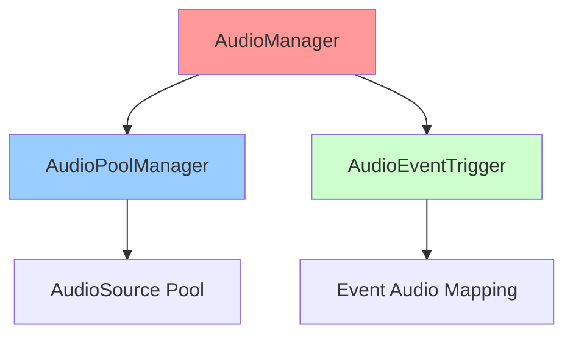
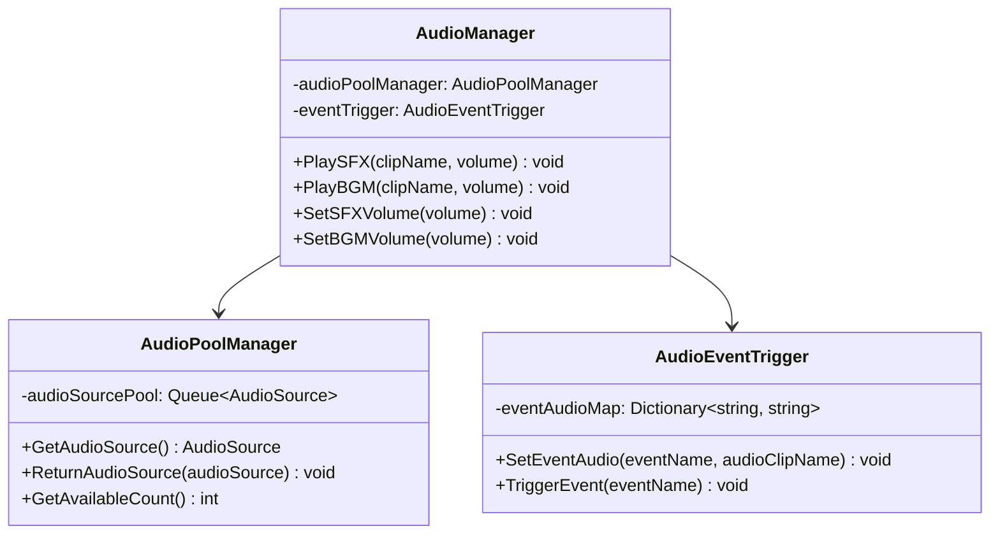
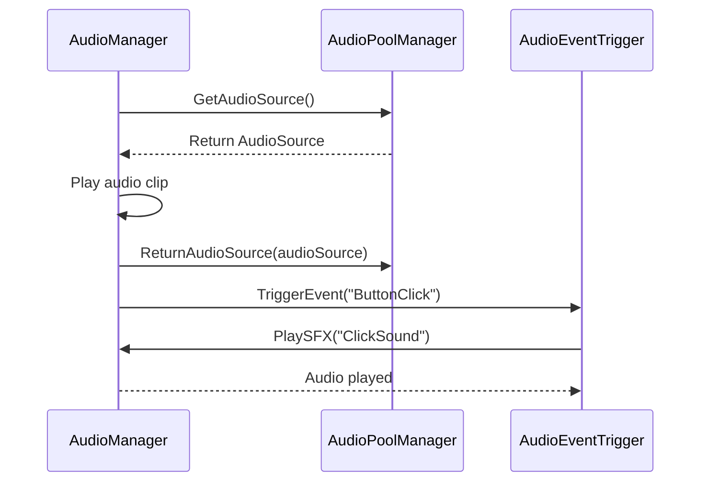

# AudioSystem 개발 문서

## 📋 시스템 개요
AudioSystem은 게임의 오디오 시스템을 관리하는 핵심 시스템입니다. CoreSystem에 통합되어 전역적으로 관리되며, 오디오 풀링, 우선순위 시스템, 이벤트 기반 오디오 트리거 등을 제공합니다. ICoreSystemInitializable 인터페이스를 구현하여 자동 초기화됩니다.

### 최근 변경(요약)
- **AnimationSystem 의존성 제거 완료**: 모든 AnimationSystem 참조 완전 제거 완료
- **CoreSystem 통합 완료**: AudioManager가 CoreSystem의 일부로 통합 관리 완료
- **Zenject DI 통합 완료**: AudioManager가 의존성 주입으로 전환 완료
- **자동 초기화 완료**: ICoreSystemInitializable 인터페이스 구현으로 자동 초기화 완료
- **싱글톤 제거 완료**: AudioManager 싱글톤 패턴 제거 및 DI 기반 전환 완료
- **인터페이스 기반 설계**: IAudioManager 인터페이스 기반 설계 완료
- **오디오 풀링**: AudioPoolManager를 통한 AudioSource 재사용 시스템 완료
- **우선순위 시스템**: 오디오 우선순위 기반 재생 관리 완료
- **한국어 로깅**: GameLogger를 통한 카테고리별 로깅 완료
- **씬 전환 지속성**: DontDestroyOnLoad를 통한 씬 전환 시 오디오 시스템 유지 완료

## 🏗️ 폴더 구조 (CoreSystem 통합)
```
CoreSystem/Audio/
├── AudioManager.cs           # 오디오 매니저 (핵심)
├── AudioPoolManager.cs       # 오디오 풀링 매니저
└── AudioEventTrigger.cs      # 오디오 이벤트 트리거
```

## 📁 주요 컴포넌트

### AudioManager.cs
- **핵심 오디오 관리**: 게임의 모든 오디오 재생 및 관리
- **오디오 풀링**: AudioPoolManager를 통한 AudioSource 재사용
- **우선순위 시스템**: 오디오 우선순위 기반 재생 관리
- **이벤트 기반**: AudioEventTrigger를 통한 이벤트 기반 오디오 재생
- **한국어 로깅**: GameLogger를 통한 카테고리별 로깅

### AudioPoolManager.cs
- **AudioSource 풀링**: AudioSource 객체 재사용으로 성능 최적화
- **메모리 관리**: AudioSource 생성/소멸 비용 절약
- **GC 압박 최소화**: 객체 풀링을 통한 가비지 컬렉션 압박 최소화

### AudioEventTrigger.cs
- **이벤트 기반 오디오**: 특정 이벤트 발생 시 오디오 재생
- **자동 트리거**: 게임 이벤트에 따른 자동 오디오 재생
- **커스터마이징**: 다양한 이벤트에 대한 오디오 설정 가능

## 🎯 주요 기능

### 1. 오디오 재생 관리
- **SFX 재생**: 효과음 재생 및 관리
- **BGM 재생**: 배경음악 재생 및 관리
- **음량 제어**: 개별 오디오 소스 음량 제어
- **재생 제어**: 재생/일시정지/정지 기능

### 2. 오디오 풀링 시스템
- **AudioSource 재사용**: AudioSource 객체 풀링으로 성능 최적화
- **메모리 효율성**: 객체 생성/소멸 비용 절약
- **GC 최적화**: 가비지 컬렉션 압박 최소화

### 3. 우선순위 시스템
- **우선순위 기반 재생**: 높은 우선순위 오디오 우선 재생
- **자동 관리**: 우선순위에 따른 자동 오디오 관리
- **충돌 방지**: 동시 재생 시 우선순위 기반 충돌 방지

### 4. 이벤트 기반 오디오
- **자동 트리거**: 게임 이벤트에 따른 자동 오디오 재생
- **커스터마이징**: 다양한 이벤트에 대한 오디오 설정
- **유연성**: 새로운 이벤트 타입 추가 가능

## 🔧 사용 방법

### 기본 사용법
```csharp
// AudioManager를 통한 오디오 재생
AudioManager audioManager = FindObjectOfType<AudioManager>();

// SFX 재생
audioManager.PlaySFX("ButtonClick", 1.0f);

// BGM 재생
audioManager.PlayBGM("MainTheme", 0.8f);

// 음량 제어
audioManager.SetSFXVolume(0.7f);
audioManager.SetBGMVolume(0.5f);

// 재생 제어
audioManager.PauseBGM();
audioManager.ResumeBGM();
audioManager.StopBGM();
```

### AudioPoolManager 사용법
```csharp
// AudioPoolManager를 통한 AudioSource 관리
AudioPoolManager poolManager = FindObjectOfType<AudioPoolManager>();

// AudioSource 요청
AudioSource audioSource = poolManager.GetAudioSource();

// AudioSource 반환
poolManager.ReturnAudioSource(audioSource);

// 풀 상태 확인
int availableCount = poolManager.GetAvailableCount();
int totalCount = poolManager.GetTotalCount();
```

### AudioEventTrigger 사용법
```csharp
// AudioEventTrigger를 통한 이벤트 기반 오디오
AudioEventTrigger eventTrigger = FindObjectOfType<AudioEventTrigger>();

// 특정 이벤트에 오디오 연결
eventTrigger.SetEventAudio("ButtonClick", "ClickSound");
eventTrigger.SetEventAudio("CardPlay", "CardPlaySound");

// 이벤트 발생 시 자동 오디오 재생
eventTrigger.TriggerEvent("ButtonClick");
```

## 📊 주요 클래스 및 메서드

### AudioManager 클래스
- **PlaySFX(string clipName, float volume)**: 효과음 재생
- **PlayBGM(string clipName, float volume)**: 배경음악 재생
- **SetSFXVolume(float volume)**: 효과음 음량 설정
- **SetBGMVolume(float volume)**: 배경음악 음량 설정
- **PauseBGM()**: 배경음악 일시정지
- **ResumeBGM()**: 배경음악 재개
- **StopBGM()**: 배경음악 정지
- **StopSFX(string clipName)**: 특정 효과음 정지
- **StopAllSFX()**: 모든 효과음 정지

### AudioPoolManager 클래스
- **GetAudioSource()**: AudioSource 요청
- **ReturnAudioSource(AudioSource audioSource)**: AudioSource 반환
- **GetAvailableCount()**: 사용 가능한 AudioSource 수 조회
- **GetTotalCount()**: 전체 AudioSource 수 조회
- **InitializePool(int initialSize)**: 풀 초기화
- **ClearPool()**: 풀 정리

### AudioEventTrigger 클래스
- **SetEventAudio(string eventName, string audioClipName)**: 이벤트에 오디오 연결
- **TriggerEvent(string eventName)**: 이벤트 발생 및 오디오 재생
- **RemoveEventAudio(string eventName)**: 이벤트 오디오 제거
- **GetEventAudio(string eventName)**: 이벤트 오디오 조회

## 🏗️ 아키텍처 패턴

### 1. 매니저 패턴 (Manager Pattern)
- **AudioManager**: 오디오 시스템 전체 관리
- **AudioPoolManager**: AudioSource 풀링 관리

### 2. 풀링 패턴 (Pooling Pattern)
- **AudioSource 풀링**: AudioSource 객체 재사용
- **메모리 최적화**: 객체 생성/소멸 비용 절약

### 3. 이벤트 패턴 (Event Pattern)
- **AudioEventTrigger**: 이벤트 기반 오디오 재생
- **자동 트리거**: 게임 이벤트에 따른 자동 오디오 재생

### 4. 우선순위 패턴 (Priority Pattern)
- **우선순위 기반 재생**: 높은 우선순위 오디오 우선 재생
- **충돌 방지**: 동시 재생 시 우선순위 기반 충돌 방지

## 🔧 기술적 구현 세부사항

### 성능 최적화
- **오디오 풀링**: AudioSource 재사용으로 성능 최적화
- **메모리 관리**: 객체 풀링을 통한 메모리 효율성
- **GC 최적화**: 가비지 컬렉션 압박 최소화
- **로딩 최적화**: 오디오 클립 사전 로딩 및 캐싱

### 스레드 안전성
- **동시성 제어**: 오디오 재생 시 락을 통한 동시성 제어
- **비동기 처리**: 오디오 로딩 시 비동기 처리
- **이벤트 처리**: 스레드 안전한 오디오 이벤트 시스템
- **데이터 동기화**: 오디오 상태 데이터 동기화

### 메모리 관리
- **생명주기 관리**: AudioSource 객체의 생성/소멸 관리
- **리소스 해제**: 오디오 재생 완료 후 리소스 정리
- **메모리 누수 방지**: 이벤트 구독 해제, 오디오 참조 해제
- **프로파일링**: 오디오 시스템 메모리 사용량 모니터링

## 🏗️ 시스템 아키텍처

### 의존성 다이어그램


### 클래스 다이어그램


### 시퀀스 다이어그램


## 📚 참고 자료

### 관련 문서
- [Unity Audio System](https://docs.unity3d.com/Manual/Audio.html)
- [AudioSource Component](https://docs.unity3d.com/Manual/class-AudioSource.html)
- [AudioClip](https://docs.unity3d.com/Manual/class-AudioClip.html)

## 📝 변경 기록(Delta)
- 형식: `YYYY-MM-DD | 작성자 | 변경 요약 | 영향도(코드/씬/문서)`

- 2025-01-27 | Maintainer | AudioSystem 개발 문서 초기 작성 | 문서
- 2025-01-27 | Maintainer | CoreSystem 통합 및 실제 폴더 구조 반영 | 문서
- 2025-01-27 | Maintainer | AnimationSystem 의존성 완전 제거 및 컴파일 에러 해결 | 코드/문서
- 2025-01-27 | Maintainer | 실제 코드 분석 기반 주요 클래스 및 메서드 정보 추가 | 문서
