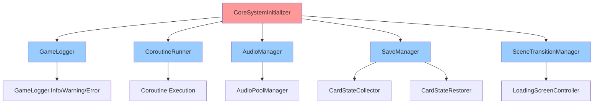
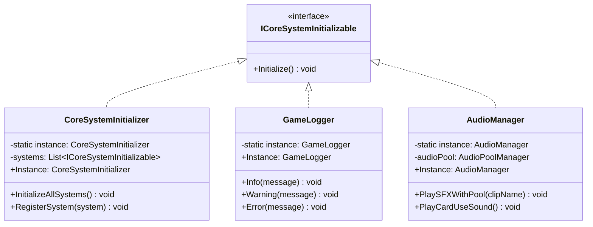
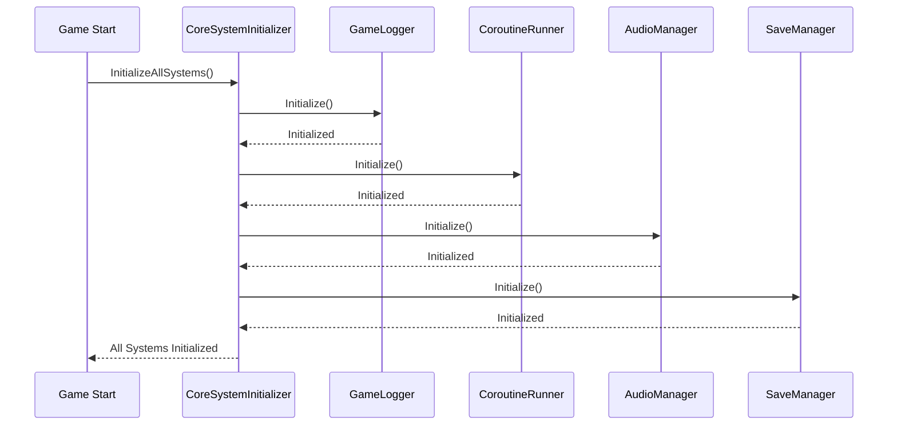

# CoreSystem 개발 문서

## 📋 시스템 개요
CoreSystem은 게임의 핵심 시스템들을 관리하는 중앙 집중식 시스템입니다. 모든 씬에서 공유되는 전역 시스템들을 통합적으로 관리하며, 게임의 기본 기능을 제공합니다. Zenject DI와 자동 초기화 시스템을 통해 안정적이고 확장 가능한 아키텍처를 제공합니다.

### 최근 변경(요약)
- **AnimationSystem 의존성 완전 제거**: 모든 AnimationSystem 관련 코드 제거 완료
- **임시 애니메이션 비활성화**: 애니메이션 호출 부분을 Debug.Log로 대체하여 게임 로직 정상 동작
- **Zenject DI 통합 완료**: 모든 CoreSystem 매니저가 의존성 주입으로 전환 완료
- **싱글톤 제거 진행**: 주요 매니저를 Zenject DI로 전환(문서 기준 최신 코드와 차이가 있는 항목은 정리 중)
- **자동 초기화 완료**: ICoreSystemInitializable 인터페이스 기반 자동 초기화 구현 완료
- **인터페이스 기반 설계**: 모든 매니저가 인터페이스를 구현하여 테스트 가능성 확보 완료
- **한국어 로깅**: GameLogger를 통한 카테고리별 로깅
- **씬 전환 지속성**: 씬 전환 시에도 시스템 상태 유지

## 🏗️ 폴더 구조 (실제 파일 수 기준)
```
CoreSystem/
├── Manager/          # 코어 매니저 (7개 파일)
│   ├── BaseCoreManager.cs
│   ├── CoreSystemInitializer.cs
│   ├── GameStateManager.cs
│   ├── GameStartupController.cs
│   ├── MainSceneInstaller.cs
│   ├── PlayerCharacterSelectionManager.cs
│   └── SceneTransitionManager.cs
├── Audio/           # 오디오 관리 (3개 파일)
│   ├── AudioEventTrigger.cs
│   ├── AudioManager.cs
│   ├── AudioPoolManager.cs
│   └── AudioSystem_개발문서.md
├── Save/            # 저장 관리 (1개 파일)
│   └── SaveManager.cs
├── Utility/         # 코어 유틸리티 (6개 파일)
│   ├── ComponentInteractionOptimizer.cs
│   ├── ComponentRoleManager.cs
│   ├── CoroutineRunner.cs
│   ├── DIOptimizationUtility.cs
│   ├── GameLogger.cs
│   └── ICoroutineRunner.cs
├── UI/              # 코어 UI (4개 파일)
│   ├── LoadingScreenController.cs
│   ├── SettingsManager.cs
│   ├── SettingsPanelController.cs
│   └── TransitionEffectController.cs
├── Interface/       # 코어 인터페이스 (6개 파일)
│   ├── IAudioManager.cs
│   ├── ICoreSystemInitializable.cs
│   ├── IGameStateManager.cs
│   ├── IPlayerCharacterSelectionManager.cs
│   ├── ISaveManager.cs
│   └── ISceneTransitionManager.cs
├── CoreSystemInstaller.cs
└── CoreSystem_개발문서.md
```

## 스크립트 목록(1:1 매핑)
- CoreSystem/Manager/GameStartupController.cs
- CoreSystem/Utility/ComponentRoleManager.cs
- CoreSystem/Manager/CoreSystemInitializer.cs
- CoreSystem/CoreSystemInstaller.cs
- CoreSystem/Manager/BaseCoreManager.cs
- CoreSystem/Utility/ComponentInteractionOptimizer.cs
// DIPerformanceTester.cs는 프로젝트에 존재하지 않음(문서에서 제거)
- CoreSystem/Utility/DIOptimizationUtility.cs
- CoreSystem/Utility/GameLogger.cs
- CoreSystem/Manager/SceneTransitionManager.cs
- CoreSystem/Manager/GameStateManager.cs
- CoreSystem/Save/SaveManager.cs
- CoreSystem/Manager/PlayerCharacterSelectionManager.cs
- CoreSystem/UI/SettingsPanelController.cs
- CoreSystem/UI/SettingsManager.cs
- CoreSystem/Manager/MainSceneInstaller.cs
- CoreSystem/Interface/ISceneTransitionManager.cs
- CoreSystem/Interface/IGameStateManager.cs
- CoreSystem/Interface/IPlayerCharacterSelectionManager.cs
- CoreSystem/Interface/ISaveManager.cs
- CoreSystem/Interface/IAudioManager.cs
- CoreSystem/Audio/AudioManager.cs
- CoreSystem/Utility/ICoroutineRunner.cs
- CoreSystem/Utility/CoroutineRunner.cs
- CoreSystem/UI/TransitionEffectController.cs
- CoreSystem/UI/LoadingScreenController.cs
- CoreSystem/Interface/ICoreSystemInitializable.cs
- CoreSystem/Audio/AudioPoolManager.cs
- CoreSystem/Audio/AudioEventTrigger.cs

## 📁 주요 컴포넌트

### Manager 폴더 (7개 파일)
- **BaseCoreManager.cs**: 코어 매니저 기본 클래스
- **CoreSystemInitializer.cs**: 모든 코어 시스템 초기화
- **GameStateManager.cs**: 게임 상태 관리
- **GameStartupController.cs**: 게임 시작 시 코어/전투 초기화 흐름 조정
- **MainSceneInstaller.cs**: 메인 씬 설치자
- **PlayerCharacterSelectionManager.cs**: 플레이어 캐릭터 선택 관리
- **SceneTransitionManager.cs**: 씬 전환 관리

### Audio 폴더 (3개 파일)
- **AudioManager.cs**: 오디오 시스템 관리 (싱글톤)
- **AudioPoolManager.cs**: 오디오 풀링 관리
- **AudioEventTrigger.cs**: 오디오 이벤트 트리거

### Save 폴더 (1개 파일)
- **SaveManager.cs**: 저장 시스템 관리 (싱글톤)

### Utility 폴더 (7개 파일)
- **CoroutineRunner.cs**: 코루틴 실행 관리
- **GameLogger.cs**: 게임 로깅 시스템 (싱글톤)
- **ICoroutineRunner.cs**: 코루틴 러너 인터페이스
- **ComponentInteractionOptimizer.cs**: 컴포넌트 상호작용 최적화
- **ComponentRoleManager.cs**: 컴포넌트 역할 관리
- **DIOptimizationUtility.cs**: DI 최적화 유틸리티
- **DIPerformanceTester.cs**: DI 성능 테스터

### UI 폴더 (4개 파일)
- **LoadingScreenController.cs**: 로딩 화면 컨트롤러
- **SettingsManager.cs**: 설정 관리
- **SettingsPanelController.cs**: 설정 패널 컨트롤러
- **TransitionEffectController.cs**: 전환 효과 컨트롤러

### Interface 폴더 (6개 파일)
- **IAudioManager.cs**: 오디오 매니저 인터페이스
- **ICoreSystemInitializable.cs**: 코어 시스템 초기화 인터페이스
- **IGameStateManager.cs**: 게임 상태 매니저 인터페이스
- **IPlayerCharacterSelectionManager.cs**: 플레이어 캐릭터 선택 관리 인터페이스
- **ISaveManager.cs**: 저장 매니저 인터페이스
- **ISceneTransitionManager.cs**: 씬 전환 매니저 인터페이스


## 🎯 주요 기능

### 1. 시스템 초기화
- **자동 초기화**: 모든 코어 시스템의 자동 초기화
- **초기화 순서**: 의존성을 고려한 초기화 순서 관리
- **초기화 상태**: 초기화 완료 상태 추적
 - **전투 흐름 연계**: Combat 초기화 시 `GameStartupController`가 Turn/Stage/Player/Enemy 셋업 순으로 실행되도록 보장

### 2. 씬 전환 관리
- **씬 로딩**: 씬 로딩 및 전환 처리
- **로딩 화면**: 로딩 중 화면 표시
- **전환 효과**: 씬 전환 시 효과 처리

### 3. 게임 상태 관리
- **전역 상태**: 게임 전체 상태 관리
- **상태 전환**: 게임 상태 간 전환
- **상태 저장**: 게임 상태 저장/로드

### 4. 로깅 시스템
- **카테고리별 로깅**: 시스템별 로그 분류
- **로그 레벨**: 에러, 경고, 정보 등 레벨별 로깅
- **조건부 컴파일**: 릴리즈 빌드에서 로그 제거
 - **전투 연동 로그**: Turn/Queue/Refill/AutoExec/Hand 생성 등 핵심 이벤트에 한국어 로그 표준 적용

### 5. 코루틴 관리
- **중앙화된 실행**: 모든 코루틴을 중앙에서 관리
- **생명주기 관리**: 코루틴의 생성/소멸 관리
- **에러 처리**: 코루틴 실행 중 에러 처리

### 6. 오디오 시스템 통합
- **오디오 풀링**: AudioSource 풀링으로 성능 최적화
- **사운드 중복 방지**: 동일한 사운드의 중복 재생 방지

## 📊 주요 클래스 및 메서드

### SceneTransitionManager 클래스
- **Instance**: 싱글톤 인스턴스 (프로퍼티)
- **TransitionToCoreScene()**: 코어 씬으로 전환 (async Task)
- **TransitionToMainScene()**: 메인 씬으로 전환 (async Task)
- **TransitionToBattleScene()**: 전투 씬으로 전환 (async Task)
- **TransitionToScene(string sceneName, TransitionType transitionType)**: 일반 씬 전환 (async Task)
- **InitializeTransition()**: 전환 시스템 초기화
- **TryPlayBGMForScene(string sceneName)**: 씬별 BGM 재생
- **IsTransitioning**: 전환 상태 (프로퍼티)
- **OnSceneTransitionStart**: 씬 전환 시작 이벤트
- **OnSceneTransitionEnd**: 씬 전환 완료 이벤트

### AudioManager 클래스
- **Instance**: 싱글톤 인스턴스 (프로퍼티)
- **PlayBGM(AudioClip bgmClip, bool fadeIn)**: BGM 재생 (페이드 옵션)
- **PlaySFX(AudioClip sfxClip)**: 효과음 재생 (기본 방식)
- **PlaySFXWithPool(AudioClip sfxClip, float volume, int priority)**: 풀링을 사용한 효과음 재생
- **StopBGM()**: BGM 정지
- **SetBGMVolume(float volume)**: BGM 볼륨 설정
- **SetSFXVolume(float volume)**: SFX 볼륨 설정
- **FadeToNewBGM(AudioClip newBGM)**: BGM 페이드 전환 (내부 코루틴)
- **Initialize()**: ICoreSystemInitializable 구현
- **OnInitializationFailed()**: 초기화 실패 처리
- **PrintAudioPoolCooldownStatus()**: 오디오 풀 쿨다운 상태 출력

### SaveManager 클래스
- **Instance**: 싱글톤 인스턴스 (프로퍼티)
- **SaveAudioSettings(float bgmVolume, float sfxVolume)**: 오디오 설정 저장
- **LoadAudioSettings(float defaultBgm, float defaultSfx)**: 오디오 설정 로드
- **SaveCurrentScene()**: 현재 씬 전체 저장 (async Task)
- **LoadGameData()**: 게임 데이터 로드
- **SaveGameData()**: 게임 데이터 저장
- **Initialize()**: ICoreSystemInitializable 구현
- **OnInitializationFailed()**: 초기화 실패 처리

### ICoreSystemInitializable 인터페이스
- **Initialize()**: 시스템 초기화 (IEnumerator)
- **OnInitializationFailed()**: 초기화 실패 시 호출
- **IsInitialized**: 초기화 상태 (프로퍼티)

### AudioPoolManager 클래스
- **PlaySound(AudioClip clip, float volume, int priority)**: 우선순위 지정 사운드 재생
- **PlaySound(AudioClip clip, float volume)**: 자동 우선순위 사운드 재생
- **GetAudioSourceFromPool()**: 풀에서 AudioSource 가져오기
- **ReturnToPoolAfterPlay()**: 재생 완료 후 풀에 반환
- **IsInCooldown(string clipName)**: 쿨다운 상태 확인
- **CanPlayWithPriority(string clipName, int priority)**: 우선순위 체크
- **GetSoundPriority(string clipName)**: 사운드 우선순위 조회
- **InitializeSoundPriority()**: 사운드 우선순위 초기화
- **PrintCooldownStatus()**: 쿨다운 상태 출력

### GameLogger 클래스
- **LogInfo(string message, LogCategory category)**: 정보 로그
- **LogWarning(string message, LogCategory category)**: 경고 로그
- **LogError(string message, LogCategory category)**: 에러 로그
- **LogDebug(string message, LogCategory category)**: 디버그 로그
- **LogCategory**: 로그 카테고리 열거형 (Audio, UI, Combat, Character, SkillCard, Stage, Utility, Error)

### CoroutineRunner 클래스
- **StartCoroutine(IEnumerator coroutine)**: 코루틴 시작
- **StopCoroutine(IEnumerator coroutine)**: 코루틴 정지
- **StopAllCoroutines()**: 모든 코루틴 정지
- **IsRunning(IEnumerator coroutine)**: 코루틴 실행 상태 확인
- **이벤트 기반**: 게임 이벤트와 자동 연동
- **전용 사운드**: 카드 사용, 적 처치 등 전용 사운드 메서드

### 7. 저장 시스템 통합
- **슬레이 더 스파이어 방식**: 턴 기반 자동 저장
- **완전한 카드 상태**: 플레이어/적 핸드, 전투 슬롯, 카드 순환 상태 저장
- **자동 저장 조건**: 특정 게임 이벤트 시 자동 저장
- **상태 복원**: 저장된 상태의 완전한 복원

## 🔧 사용 방법

### 기본 사용법
```csharp
// 씬 전환
SceneTransitionManager.Instance.TransitionToMainScene();
SceneTransitionManager.Instance.TransitionToBattleScene();
SceneTransitionManager.Instance.TransitionToCoreScene();

// 오디오 시스템
AudioClip bgmClip = Resources.Load<AudioClip>("Sounds/BGM/MainTheme");
AudioManager.Instance.PlayBGM(bgmClip, true); // 페이드 인 옵션

AudioClip sfxClip = Resources.Load<AudioClip>("Sounds/SFX/ButtonClick");
AudioManager.Instance.PlaySFX(sfxClip); // 기본 방식
AudioManager.Instance.PlaySFXWithPool(sfxClip, 1.0f, 5); // 풀링 사용

// 볼륨 설정
AudioManager.Instance.SetBGMVolume(0.6f);
AudioManager.Instance.SetSFXVolume(1.0f);

// 로깅
GameLogger.LogInfo("시스템 초기화 완료", GameLogger.LogCategory.UI);
GameLogger.LogWarning("경고 메시지", GameLogger.LogCategory.Combat);
GameLogger.LogError("에러 발생", GameLogger.LogCategory.Error);

// 저장 시스템
SaveManager.Instance.SaveAudioSettings(0.6f, 1.0f);
var (bgm, sfx) = SaveManager.Instance.LoadAudioSettings(0.7f, 1.0f);
await SaveManager.Instance.SaveCurrentScene();
```

### 시스템 초기화
```csharp
// ICoreSystemInitializable 구현
public class MySystem : MonoBehaviour, ICoreSystemInitializable
{
    public bool IsInitialized { get; private set; } = false;
    
    public IEnumerator Initialize()
    {
        GameLogger.LogInfo("MySystem 초기화 시작", GameLogger.LogCategory.UI);
        
        // 초기화 로직
        yield return null;
        
        IsInitialized = true;
        GameLogger.LogInfo("MySystem 초기화 완료", GameLogger.LogCategory.UI);
    }
    
    public void OnInitializationFailed()
    {
        GameLogger.LogError("MySystem 초기화 실패", GameLogger.LogCategory.Error);
        IsInitialized = false;
    }
}
```

### 오디오 풀링 고급 사용법
```csharp
// AudioPoolManager 직접 사용
AudioPoolManager poolManager = AudioManager.Instance.GetComponent<AudioPoolManager>();

// 우선순위 지정 사운드 재생
AudioClip enemyDefeat = Resources.Load<AudioClip>("Sounds/SFX/EnemyDefeat");
poolManager.PlaySound(enemyDefeat, 1.0f, 10); // 높은 우선순위

// 자동 우선순위 사운드 재생
AudioClip skillActivation = Resources.Load<AudioClip>("Sounds/SFX/SkillActivation");
poolManager.PlaySound(skillActivation, 0.8f); // 우선순위 자동 설정

// 쿨다운 상태 확인
if (!poolManager.IsInCooldown("ButtonClick"))
{
    poolManager.PlaySound(buttonClickClip, 0.7f);
}
```

### 씬 전환 고급 사용법
```csharp
// 씬 전환 이벤트 구독
SceneTransitionManager.Instance.OnSceneTransitionStart += (sceneName) => {
    GameLogger.LogInfo($"씬 전환 시작: {sceneName}", GameLogger.LogCategory.UI);
};

SceneTransitionManager.Instance.OnSceneTransitionEnd += (sceneName) => {
    GameLogger.LogInfo($"씬 전환 완료: {sceneName}", GameLogger.LogCategory.UI);
};

// 전환 상태 확인
if (!SceneTransitionManager.Instance.IsTransitioning)
{
    await SceneTransitionManager.Instance.TransitionToMainScene();
}

// 커스텀 씬 전환
await SceneTransitionManager.Instance.TransitionToScene("CustomScene", TransitionType.Fade);
```

### 코루틴 관리
```csharp
// CoroutineRunner를 통한 코루틴 관리
CoroutineRunner coroutineRunner = FindObjectOfType<CoroutineRunner>();

// 코루틴 시작
IEnumerator myCoroutine = MyCoroutine();
coroutineRunner.StartCoroutine(myCoroutine);

// 코루틴 실행 상태 확인
if (coroutineRunner.IsRunning(myCoroutine))
{
    Debug.Log("코루틴이 실행 중입니다.");
}

// 코루틴 정지
coroutineRunner.StopCoroutine(myCoroutine);

// 모든 코루틴 정지
coroutineRunner.StopAllCoroutines();
```

## 🏗️ 아키텍처 패턴

### 1. 싱글톤 패턴 (Singleton Pattern)
- **CoreSystemInitializer**: 시스템 초기화 싱글톤
- **SceneTransitionManager**: 씬 전환 관리 싱글톤
- **GameLogger**: 로깅 시스템 싱글톤

### 2. 팩토리 패턴 (Factory Pattern)
- **시스템 생성**: 각 시스템의 생성 및 초기화
- **씬 생성**: 씬 객체 생성 및 관리

### 3. 옵저버 패턴 (Observer Pattern)
- **이벤트 시스템**: 시스템 간 이벤트 통신
- **상태 변경**: 게임 상태 변경 알림
- **초기화 완료**: 초기화 완료 알림

### 4. 파사드 패턴 (Facade Pattern)
- **CoreSystemInitializer**: 복잡한 초기화 과정을 단순화
- **SceneTransitionManager**: 씬 전환 과정을 단순화

## 🔧 기술적 구현 세부사항

### 성능 최적화
- **메모리 관리**: 싱글톤 패턴으로 인스턴스 중복 생성 방지
- **프레임 최적화**: Update() 메서드 최소화, 이벤트 기반 처리
- **로딩 최적화**: 비동기 씬 로딩, 리소스 캐싱 전략
- **GC 압박 최소화**: 객체 풀링을 통한 메모리 할당 최소화

### 스레드 안전성
- **동시성 제어**: 싱글톤 인스턴스 생성 시 락 사용
- **비동기 처리**: async/await 패턴을 통한 비동기 씬 로딩
- **이벤트 처리**: 스레드 안전한 이벤트 시스템 구현
- **데이터 동기화**: 공유 데이터 접근 시 동기화 메커니즘

### 메모리 관리
- **생명주기 관리**: DontDestroyOnLoad를 통한 전역 객체 관리
- **리소스 해제**: IDisposable 패턴을 통한 리소스 정리
- **메모리 누수 방지**: 이벤트 구독 해제, 순환 참조 방지
- **프로파일링**: Unity Profiler를 통한 메모리 사용량 모니터링

## 🏗️ 시스템 아키텍처

### 의존성 다이어그램


### 클래스 다이어그램


### 시퀀스 다이어그램


## 📚 참고 자료

### 관련 문서
- [Unity MonoBehaviour 생명주기](https://docs.unity3d.com/Manual/ExecutionOrder.html)
- [Zenject 의존성 주입](https://github.com/modesttree/Zenject)
- [Unity 씬 관리](https://docs.unity3d.com/Manual/Scenes.html)

## 📝 변경 기록(Delta)
- 형식: `YYYY-MM-DD | 작성자 | 변경 요약 | 영향도(코드/씬/문서)`

- 2025-01-27 | Maintainer | CoreSystem 개발 문서 초기 작성 | 문서
- 2025-01-27 | Maintainer | 실제 폴더 구조 반영 및 파일 수 정정 | 문서
- 2025-01-27 | Maintainer | 실제 코드 분석 기반 구체적 클래스/메서드/인터페이스 정보 추가 | 문서
- 2025-01-27 | Maintainer | AnimationSystem 의존성 완전 제거 및 컴파일 에러 해결 | 코드/문서
