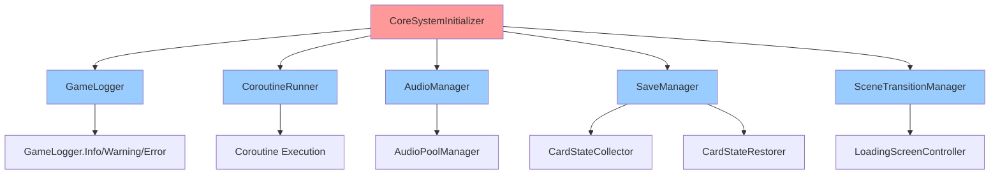
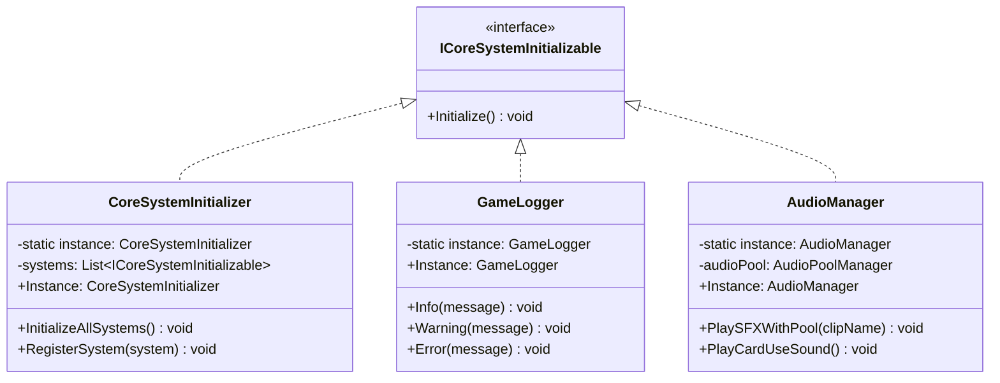
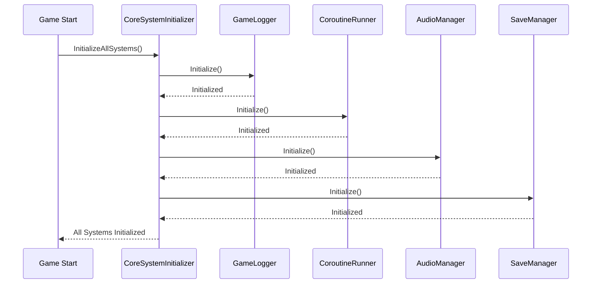

# CoreSystem 개발 문서

## 📋 시스템 개요
CoreSystem은 게임의 핵심 시스템들을 관리하는 중앙 집중식 시스템입니다. 모든 씬에서 공유되는 전역 시스템들을 통합적으로 관리하며, 게임의 기본 기능을 제공합니다.

## 🏗️ 폴더 구조
```
CoreSystem/
├── Manager/          # 코어 매니저 (4개 파일)
├── Audio/           # 오디오 관리 (3개 파일)
├── Save/            # 저장 관리 (1개 파일)
├── Utility/         # 코어 유틸리티 (3개 파일)
├── UI/              # 코어 UI (4개 파일)
├── Interface/       # 코어 인터페이스 (2개 파일)
└── Animation/      # 애니메이션 관리 (2개 파일)
```

## 📁 주요 컴포넌트

### Manager 폴더 (4개 파일)
- **CoreSystemInitializer.cs**: 모든 코어 시스템 초기화
- **SceneTransitionManager.cs**: 씬 전환 관리
- **GameStateManager.cs**: 게임 상태 관리
- **SystemManager.cs**: 시스템 통합 관리

### Audio 폴더 (3개 파일)
- **AudioManager.cs**: 오디오 시스템 관리
- **AudioPoolManager.cs**: 오디오 풀링 관리
- **AudioEventTrigger.cs**: 오디오 이벤트 트리거

### Save 폴더 (1개 파일)
- **SaveManager.cs**: 저장 시스템 관리

### Utility 폴더 (3개 파일)
- **CoroutineRunner.cs**: 코루틴 실행 관리
- **GameLogger.cs**: 게임 로깅 시스템
- **ICoroutineRunner.cs**: 코루틴 러너 인터페이스

### UI 폴더 (4개 파일)
- **LoadingScreenController.cs**: 로딩 화면 컨트롤러
- **SettingsManager.cs**: 설정 관리
- **SettingsPanelController.cs**: 설정 패널 컨트롤러
- **TransitionEffectController.cs**: 전환 효과 컨트롤러

### Interface 폴더 (2개 파일)
- **ICoreSystemInitializable.cs**: 코어 시스템 초기화 인터페이스
- **IPlayerCharacterSelectionManager.cs**: 플레이어 캐릭터 선택 관리 인터페이스

### Animation 폴더 (2개 파일)
- **AnimationDatabaseManager.cs**: 애니메이션 데이터베이스 관리
- **AnimationManager.cs**: 애니메이션 시스템 관리

## 🎯 주요 기능

### 1. 시스템 초기화
- **자동 초기화**: 모든 코어 시스템의 자동 초기화
- **초기화 순서**: 의존성을 고려한 초기화 순서 관리
- **초기화 상태**: 초기화 완료 상태 추적

### 2. 씬 전환 관리
- **씬 로딩**: 씬 로딩 및 전환 처리
- **로딩 화면**: 로딩 중 화면 표시
- **전환 효과**: 씬 전환 시 효과 처리

### 3. 게임 상태 관리
- **전역 상태**: 게임 전체 상태 관리
- **상태 전환**: 게임 상태 간 전환
- **상태 저장**: 게임 상태 저장/로드

### 4. 로깅 시스템
- **카테고리별 로깅**: 시스템별 로그 분류
- **로그 레벨**: 에러, 경고, 정보 등 레벨별 로깅
- **조건부 컴파일**: 릴리즈 빌드에서 로그 제거

### 5. 코루틴 관리
- **중앙화된 실행**: 모든 코루틴을 중앙에서 관리
- **생명주기 관리**: 코루틴의 생성/소멸 관리
- **에러 처리**: 코루틴 실행 중 에러 처리

### 6. 오디오 시스템 통합
- **오디오 풀링**: AudioSource 풀링으로 성능 최적화
- **사운드 중복 방지**: 동일한 사운드의 중복 재생 방지
- **이벤트 기반**: 게임 이벤트와 자동 연동
- **전용 사운드**: 카드 사용, 적 처치 등 전용 사운드 메서드

### 7. 저장 시스템 통합
- **슬레이 더 스파이어 방식**: 턴 기반 자동 저장
- **완전한 카드 상태**: 플레이어/적 핸드, 전투 슬롯, 카드 순환 상태 저장
- **자동 저장 조건**: 특정 게임 이벤트 시 자동 저장
- **상태 복원**: 저장된 상태의 완전한 복원

## 🔧 사용 방법

### 기본 사용법
```csharp
// 코어 시스템 초기화
CoreSystemInitializer.Instance.InitializeAllSystems();

// 씬 전환
SceneTransitionManager.Instance.LoadScene("CombatScene");

// 로깅
GameLogger.Info("시스템 초기화 완료");
GameLogger.Warning("경고 메시지");
GameLogger.Error("에러 발생");

// 코루틴 실행
CoroutineRunner.Instance.StartCoroutine(MyCoroutine());

// 오디오 시스템
AudioManager.Instance.PlaySFXWithPool("CardUse"); // 풀링 사용
AudioManager.Instance.PlayCardUseSound(); // 전용 사운드
AudioEventTrigger.Instance.OnCardUsed(); // 이벤트 기반

// 저장 시스템
SaveManager.Instance.AutoSave(); // 자동 저장
SaveManager.Instance.LoadGame(); // 게임 로드
```

### 시스템 초기화
```csharp
// ICoreSystemInitializable 구현
public class MySystem : MonoBehaviour, ICoreSystemInitializable
{
    public void Initialize()
    {
        // 초기화 로직
    }
}
```

## 🏗️ 아키텍처 패턴

### 1. 싱글톤 패턴 (Singleton Pattern)
- **CoreSystemInitializer**: 시스템 초기화 싱글톤
- **SceneTransitionManager**: 씬 전환 관리 싱글톤
- **GameLogger**: 로깅 시스템 싱글톤

### 2. 팩토리 패턴 (Factory Pattern)
- **시스템 생성**: 각 시스템의 생성 및 초기화
- **씬 생성**: 씬 객체 생성 및 관리

### 3. 옵저버 패턴 (Observer Pattern)
- **이벤트 시스템**: 시스템 간 이벤트 통신
- **상태 변경**: 게임 상태 변경 알림
- **초기화 완료**: 초기화 완료 알림

### 4. 파사드 패턴 (Facade Pattern)
- **CoreSystemInitializer**: 복잡한 초기화 과정을 단순화
- **SceneTransitionManager**: 씬 전환 과정을 단순화

## 🔧 기술적 구현 세부사항

### 성능 최적화
- **메모리 관리**: 싱글톤 패턴으로 인스턴스 중복 생성 방지
- **프레임 최적화**: Update() 메서드 최소화, 이벤트 기반 처리
- **로딩 최적화**: 비동기 씬 로딩, 리소스 캐싱 전략
- **GC 압박 최소화**: 객체 풀링을 통한 메모리 할당 최소화

### 스레드 안전성
- **동시성 제어**: 싱글톤 인스턴스 생성 시 락 사용
- **비동기 처리**: async/await 패턴을 통한 비동기 씬 로딩
- **이벤트 처리**: 스레드 안전한 이벤트 시스템 구현
- **데이터 동기화**: 공유 데이터 접근 시 동기화 메커니즘

### 메모리 관리
- **생명주기 관리**: DontDestroyOnLoad를 통한 전역 객체 관리
- **리소스 해제**: IDisposable 패턴을 통한 리소스 정리
- **메모리 누수 방지**: 이벤트 구독 해제, 순환 참조 방지
- **프로파일링**: Unity Profiler를 통한 메모리 사용량 모니터링

## 🏗️ 시스템 아키텍처

### 의존성 다이어그램


### 클래스 다이어그램


### 시퀀스 다이어그램


## 📚 참고 자료

### 관련 문서
- [Unity MonoBehaviour 생명주기](https://docs.unity3d.com/Manual/ExecutionOrder.html)
- [Zenject 의존성 주입](https://github.com/modesttree/Zenject)
- [Unity 씬 관리](https://docs.unity3d.com/Manual/Scenes.html)


