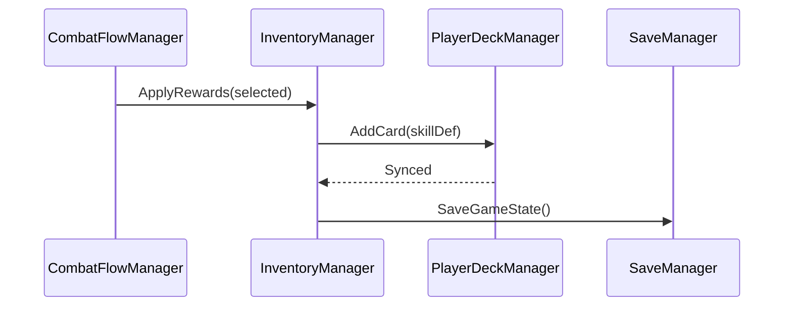

# InventorySystem 개발 문서

## 📋 시스템 개요
InventorySystem은 플레이어의 인벤토리(소지 카드/자원/보상)를 관리하는 시스템입니다. 전투 보상(Rewards) 수령, 스테이지 전환 중 보상 적용, 저장/로드와의 연계를 중심으로 설계됩니다.

### 최근 변경(요약)
- **보상 연계(신규)**: CombatFlowManager의 Rewards 단계와 직접 연동하여 보상 수령/적용
- **스킬카드 연계(신규)**: 획득 카드 → PlayerDeckManager/CardCirculationSystem에 반영
- **저장 연계(신규)**: SaveSystem를 통해 인벤토리 상태를 함께 저장/복원

## 🏗️ 폴더 구조 (실제 파일 수 기준)
```
InventorySystem/
├── InventoryManager.cs
├── InventoryPanelController.cs
├── InventoryRandomizer.cs
└── InventorySlot.cs
```

## 스크립트 목록(1:1 매핑)
- InventorySystem/InventoryManager.cs
- InventorySystem/InventoryPanelController.cs
- InventorySystem/InventoryRandomizer.cs
- InventorySystem/InventorySlot.cs

## 📁 주요 컴포넌트
- **InventoryManager**: 인벤토리 데이터/갱신/이벤트 허브
- **InventoryPanelController**: UI 표시 및 갱신(보상 미리보기/수령 확인)
- **InventoryRandomizer**: 보상 후보 셔플/선정 유틸리티
- **InventorySlot**: UI 슬롯(아이콘/수량/툴팁)

## 🎯 주요 기능
1. **보상 수령**: CombatFlowManager의 Rewards 단계에서 선택된 보상 적용
2. **카드 획득 반영**: SkillCardDefinition 획득 시 PlayerDeckManager에 등록, 순환 시스템 동기화
3. **자원/골드 관리**: 수치형 리소스 증감 및 UI 갱신
4. **저장/로드 연계**: SaveSystem 호출로 인벤토리 상태 직렬화/복원

## 🔧 사용 방법
```csharp
// 보상 수령(CombatFlowManager → InventoryManager)
inventoryManager.ApplyRewards(selectedRewards);

// 카드 보상 반영
inventoryManager.AddCardReward(skillCardDefinition);

// 저장 연계
saveManager.SaveGameState();
```

## 이벤트 연계
- **Rewards 수령**: CombatFlowManager.OnRewardsSelected → InventoryManager.ApplyRewards
- **카드 추가**: InventoryManager.OnCardAdded → PlayerDeckManager.SyncCirculation()
- **저장 트리거**: SaveEventTrigger.OnStageCompleted/OnCardExecutionCompleted 이후 호출 권장

## UI 규칙
- 보상 리스트는 선택 시 하이라이트, 수령 버튼 확인 후 비활성
- DOTween으로 페이드/스케일 연출, SafeMode 유지
- CanvasGroup으로 상호작용 제어

## 저장 항목(권장)
- 보유 카드 ID 목록, 수량(필요 시)
- 골드/자원 수치
- 최근 수령 보상 기록(옵션)

## 🏗️ 시스템 아키텍처


## 📝 변경 기록(Delta)
- 2025-09-23 | Maintainer | 초기 문서 작성, 보상/저장/스킬카드 연계 규칙 정립 | 문서
