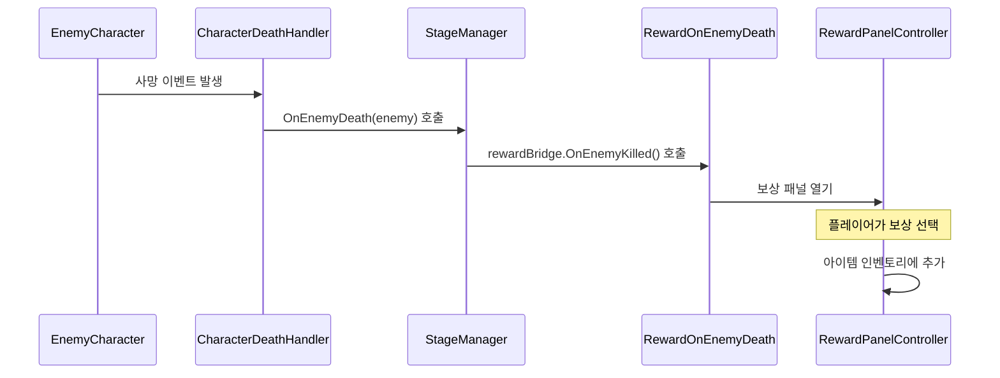

# RewardSystem 사용법

## 📋 개요
RougeShool 프로젝트의 적 처치 보상 시스템은 **ItemSystem**을 기반으로 작동합니다.
기존의 미완성된 StageSystem 보상은 제거되고, 실제 작동하는 ItemSystem 보상만 남겨두었습니다.

## 🎯 보상 시스템 구조

### 주요 컴포넌트
- **RewardOnEnemyDeath**: 적 처치 시 보상 패널을 여는 브리지 컴포넌트
- **RewardPanelController**: 보상 패널 UI 관리
- **IRewardGenerator**: 보상 생성 로직 (Optional)
- **EnemyRewardConfig**: 적별 보상 설정
- **PlayerRewardProfile**: 플레이어 타입별 보상 프로필

### 보상 타입
- **액티브 아이템**: 사용 가능한 아이템
- **패시브 아이템**: 지속 효과 아이템

## 🔄 보상 지급 흐름



## 🛠️ 설정 방법

### 1. StageManager 설정
```csharp
[Header("🎁 보상 UI 브리지 (선택)")]
[SerializeField] private RewardOnEnemyDeath rewardBridge;
```

### 2. RewardOnEnemyDeath 설정
```csharp
[Header("보상 구성 참조")]
[SerializeField] private EnemyRewardConfig enemyRewardConfig;
[SerializeField] private PlayerRewardProfile playerRewardProfile;
[SerializeField] private RewardProfile rewardProfile;
[SerializeField] private RewardPanelController rewardPanel;

[Header("표시 모드")]
[SerializeField] private RewardDisplayMode displayMode = RewardDisplayMode.Combined;
```

### 3. 보상 표시 모드
- **ActiveOnly**: 액티브 아이템만 표시
- **PassiveOnly**: 패시브 아이템만 표시
- **Combined**: 액티브 + 패시브 모두 표시

## 🎮 플레이어 타입별 보상

### 자동 프로필 선택
```csharp
switch (data.CharacterType)
{
    case PlayerCharacterType.Sword:
        return swordPlayerRewardProfile ?? playerRewardProfile;
    case PlayerCharacterType.Bow:
        return bowPlayerRewardProfile ?? playerRewardProfile;
    case PlayerCharacterType.Staff:
        return staffPlayerRewardProfile ?? playerRewardProfile;
    default:
        return playerRewardProfile;
}
```

## ⚠️ 에러 처리

### 필수 컴포넌트 누락 시
- **RewardPanelController 없음**: 경고 로그 출력 후 종료
- **EnemyRewardConfig 없음**: 경고 로그 출력 후 종료
- **IRewardGenerator 없음**: 기본 보상 패널 열기 (Toggle)

### 로깅
```csharp
GameLogger.LogWarning("[RewardOnEnemyDeath] RewardPanelController가 설정되지 않았습니다", GameLogger.LogCategory.UI);
GameLogger.LogWarning("[RewardOnEnemyDeath] EnemyRewardConfig가 설정되지 않았습니다", GameLogger.LogCategory.UI);
GameLogger.LogWarning("[RewardOnEnemyDeath] IRewardGenerator가 주입되지 않았습니다. 기본 보상 패널을 엽니다.", GameLogger.LogCategory.UI);
```

## 🔧 사용 예시

### 기본 사용법
```csharp
// StageManager에서 적 처치 시 자동 호출
public void OnEnemyDeath(ICharacter enemy)
{
    // 보상 UI 열기 (설정된 경우)
    if (rewardBridge != null)
    {
        rewardBridge.OnEnemyKilled();
    }
}
```

### 런타임 컨텍스트 설정
```csharp
// 스테이지 인덱스와 런 시드 설정
rewardBridge.SetContext(stageIndex, runSeed);
```

## 📝 변경 사항

### 제거된 컴포넌트
- ❌ `IStageRewardManager` 인터페이스
- ❌ `StageRewardData` ScriptableObject
- ❌ `CardCirculationSystem.GiveEnemyDefeatCardRewards()` 메서드

### 개선된 기능
- ✅ 더 나은 에러 처리
- ✅ 상세한 로깅
- ✅ IRewardGenerator 없을 때 폴백 처리
- ✅ 에디터에서 설정 검증

## 🎯 결론

현재 보상 시스템은 **ItemSystem**의 `RewardOnEnemyDeath` 컴포넌트를 통해 작동하며, 적 처치 시 자동으로 보상 패널이 열려 플레이어가 아이템을 선택할 수 있습니다. 시스템은 플레이어 타입별 맞춤 보상을 제공하며, 액티브/패시브 아이템을 선택적으로 표시할 수 있습니다.
