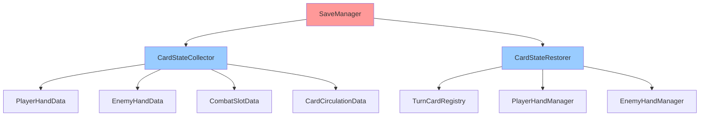
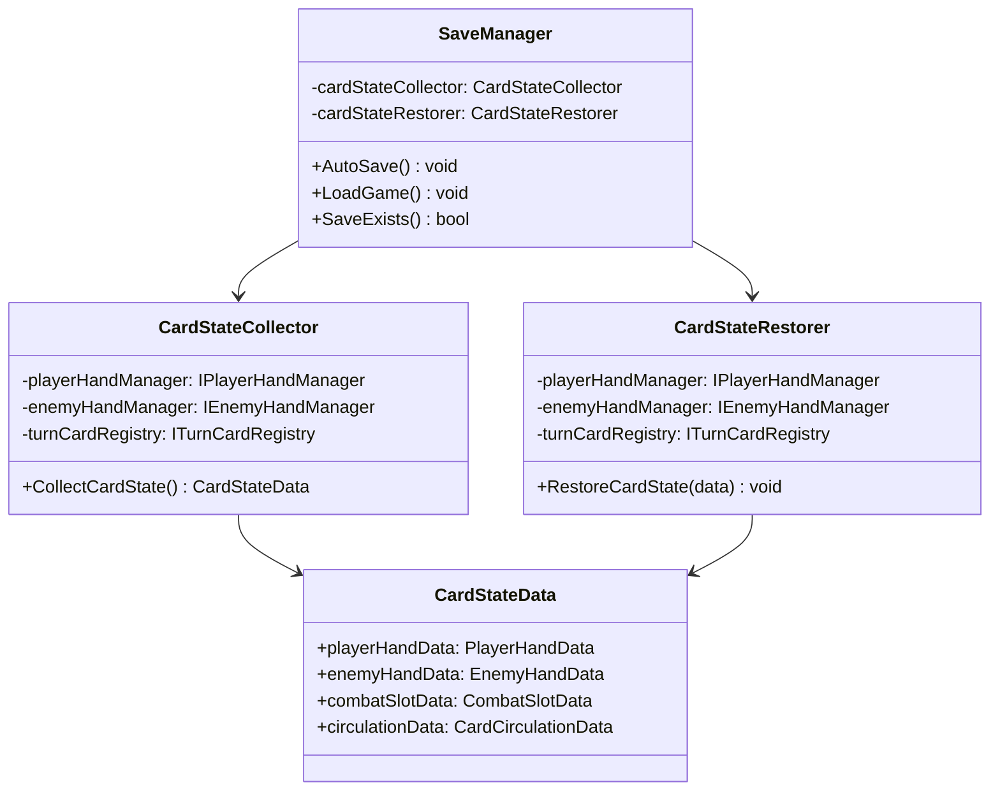
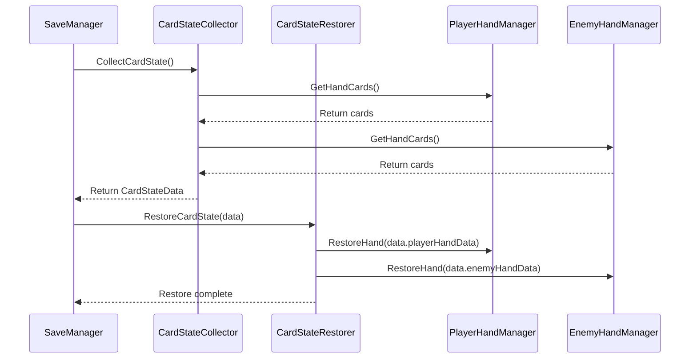

# SaveSystem 개발 문서

## 📋 시스템 개요
SaveSystem은 게임의 저장/로드 기능을 관리하는 시스템입니다. 슬레이 더 스파이어 방식의 턴 기반 자동 저장 시스템을 제공합니다.

## 🏗️ 현재 폴더 구조 (리팩토링 후)
```
SaveSystem/
├── Manager/           # 저장 매니저 (3개 파일) - 신규
├── Interface/         # 저장 인터페이스 (2개 파일) - 신규
├── Data/              # 저장 데이터 (3개 파일) - 신규
└── Event/             # 저장 이벤트 (2개 파일) - 신규
```

## 📁 실제 구현 위치
```
CoreSystem/Save/
└── SaveManager.cs     # 실제 저장 매니저 구현 (확장됨)

SaveSystem/ (새로운 구조)
├── Manager/
│   ├── CardStateCollector.cs    # 카드 상태 수집
│   ├── CardStateRestorer.cs     # 카드 상태 복원
│   └── SaveManager.cs           # 저장 매니저
├── Interface/
│   ├── ISaveManager.cs          # 저장 매니저 인터페이스
│   └── ICardStateManager.cs     # 카드 상태 관리 인터페이스
├── Data/
│   ├── CompleteCardStateData.cs # 완전한 카드 상태 데이터
│   ├── PlayerHandData.cs        # 플레이어 핸드 데이터
│   └── EnemyHandData.cs         # 적 핸드 데이터
└── Event/
    ├── SaveEventTrigger.cs      # 저장 이벤트 트리거
    └── AutoSaveTrigger.cs       # 자동 저장 트리거
```

## 📊 SaveManager.cs 분석

### 주요 기능 (리팩토링 후)
- **슬레이 더 스파이어 방식**: 턴 기반 자동 저장 시스템
- **완전한 카드 상태**: 플레이어/적 핸드, 전투 슬롯, 카드 순환 상태 저장
- **자동 저장 조건**: 특정 게임 이벤트 시 자동 저장
- **상태 복원**: 저장된 상태의 완전한 복원
- **JSON 기반 저장**: JsonUtility를 활용한 데이터 직렬화
- **데이터 검증**: 저장된 데이터의 유효성 검증

### 주요 메서드 (리팩토링 후)
- `SaveGameState()`: 게임 상태 저장 (신규)
- `LoadGameState()`: 게임 상태 로드 (신규)
- `AutoSave()`: 자동 저장 (신규)
- `SaveCardState()`: 카드 상태 저장 (신규)
- `RestoreCardState()`: 카드 상태 복원 (신규)
- `SaveSceneData(string sceneName)`: 씬 데이터 저장 (유지)
- `LoadSceneData(string sceneName)`: 씬 데이터 로드 (유지)
- `SaveToFile(string fileName, string data)`: 파일로 저장 (유지)
- `LoadFromFile(string fileName)`: 파일에서 로드 (유지)

### 데이터 구조 (리팩토링 후)
```csharp
[System.Serializable]
public class CompleteCardStateData
{
    public PlayerHandData playerHand;           // 플레이어 핸드 상태
    public EnemyHandData enemyHand;            // 적 핸드 상태
    public CombatSlotData combatSlots;         // 전투 슬롯 상태
    public CardCirculationData circulation;    // 카드 순환 상태
    public GameStateData gameState;            // 게임 상태
    public string saveTime;                    // 저장 시간
}

[System.Serializable]
public class PlayerHandData
{
    public List<string> cardIds;              // 카드 ID 목록
    public List<Vector2> cardPositions;       // 카드 위치
}

[System.Serializable]
public class EnemyHandData
{
    public List<string> cardIds;              // 카드 ID 목록
    public List<Vector2> cardPositions;       // 카드 위치
}

[System.Serializable]
public class CombatSlotData
{
    public string firstSlotCardId;             // 첫 번째 슬롯 카드
    public string secondSlotCardId;            // 두 번째 슬롯 카드
    public SlotOwner firstSlotOwner;           // 첫 번째 슬롯 소유자
    public SlotOwner secondSlotOwner;          // 두 번째 슬롯 소유자
}

[System.Serializable]
public class CardCirculationData
{
    public List<string> unusedCards;          // 사용하지 않은 카드들
    public List<string> usedCards;            // 사용된 카드들
}

[System.Serializable]
public class GameStateData
{
    public int currentTurn;                   // 현재 턴
    public bool isEnemyFirst;                 // 적 선공 여부
    public string currentPhase;               // 현재 페이즈
}
```

## 🎯 시스템 특징

### 장점 (리팩토링 후)
1. **슬레이 더 스파이어 방식**: 턴 기반 자동 저장으로 게임 진행 중 언제든 복원 가능
2. **완전한 상태 저장**: 플레이어/적 핸드, 전투 슬롯, 카드 순환 등 모든 상태 저장
3. **자동 저장 조건**: 특정 게임 이벤트 시 자동 저장으로 데이터 손실 방지
4. **JSON 기반**: 가독성 좋은 데이터 형식
5. **CoreSystem 통합**: 전역 시스템으로 완전 통합
6. **데이터 검증**: 저장된 데이터의 유효성 검증 강화

### 개선사항
1. **폴더 구조 정리**: SaveSystem 폴더는 문서용, 실제 구현은 CoreSystem/Save
2. **기능 확장**: 카드 상태 관리, 자동 저장 트리거 등 새로운 기능 추가
3. **성능 최적화**: 필요한 데이터만 저장하여 성능 개선
4. **타입 안전성**: 강타입 데이터 구조로 타입 안전성 향상

## 🔧 사용 방법

### 기본 사용법 (리팩토링 후)
```csharp
// 게임 상태 저장 (신규)
SaveManager.Instance.SaveGameState();

// 게임 상태 로드 (신규)
SaveManager.Instance.LoadGameState();

// 자동 저장 (신규)
SaveManager.Instance.AutoSave();

// 카드 상태 저장 (신규)
SaveManager.Instance.SaveCardState();

// 카드 상태 복원 (신규)
SaveManager.Instance.RestoreCardState();

// 씬 데이터 저장 (유지)
SaveManager.Instance.SaveSceneData("CombatScene");

// 씬 데이터 로드 (유지)
SaveManager.Instance.LoadSceneData("CombatScene");
```

### 자동 저장 트리거 사용법 (신규)
```csharp
// 특정 이벤트 시 자동 저장
AutoSaveTrigger.Instance.OnEnemyCardPlaced();    // 적 카드 배치 시
AutoSaveTrigger.Instance.OnBeforePlayerTurn();   // 플레이어 턴 시작 전
AutoSaveTrigger.Instance.OnTurnExecution();      // 턴 실행 중
AutoSaveTrigger.Instance.OnTurnCompleted();       // 턴 완료 시
AutoSaveTrigger.Instance.OnStageCompleted();      // 스테이지 완료 시
AutoSaveTrigger.Instance.OnGameExit();            // 게임 종료 시
```

### 커스텀 데이터 저장
```csharp
// 커스텀 컴포넌트 데이터 저장
public class CustomComponent : MonoBehaviour
{
    public void SaveData()
    {
        var data = new ComponentData
        {
            componentType = "CustomComponent",
            data = JsonUtility.ToJson(customData)
        };
        // SaveManager에 전달
    }
}
```

## 🔧 기술적 구현 세부사항

### 성능 최적화
- **메모리 관리**: 저장 데이터 직렬화 시 메모리 효율성
- **프레임 최적화**: 비동기 저장/로드로 프레임 블로킹 방지
- **로딩 최적화**: 저장 데이터 사전 로딩 및 캐싱
- **압축**: 저장 데이터 압축을 통한 용량 최적화

### 스레드 안전성
- **동시성 제어**: 저장/로드 시 락을 통한 동시성 제어
- **비동기 처리**: async/await 패턴을 통한 비동기 저장/로드
- **이벤트 처리**: 스레드 안전한 저장 이벤트 시스템
- **데이터 동기화**: 저장 데이터 동기화

### 메모리 관리
- **생명주기 관리**: 저장 데이터 객체의 생성/소멸 관리
- **리소스 해제**: 저장 완료 후 리소스 정리
- **메모리 누수 방지**: 이벤트 구독 해제, 데이터 참조 해제
- **프로파일링**: 저장 시스템 메모리 사용량 모니터링

## 🏗️ 시스템 아키텍처

### 의존성 다이어그램


### 클래스 다이어그램


### 시퀀스 다이어그램


## 📚 참고 자료

### 관련 문서
- [Unity JsonUtility](https://docs.unity3d.com/Manual/JSONSerialization.html)
- [파일 I/O](https://docs.microsoft.com/ko-kr/dotnet/api/system.io.file)
- [슬레이 더 스파이어](https://www.mobygames.com/game/slay-the-spire)


