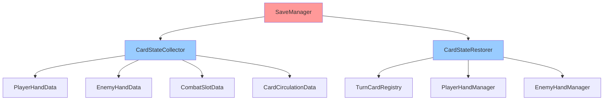
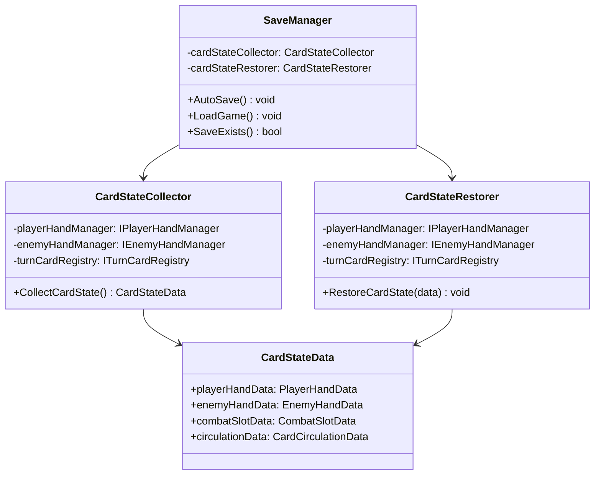
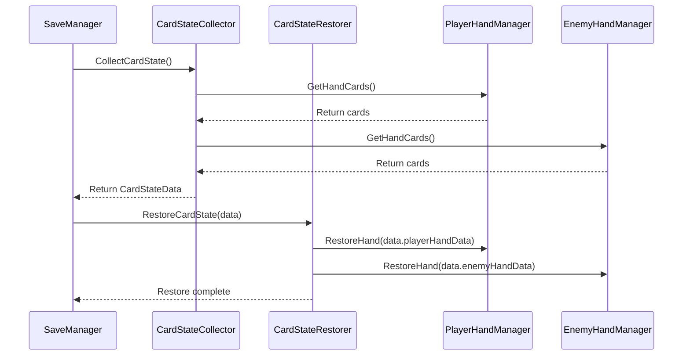

# SaveSystem 개발 문서

## 📋 시스템 개요
SaveSystem은 게임의 저장/로드 기능을 관리하는 시스템입니다. 슬레이 더 스파이어 방식의 턴 기반 자동 저장 시스템을 제공합니다. CoreSystem에 통합되어 전역적으로 관리되며, ICoreSystemInitializable 인터페이스를 구현하여 자동 초기화됩니다.

### 최근 변경(요약)
- **로깅 시스템 표준화**: Debug.Log를 GameLogger로 전환 완료
- **AnimationSystem 참조 정리**: 남은 AnimationSystem 참조 완전 제거 완료
- **CoreSystem 통합**: SaveManager가 CoreSystem의 일부로 통합 관리 완료
- **Zenject DI 통합**: SaveManager가 의존성 주입으로 전환 완료
- **자동 초기화**: ICoreSystemInitializable 인터페이스 구현으로 자동 초기화 완료
- **새로운 슬롯 시스템 반영**: 모든 저장/복원 로직이 새로운 5슬롯 시스템으로 업데이트 완료
- **레거시 슬롯 최적화**: SLOT_1/SLOT_2 → BATTLE_SLOT/WAIT_SLOT_1 전환 완료
- **컴파일 에러 해결**: 모든 SaveSystem 관련 컴파일 에러 해결 완료
- **TurnManager 연계 강화(신규)**: 턴/큐 진행 이벤트 기반 자동 저장(초기 큐 셋업 완료, 턴 전환, 카드 실행 완료)
- **적 핸드 제거 반영(신규)**: 적 핸드 데이터/매니저 완전 제거, 적 카드는 대기큐에서만 관리
- **데이터 구조 정합화(신규)**: 전투 슬롯 상태를 BATTLE/WAIT1~4 + 소유자/카드ID로 저장, PLAYER_MARKER 지원

## 🏗️ 폴더 구조 (실제 파일 수 기준)
```
SaveSystem/
├── Manager/           # 저장 매니저 (4개 파일)
│   ├── AutoSaveManager.cs
│   ├── BaseSaveManager.cs
│   ├── CardStateCollector.cs
│   └── CardStateRestorer.cs
├── Interface/         # 저장 인터페이스 (3개 파일)
│   ├── IAutoSaveManager.cs
│   ├── ICardStateCollector.cs
│   └── ICardStateRestorer.cs
├── Data/              # 저장 데이터 (3개 파일)
│   ├── AutoSaveCondition.cs
│   ├── CardSlotData.cs
│   └── CompleteCardStateData.cs
├── Event/             # 저장 이벤트 (1개 파일)
│   └── SaveEventTrigger.cs
└── SaveSystem_개발문서.md
```

## 스크립트 목록(1:1 매핑)
- SaveSystem/Manager/CardStateRestorer.cs
- SaveSystem/Manager/CardStateCollector.cs
- SaveSystem/Manager/AutoSaveManager.cs
- SaveSystem/Manager/BaseSaveManager.cs
- SaveSystem/Interface/IAutoSaveManager.cs
- SaveSystem/Interface/ICardStateRestorer.cs
- SaveSystem/Interface/ICardStateCollector.cs
- SaveSystem/Data/CompleteCardStateData.cs
- SaveSystem/Event/SaveEventTrigger.cs
- SaveSystem/Data/CardSlotData.cs
- SaveSystem/Data/AutoSaveCondition.cs

## 📁 실제 구현 위치
```
CoreSystem/Save/
└── SaveManager.cs     # 실제 저장 매니저 구현 (확장됨)

SaveSystem/ (새로운 구조)
├── Manager/
│   ├── AutoSaveManager.cs       # 자동 저장 매니저
│   ├── CardStateCollector.cs    # 카드 상태 수집
│   └── CardStateRestorer.cs     # 카드 상태 복원
├── Interface/
│   ├── ICardStateCollector.cs   # 카드 상태 수집 인터페이스
│   └── ICardStateRestorer.cs    # 카드 상태 복원 인터페이스
├── Data/
│   ├── AutoSaveCondition.cs     # 자동 저장 조건
│   ├── CardSlotData.cs          # 카드 슬롯 데이터
│   └── CompleteCardStateData.cs # 완전한 카드 상태 데이터
└── Event/
    └── SaveEventTrigger.cs      # 저장 이벤트 트리거
```

## 📊 SaveManager.cs 분석

### 주요 기능 (리팩토링 후)
- **슬레이 더 스파이어 방식**: 턴 기반 자동 저장 시스템
- **완전한 카드 상태**: 플레이어/적 핸드, 전투 슬롯, 카드 순환 상태 저장
- **자동 저장 조건**: 특정 게임 이벤트 시 자동 저장
- **상태 복원**: 저장된 상태의 완전한 복원
- **JSON 기반 저장**: JsonUtility를 활용한 데이터 직렬화
- **데이터 검증**: 저장된 데이터의 유효성 검증

### 주요 메서드 (실제 구현)
- `SaveGameState()`: 게임 상태 저장 (신규)
- `LoadGameState()`: 게임 상태 로드 (신규)
- `AutoSave()`: 자동 저장 (신규)
- `SaveCardState()`: 카드 상태 저장 (신규)
- `RestoreCardState()`: 카드 상태 복원 (신규)
- `SaveSceneData(string sceneName)`: 씬 데이터 저장 (유지)
- `LoadSceneData(string sceneName)`: 씬 데이터 로드 (유지)
- `SaveToFile(string fileName, string data)`: 파일로 저장 (유지)
- `LoadFromFile(string fileName)`: 파일에서 로드 (유지)

## 📊 주요 클래스 및 메서드

### AutoSaveManager 클래스
- **TriggerAutoSave(string conditionName)**: 특정 조건으로 자동 저장 트리거
- **SaveGameState(string saveName)**: 수동 게임 상태 저장 (async)
- **LoadGameState(string filePath)**: 저장된 게임 상태 로드 (async)
- **AddAutoSaveCondition(string name, AutoSaveTrigger trigger, string description)**: 자동 저장 조건 추가
- **RemoveAutoSaveCondition(string name)**: 자동 저장 조건 제거
- **UpdateAutoSaveCondition(string name, bool enabled)**: 자동 저장 조건 업데이트
- **InitializeAutoSaveConditions()**: 자동 저장 조건 초기화
- **AddDefaultAutoSaveConditions()**: 기본 자동 저장 조건 추가
- **IsAutoSaveEnabled**: 자동 저장 활성화 여부 (프로퍼티)

### SaveEventTrigger 클래스
- **OnInitialQueueSetupCompleted()**: 전투/대기 슬롯 초기 셋업 완료 시
- **OnTurnChanged()**: 턴 전환 직후
- **OnCardExecutionCompleted()**: 배틀 슬롯 카드 실행 완료 직후
- **OnStageCompleted()**: 스테이지 완료 후
- **OnStageFailed()**: 스테이지 실패 후
- **OnCombatStart()**: 전투 시작 시
- **OnCombatEnd()**: 전투 종료 시

### CompleteCardStateData 클래스
- **playerHandSlots**: 플레이어 핸드카드 슬롯 목록 (프로퍼티)
- **firstSlotCard**: 첫 번째 전투 슬롯 카드 (프로퍼티)
- **secondSlotCard**: 두 번째 전투 슬롯 카드 (프로퍼티)
- **unusedStorageCards**: 미사용 카드 저장소 (프로퍼티) - 보관함 시스템 제거됨
- **usedStorageCards**: 사용된 카드 저장소 (프로퍼티) - 보관함 시스템 제거됨
- **isPlayerFirst**: 플레이어 선공 여부 (프로퍼티)
- **IsValid()**: 데이터 유효성 검증
- **GetSaveTime()**: 저장 시간 반환
- **SetSaveTime()**: 저장 시간 설정
- **적 핸드 관련 필드 제거됨**: `enemyHandSlots` 필드 제거, 적 카드는 대기 슬롯에서 직접 관리

### AutoSaveCondition 클래스
- **conditionName**: 조건 이름 (프로퍼티)
- **trigger**: 저장 트리거 타입 (프로퍼티)
- **isEnabled**: 활성화 여부 (프로퍼티)
- **description**: 조건 설명 (프로퍼티)
- **IsValid()**: 조건 유효성 검증
- **ToString()**: 조건 정보를 문자열로 반환

### AutoSaveTrigger 열거형
- **Manual**: 수동 저장
- **TurnComplete**: 턴 완료 시
- **StageComplete**: 스테이지 완료 시
- **CombatStart**: 전투 시작 시
- **CombatEnd**: 전투 종료 시
- **EnemyCardPlaced**: 적 카드 배치 시
- **BeforeTurnStart**: 턴 시작 전
- **DuringTurnExecution**: 턴 실행 중

### 데이터 구조 (리팩토링 후)
```csharp
[System.Serializable]
public class CompleteCardStateData
{
    public PlayerHandData playerHand;           // 플레이어 핸드 상태
    public CombatSlotData combatSlots;          // 전투/대기 슬롯 상태
    public CardCirculationData circulation;     // 카드 순환 상태
    public GameStateData gameState;             // 게임 상태(턴/큐 메타)
    public string saveTime;                     // 저장 시간
}

[System.Serializable]
public class PlayerHandData
{
    public List<string> cardIds;              // 카드 ID 목록
    public List<Vector2> cardPositions;       // 카드 위치
}

[System.Serializable]
public class CombatSlotData
{
    public string battleSlotCardId;            // 배틀 슬롯 카드ID (또는 PLAYER_MARKER)
    public SlotOwner battleSlotOwner;          // 배틀 슬롯 소유자
    public string wait1CardId;                 // 대기 1 슬롯 카드ID
    public SlotOwner wait1Owner;               // 대기 1 슬롯 소유자
    public string wait2CardId;                 // 대기 2 슬롯 카드ID
    public SlotOwner wait2Owner;               // 대기 2 슬롯 소유자
    public string wait3CardId;                 // 대기 3 슬롯 카드ID
    public SlotOwner wait3Owner;               // 대기 3 슬롯 소유자
    public string wait4CardId;                 // 대기 4 슬롯 카드ID
    public SlotOwner wait4Owner;               // 대기 4 슬롯 소유자
}

[System.Serializable]
public class CardCirculationData
{
    public List<string> unusedCards;          // 사용하지 않은 카드들
    public List<string> usedCards;            // 사용된 카드들
}

[System.Serializable]
public class GameStateData
{
    public int turnCount;                     // 현재 턴 수(1부터 증가)
    public string currentTurn;                // "Player" 또는 "Enemy"
    public bool nextSpawnIsPlayer;            // 대기4 교대 스폰 여부
    public bool initialQueueSetupCompleted;   // 초기 큐 셋업 완료 여부
    public string flowState;                  // CombatFlowManager 메타 상태
}
```

## 🎯 시스템 특징

### 장점 (리팩토링 후)
1. **슬레이 더 스파이어 방식**: 턴 기반 자동 저장으로 게임 진행 중 언제든 복원 가능
2. **완전한 상태 저장**: 플레이어/적 핸드, 전투 슬롯, 카드 순환 등 모든 상태 저장
3. **자동 저장 조건**: 특정 게임 이벤트 시 자동 저장으로 데이터 손실 방지
4. **JSON 기반**: 가독성 좋은 데이터 형식
5. **CoreSystem 통합**: 전역 시스템으로 완전 통합
6. **데이터 검증**: 저장된 데이터의 유효성 검증 강화

### 개선사항
1. **폴더 구조 정리**: SaveSystem 폴더는 문서용, 실제 구현은 CoreSystem/Save
2. **기능 확장**: 카드 상태 관리, 자동 저장 트리거 등 새로운 기능 추가
3. **성능 최적화**: 필요한 데이터만 저장하여 성능 개선
4. **타입 안전성**: 강타입 데이터 구조로 타입 안전성 향상

## 🔧 사용 방법

### 기본 사용법
```csharp
// AutoSaveManager를 통한 자동 저장
AutoSaveManager autoSaveManager = FindObjectOfType<AutoSaveManager>();

// 특정 조건으로 자동 저장 트리거
autoSaveManager.TriggerAutoSave("EnemyCardPlaced");
autoSaveManager.TriggerAutoSave("TurnCompleted");

// 수동 저장
await autoSaveManager.SaveGameState("ManualSave");

// 게임 상태 로드
autoSaveManager.LoadGameState("ManualSave_20250127_143022.json");

// 자동 저장 조건 관리
autoSaveManager.AddAutoSaveCondition("CustomCondition", AutoSaveTrigger.Manual, "커스텀 조건");
autoSaveManager.RemoveAutoSaveCondition("CustomCondition");
autoSaveManager.UpdateAutoSaveCondition("TurnCompleted", true);
```

### SaveEventTrigger를 통한 이벤트 기반 저장
```csharp
// SaveEventTrigger를 통한 자동 저장 트리거
SaveEventTrigger saveEventTrigger = FindObjectOfType<SaveEventTrigger>();

// 턴 관련 이벤트
saveEventTrigger.OnEnemyCardPlaced();        // 적 카드 배치 후
saveEventTrigger.OnTurnStartButtonPressed(); // 턴 시작 버튼 누르기 전
saveEventTrigger.OnTurnExecution();          // 턴 실행 중
saveEventTrigger.OnTurnCompleted();          // 턴 완료 후

// 스테이지 관련 이벤트
saveEventTrigger.OnStageCompleted();         // 스테이지 완료 후
saveEventTrigger.OnStageFailed();            // 스테이지 실패 후

// 전투 관련 이벤트
saveEventTrigger.OnCombatStart();            // 전투 시작 시
saveEventTrigger.OnCombatEnd();              // 전투 종료 시
```

### 데이터 구조 사용법
```csharp
// CompleteCardStateData 생성 및 사용
CompleteCardStateData cardState = new CompleteCardStateData();

// 플레이어 핸드카드 설정
cardState.playerHand = new PlayerHandData
{
    cardIds = new List<string> { "player_card_001", "player_card_002", "player_card_003" },
    cardPositions = new List<Vector2> { Vector2.zero, new Vector2(100, 0), new Vector2(200, 0) }
};

// 전투/대기 슬롯 카드 설정
cardState.combatSlots = new CombatSlotData
{
    battleSlotCardId = "PLAYER_MARKER",
    battleSlotOwner = SlotOwner.PLAYER,
    wait4CardId = "enemy_skill_101",
    wait4Owner = SlotOwner.ENEMY
};

// 카드 순환 상태 설정
cardState.circulation = new CardCirculationData
{
    unusedCards = new List<string> { "enemy_skill_101", "enemy_skill_102" },
    usedCards = new List<string> { "player_skill_001" }
};

// 턴 상태 설정
cardState.gameState = new GameStateData
{
    turnCount = 1,
    currentTurn = "Player",
    nextSpawnIsPlayer = false,
    initialQueueSetupCompleted = true,
    flowState = "InCombat"
};

// 데이터 유효성 검증
if (cardState.IsValid())
{
    Debug.Log("카드 상태 데이터가 유효합니다.");
}
```

### AutoSaveCondition 관리
```csharp
// 자동 저장 조건 생성
AutoSaveCondition condition = new AutoSaveCondition(
    "TurnCompleted", 
    AutoSaveTrigger.TurnComplete, 
    "턴 완료 시 자동 저장"
);

// 조건 유효성 확인
if (condition.IsValid())
{
    Debug.Log($"조건 '{condition.conditionName}'이 유효합니다.");
}

// 조건 정보 출력
Debug.Log(condition.ToString());
```

### 자동 저장 트리거 사용법 (신규)
```csharp
// 특정 이벤트 시 자동 저장
AutoSaveTrigger.Instance.OnInitialQueueSetupCompleted(); // 초기 큐 셋업 완료
AutoSaveTrigger.Instance.OnTurnChanged();                 // 턴 전환 직후
AutoSaveTrigger.Instance.OnCardExecutionCompleted();      // 카드 실행 완료 직후
AutoSaveTrigger.Instance.OnStageCompleted();              // 스테이지 완료 시
AutoSaveTrigger.Instance.OnGameExit();                    // 게임 종료 시
```

### 커스텀 데이터 저장
```csharp
// 커스텀 컴포넌트 데이터 저장
public class CustomComponent : MonoBehaviour
{
    public void SaveData()
    {
        var data = new ComponentData
        {
            componentType = "CustomComponent",
            data = JsonUtility.ToJson(customData)
        };
        // SaveManager에 전달
    }
}
```

## 🔧 기술적 구현 세부사항

### 성능 최적화
- **메모리 관리**: 저장 데이터 직렬화 시 메모리 효율성
- **프레임 최적화**: 비동기 저장/로드로 프레임 블로킹 방지
- **로딩 최적화**: 저장 데이터 사전 로딩 및 캐싱
- **압축**: 저장 데이터 압축을 통한 용량 최적화

### 스레드 안전성
- **동시성 제어**: 저장/로드 시 락을 통한 동시성 제어
- **비동기 처리**: async/await 패턴을 통한 비동기 저장/로드
- **이벤트 처리**: 스레드 안전한 저장 이벤트 시스템
- **데이터 동기화**: 저장 데이터 동기화

### 메모리 관리
- **생명주기 관리**: 저장 데이터 객체의 생성/소멸 관리
- **리소스 해제**: 저장 완료 후 리소스 정리
- **메모리 누수 방지**: 이벤트 구독 해제, 데이터 참조 해제
- **프로파일링**: 저장 시스템 메모리 사용량 모니터링

## 🏗️ 시스템 아키텍처

### 의존성 다이어그램


### 클래스 다이어그램


### 시퀀스 다이어그램


## 📚 참고 자료

### 관련 문서
- [Unity JsonUtility](https://docs.unity3d.com/Manual/JSONSerialization.html)
- [파일 I/O](https://docs.microsoft.com/ko-kr/dotnet/api/system.io.file)
- [슬레이 더 스파이어](https://www.mobygames.com/game/slay-the-spire)

## 📝 변경 기록(Delta)
- 형식: `YYYY-MM-DD | 작성자 | 변경 요약 | 영향도(코드/씬/문서)`

- 2025-01-27 | Maintainer | SaveSystem 개발 문서 초기 작성 | 문서
- 2025-01-27 | Maintainer | 실제 폴더 구조 반영 및 파일 수 정정 | 문서
- 2025-01-27 | Maintainer | 실제 코드 분석 기반 구체적 클래스/메서드/데이터 구조 정보 추가 | 문서
- 2025-01-27 | Maintainer | 적 핸드 매니저 시스템 제거, 저장 데이터 구조 간소화, 인터페이스 간소화 완료 | 코드/문서
- 2025-01-27 | Maintainer | AnimationSystem 의존성 완전 제거 및 컴파일 에러 해결 | 코드/문서
