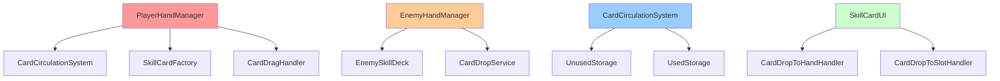
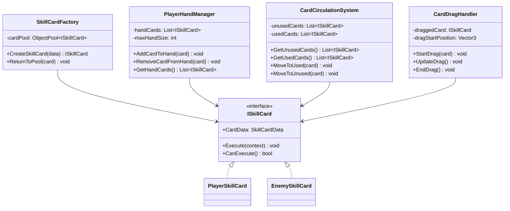
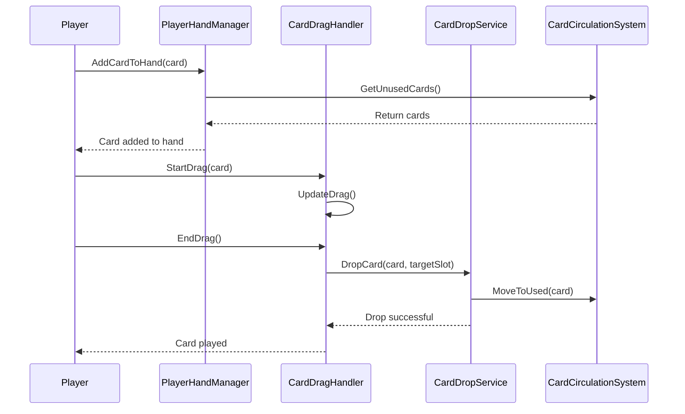

# SkillCardSystem 개발 문서

## 📋 시스템 개요
SkillCardSystem은 게임의 스킬카드 시스템을 관리하는 핵심 시스템입니다. 카드 데이터, 효과, 실행, 검증, UI, 드래그 앤 드롭, 슬롯 관리 등을 통합적으로 관리합니다.

## 🏗️ 폴더 구조
```
SkillCardSystem/
├── Core/             # 핵심 로직 (2개 파일)
├── Data/             # 카드 데이터 (3개 파일)
├── Deck/             # 덱 관리 (3개 파일)
├── DragDrop/         # 드래그 앤 드롭 (3개 파일)
├── Effect/           # 효과 구현 (12개 파일)
├── Executor/         # 실행기 (1개 파일)
├── Factory/          # 팩토리 패턴 (3개 파일)
├── Installation/     # DI 설치 (1개 파일) [주의: 폴더명 오타 - Installer이어야 함]
├── Interface/        # 인터페이스 (26개 파일)
├── Manager/          # 매니저 클래스 (3개 파일)
├── Runtime/          # 런타임 로직 (5개 파일)
├── Service/          # 서비스 클래스 (6개 파일)
├── Slot/             # 슬롯 시스템 (11개 파일)
├── UI/               # UI 관련 (5개 파일)
└── Validator/        # 검증기 (2개 파일)
```

## 📁 주요 컴포넌트

### Core 폴더 (2개 파일)
- **PlayerSkillCard.cs**: 플레이어 스킬카드 기본 클래스
- **EnemySkillCard.cs**: 적 스킬카드 기본 클래스

### Data 폴더 (2개 파일)
- **SkillCardData.cs**: 스킬카드 데이터 (ScriptableObject)
- **PlayerSkillCard.cs**: 플레이어 스킬카드 데이터

### Deck 폴더 (3개 파일)
- **PlayerSkillDeck.cs**: 플레이어 스킬 덱
- **EnemySkillDeck.cs**: 적 스킬 덱
- **PlayerSkillCardEntry.cs**: 플레이어 스킬카드 엔트리

### Effect 폴더 (4개 파일)
- **BleedEffectCommand.cs**: 출혈 효과 명령
- **DamageEffectSO.cs**: 데미지 효과 데이터
- **GuardEffectSO.cs**: 방어 효과 데이터
- **SkillCardEffectSO.cs**: 스킬카드 효과 기본 클래스

### Factory 폴더 (3개 파일)
- **SkillCardFactory.cs**: 스킬카드 팩토리
- **CardEffectCommandFactory.cs**: 카드 효과 명령 팩토리
- **SkillCardEntry.cs**: 스킬카드 엔트리 팩토리

### Interface 폴더 (8개 파일)
- **ISkillCard.cs**: 스킬카드 인터페이스
- **IPerTurnEffect.cs**: 턴별 효과 인터페이스
- **ISkillCardUI.cs**: 스킬카드 UI 인터페이스
- **IPlayerHandManager.cs**: 플레이어 핸드 관리 인터페이스
- **IEnemyHandManager.cs**: 적 핸드 관리 인터페이스
- **ICardCirculationSystem.cs**: 카드 순환 시스템 인터페이스
- **ICardDropValidator.cs**: 카드 드롭 검증 인터페이스
- **ICardExecutionContext.cs**: 카드 실행 컨텍스트 인터페이스

### Manager 폴더 (3개 파일)
- **PlayerHandManager.cs**: 플레이어 핸드 관리
- **EnemyHandManager.cs**: 적 핸드 관리
- **CardCirculationSystem.cs**: 카드 순환 시스템

### Service 폴더 (3개 파일)
- **CardExecutionContextProvider.cs**: 카드 실행 컨텍스트 제공
- **PlayerCardReplacementHandler.cs**: 플레이어 카드 교체 처리
- **CardPlacementService.cs**: 카드 배치 서비스

### UI 폴더 (3개 파일)
- **SkillCardUI.cs**: 스킬카드 UI
- **SkillCardUIFactory.cs**: 스킬카드 UI 팩토리
- **PlayerHandCardSlotUI.cs**: 플레이어 핸드 카드 슬롯 UI

### DragDrop 폴더 (4개 파일)
- **CardDragHandler.cs**: 카드 드래그 처리
- **CardDropService.cs**: 카드 드롭 서비스
- **CardDropToHandHandler.cs**: 핸드로 카드 드롭 처리
- **CardDropToSlotHandler.cs**: 슬롯으로 카드 드롭 처리

## 🎯 주요 기능

### 1. 카드 데이터 관리
- **ScriptableObject**: 카드 데이터를 에셋으로 관리
- **런타임 인스턴스**: 게임 중 동적 생성/수정

### 2. 효과 시스템
- **모듈화된 효과**: 각 효과를 독립적인 모듈로 구현
- **효과 실행**: 효과의 순차적 실행 및 결과 처리

### 3. 덱 관리
- **덱 구성**: 플레이어/적 덱 구성 및 관리
- **카드 드로우**: 덱에서 카드 드로우

### 4. 핸드 관리
- **플레이어 핸드**: 플레이어 카드 핸드 관리
- **적 핸드**: 적 카드 핸드 관리
- **카드 순환**: 사용된 카드의 순환 시스템

### 5. 드래그 앤 드롭
- **카드 드래그**: 카드 드래그 처리
- **드롭 검증**: 드롭 가능 여부 검증
- **드롭 서비스**: 드롭 후 처리

### 6. 애니메이션 연동(인스펙터 구동)
- 카드별 애니메이션은 Animation DB 엔트리에서 “스크립트 타입 문자열”만 지정
- 타입 미지정 시 슬롯별 `*Animation001`을 자동 적용(전역/폴백 개념 제거)
- 드래그는 `start/end` 호출이 내부적으로 `drag` 스크립트 타입으로 매핑되어 전달됨

## 🔧 사용 방법

### 기본 사용법
```csharp
// SkillCardFactory를 통한 카드 생성
SkillCardFactory factory = new SkillCardFactory();
ISkillCard playerCard = factory.CreatePlayerCard(cardData, effects, "플레이어");
ISkillCard enemyCard = factory.CreateEnemyCard(cardData, effects, "적");

// SkillCardDefinition 기반 카드 생성
SkillCardDefinition definition = Resources.Load<SkillCardDefinition>("SkillCards/Fireball");
ISkillCard card = factory.CreateFromDefinition(definition, Owner.Player, "마법사");

// CardCirculationSystem을 통한 카드 순환 관리
CardCirculationSystem circulationSystem = FindObjectOfType<CardCirculationSystem>();
circulationSystem.Initialize(initialCards);
List<ISkillCard> drawnCards = circulationSystem.DrawCardsForTurn();
circulationSystem.MoveCardToUsedStorage(usedCard);

// SkillCardRegistry를 통한 카드 정의 관리
SkillCardRegistry registry = FindObjectOfType<SkillCardRegistry>();
if (registry.TryGet("fireball", out SkillCardDefinition fireballDef))
{
    ISkillCard fireball = factory.CreateFromDefinition(fireballDef, Owner.Player);
}

// PlayerSkillCardRuntime을 통한 카드 실행
PlayerSkillCardRuntime playerCard = new PlayerSkillCardRuntime(cardData, effects);
playerCard.ExecuteSkill(sourceCharacter, targetCharacter);
playerCard.StartCooldown();
playerCard.ReduceCooldown();
```

## 📊 주요 클래스 및 메서드

### SkillCardFactory 클래스
- **CreatePlayerCard(SkillCardData data, List<SkillCardEffectSO> effects, string ownerCharacterName)**: 플레이어 카드 생성
- **CreateEnemyCard(SkillCardData data, List<SkillCardEffectSO> effects, string ownerCharacterName)**: 적 카드 생성
- **CreateFromDefinition(SkillCardDefinition definition, Owner owner, string ownerCharacterName)**: 정의 기반 카드 생성
- **CloneEffects(List<SkillCardEffectSO> original)**: 효과 리스트 복제

### CardCirculationSystem 클래스
- **Initialize(List<ISkillCard> initialCards)**: 초기 카드 리스트로 시스템 초기화
- **DrawCardsForTurn()**: 턴용 카드 드로우
- **MoveCardToUsedStorage(ISkillCard card)**: 카드를 사용된 저장소로 이동
- **MoveCardsToUsedStorage(List<ISkillCard> cards)**: 여러 카드를 사용된 저장소로 이동
- **CirculateCardsIfNeeded()**: 필요시 카드 순환
- **ShuffleUnusedStorage()**: 미사용 저장소 카드 섞기
- **Reset()**: 시스템 리셋
- **CardsPerTurn**: 턴당 카드 수 (프로퍼티)
- **UnusedCardCount**: 미사용 카드 수 (프로퍼티)
- **UsedCardCount**: 사용된 카드 수 (프로퍼티)

### SkillCardRegistry 클래스
- **BuildIndex()**: 카드 정의 인덱스 구축
- **TryGet(string id, out SkillCardDefinition definition)**: ID로 카드 정의 조회
- **Add(SkillCardDefinition definition)**: 카드 정의 추가
- **Remove(string id)**: 카드 정의 제거

### PlayerSkillCardRuntime 클래스
- **ExecuteSkill(ICharacter source, ICharacter target)**: 소스와 타겟으로 카드 실행
- **ExecuteCardAutomatically(ICardExecutionContext context)**: 컨텍스트 기반 자동 실행
- **StartCooldown()**: 쿨타임 시작
- **ReduceCooldown()**: 쿨타임 감소
- **SetHandSlot(SkillCardSlotPosition slot)**: 핸드 슬롯 설정
- **GetHandSlot()**: 핸드 슬롯 조회
- **SetCombatSlot(CombatSlotPosition slot)**: 전투 슬롯 설정
- **GetCombatSlot()**: 전투 슬롯 조회
- **GetMaxCoolTime()**: 최대 쿨타임 조회
- **GetCurrentCoolTime()**: 현재 쿨타임 조회
- **SetCurrentCoolTime(int value)**: 현재 쿨타임 설정

### 데이터 클래스
- **SkillCardData**: 카드 기본 데이터 (CardId, Name, Description, Artwork, CoolTime, Cost, Damage, CardType, OwnerCharacterName)
- **SkillCardDefinition**: 카드 정의 ScriptableObject (id, displayNameKO, descriptionKO, icon, ownerPolicy, categories, keywords, drawWeight, actionCost, targetRule, effects, ownerModifiers)
- **EffectRef**: 효과 참조 (effect, magnitudeOverride, durationOverride, order)
- **OwnerModifier**: 소유자별 수정자 (owner, magnitudeMultiplier, durationDelta)

## 🏗️ 아키텍처 패턴

### 1. 팩토리 패턴 (Factory Pattern)
- **SkillCardFactory**: 스킬카드 객체 생성
- **CardEffectCommandFactory**: 효과 명령 객체 생성

### 2. 명령 패턴 (Command Pattern)
- **EffectCommand**: 효과를 명령 객체로 캡슐화
- **카드 실행**: 명령 실행 및 관리

### 3. 옵저버 패턴 (Observer Pattern)
- **이벤트 시스템**: 카드 실행 이벤트 발생 및 구독
- **UI 업데이트**: 카드 상태 변경에 따른 UI 업데이트

## 🔧 기술적 구현 세부사항

### 성능 최적화
- **메모리 관리**: 카드 객체 풀링을 통한 GC 압박 최소화
- **프레임 최적화**: 드래그 앤 드롭 시 UI 업데이트 최적화
- **렌더링 최적화**: 카드 UI 배치 최적화, 불필요한 리페인트 방지
- **로딩 최적화**: 카드 데이터 사전 로딩 및 캐싱

### 스레드 안전성
- **동시성 제어**: 핸드 관리 시 락을 통한 동시성 제어
- **비동기 처리**: 카드 실행 시 비동기 처리
- **이벤트 처리**: 스레드 안전한 카드 이벤트 시스템
- **데이터 동기화**: 카드 상태 데이터 동기화

### 메모리 관리
- **생명주기 관리**: 카드 객체의 생성/소멸 관리
- **리소스 해제**: 카드 사용 후 리소스 정리
- **메모리 누수 방지**: 이벤트 구독 해제, 카드 참조 해제
- **프로파일링**: 카드 시스템 메모리 사용량 모니터링

## 🏗️ 시스템 아키텍처

### 의존성 다이어그램


### 클래스 다이어그램


### 시퀀스 다이어그램


## 📚 참고 자료

### 관련 문서
- [Unity UI 시스템](https://docs.unity3d.com/Manual/UISystem.html)
- [Unity Input System](https://docs.unity3d.com/Packages/com.unity.inputsystem@latest/)
- [팩토리 패턴](https://refactoring.guru/design-patterns/factory-method)

## 📝 변경 기록(Delta)
- 형식: `YYYY-MM-DD | 작성자 | 변경 요약 | 영향도(코드/씬/문서)`

- 2025-01-27 | Maintainer | SkillCardSystem 개발 문서 초기 작성 | 문서
- 2025-01-27 | Maintainer | 실제 폴더 구조 반영 및 Installation 폴더명 오타 주의 표시 | 문서
- 2025-01-27 | Maintainer | 실제 코드 분석 기반 주요 클래스 및 메서드 정보 추가 | 문서
