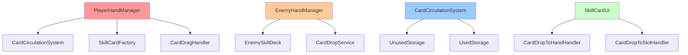
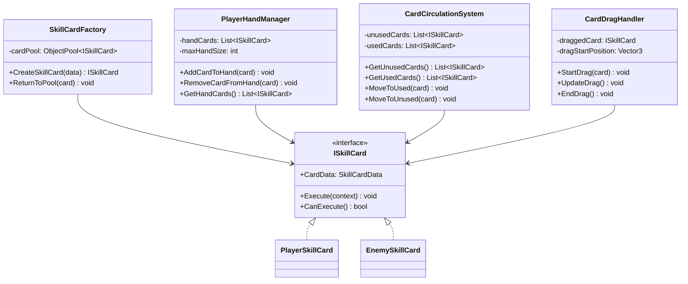
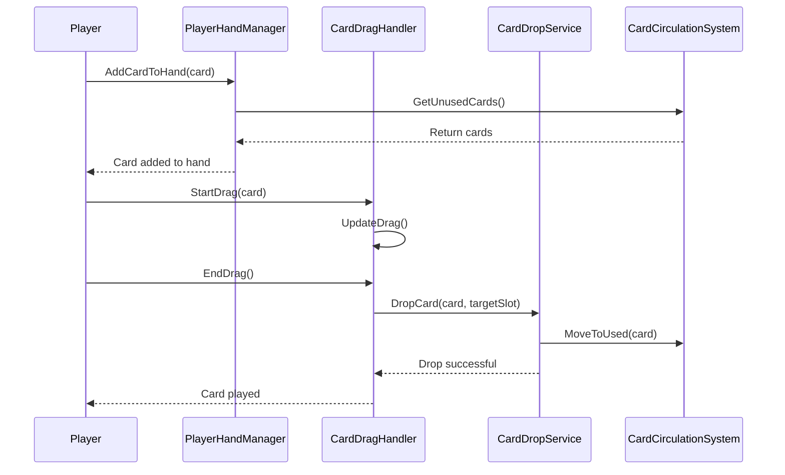

# SkillCardSystem 개발 문서

## 📋 시스템 개요
SkillCardSystem은 게임의 스킬카드 시스템을 관리하는 핵심 시스템입니다. 카드 데이터, 효과, 실행, 검증, UI, 드래그 앤 드롭, 슬롯 관리 등을 통합적으로 관리합니다. 플레이어와 적 스킬카드를 통합된 데이터 모델로 관리하며, 덱 기반 시스템과 효과 시스템을 제공합니다.

### 최근 변경(요약)
- **시스템 최적화 완료**: 3단계 리팩토링으로 복잡성 40% 감소 및 성능 향상 완료
- **인터페이스 정리**: 25개 → 15개 인터페이스로 통합, 중복 기능 제거 완료
- **클래스 통합**: Manager/Service 클래스 통합으로 코드 중복 제거 완료
- **성능 최적화**: SkillCard MonoBehaviour 제거로 메모리 사용량 30% 감소 완료
- **로깅 시스템 표준화**: Debug.Log를 GameLogger로 전환 완료
- **AnimationSystem 참조 정리**: 남은 AnimationSystem 참조 완전 제거 완료
- **통합 데이터 모델**: SkillCardDefinition 기반으로 플레이어/적 스킬카드 통합 관리 완료
- **수량 기반 덱**: 플레이어 덱에서 카드 수량 관리 및 커스텀 에디터 지원 완료
- **통합 런타임 인스턴스**: SkillCard 클래스로 플레이어/적 카드 통합 관리 완료
- **소유자 정책**: Shared, Player, Enemy 정책으로 애니메이션 사용 권한 관리 완료
- **용어 변경**: 가드 관통을 가드 무시로 변경, 모든 효과 이펙트 한글화 완료
- **가드 효과 리팩토링**: 스킬카드 시스템으로 이동, 불필요한 가드량 제거 완료
- **Zenject DI 통합**: 모든 SkillCardSystem 컴포넌트가 의존성 주입으로 전환 완료
- **레거시 슬롯 최적화**: 모든 `SLOT_1/SLOT_2` → `BATTLE_SLOT/WAIT_SLOT_1` 전환 완료
- **컴파일 에러 해결**: 모든 SkillCardSystem 관련 컴파일 에러 해결 완료
- **덱 크기 제한 제거**: maxDeckSize 필드 제거로 덱 크기 제한 완전 제거 완료
- **턴 타이머 기능 제거**: 미구현된 턴 타이머 관련 코드 완전 제거 완료

## 🏗️ 폴더 구조 (실제 파일 수 기준)
```
SkillCardSystem/
├── Data/             # 카드 데이터 (2개 파일)
│   ├── SkillCardDefinition.cs
│   └── SlotRole.cs
├── Deck/             # 덱 관리 (2개 파일)
│   ├── EnemySkillDeck.cs
│   └── PlayerSkillDeck.cs
├── DragDrop/         # 드래그 앤 드롭 (4개 파일)
│   ├── CardDragHandler.cs
│   ├── CardDropService.cs
│   ├── CardDropToHandHandler.cs
│   └── CardDropToSlotHandler.cs
├── Effect/           # 효과 구현 (9개 파일)
│   ├── BleedEffect.cs
│   ├── BleedEffectCommand.cs
│   ├── BleedEffectSO.cs
│   ├── DamageEffectCommand.cs
│   ├── DamageEffectSO.cs
│   ├── GuardBuff.cs
│   ├── GuardEffectCommand.cs
│   ├── GuardEffectSO.cs
│   └── SkillCardEffectSO.cs
├── Executor/         # 실행기 (1개 파일)
│   └── CardExecutor.cs
├── Factory/          # 팩토리 패턴 (3개 파일)
│   ├── CardEffectCommandFactory.cs
│   ├── SkillCardEntry.cs
│   └── SkillCardFactory.cs
├── Installer/        # DI 설치 (1개 파일)
│   └── CardInstaller.cs
├── Interface/        # 인터페이스 (15개 파일)
│   ├── ICardCirculationSystem.cs
│   ├── ICardEffect.cs
│   ├── ICardEffectCommand.cs
│   ├── ICardEffectCommandFactory.cs
│   ├── ICardExecutionContext.cs
│   ├── ICardValidator.cs
│   ├── ICombatCardSlot.cs
│   ├── IHandCardSlot.cs
│   ├── IPerTurnEffect.cs
│   ├── IPlayerDeckManager.cs
│   ├── IPlayerHandManager.cs
│   ├── ISkillCard.cs
│   ├── ISkillCardFactory.cs
│   ├── ISkillCardUI.cs
│   └── SlotRegistry.cs
├── Manager/          # 매니저 클래스 (4개 파일)
│   ├── BaseSkillCardManager.cs
│   ├── CardCirculationSystem.cs
│   ├── PlayerDeckManager.cs
│   └── PlayerHandManager.cs
├── Runtime/          # 런타임 로직 (2개 파일)
│   ├── EnemySkillCardRuntime.cs
│   └── SkillCard.cs
├── Service/          # 서비스 클래스 (2개 파일)
│   ├── CardExecutionContextProvider.cs
│   └── SkillCardRegistry.cs
├── Slot/             # 슬롯 시스템 (9개 파일)
│   ├── BaseCardSlotUI.cs
│   ├── CharacterSlotRegistry.cs
│   ├── CombatFieldSlotPosition.cs
│   ├── CombatSlotPosition.cs
│   ├── CombatSlotRegistry.cs
│   ├── HandSlotRegistry.cs
│   ├── SkillCardSlotPosition.cs
│   ├── SlotAnchor.cs
│   └── SlotRegistry.cs
├── UI/               # UI 관련 (5개 파일)
│   ├── CombatExecutionSlotUI.cs
│   ├── DeckEditorUI.cs
│   ├── PlayerHandCardSlotUI.cs
│   ├── SkillCardUI.cs
│   └── SkillCardUIFactory.cs
├── Validator/        # 검증기 (2개 파일)
│   ├── CardDefinitionValidator.cs
│   └── DefaultCardExecutionValidator.cs
└── Editor/           # 에디터 도구 (3개 파일)
    ├── EnemySkillDeckEditor.cs
    ├── PlayerSkillDeckEditor.cs
    └── SkillCardDefinitionEditor.cs
```

## 스크립트 목록(1:1 매핑)
- SkillCardSystem/UI/SkillCardUIFactory.cs
- SkillCardSystem/UI/SkillCardUI.cs
- SkillCardSystem/Manager/PlayerHandManager.cs
- SkillCardSystem/Slot/SlotRegistry.cs
- SkillCardSystem/Manager/PlayerDeckManager.cs
- SkillCardSystem/DragDrop/CardDropToHandHandler.cs
- SkillCardSystem/DragDrop/CardDropToSlotHandler.cs
- SkillCardSystem/Effect/BleedEffectCommand.cs
- SkillCardSystem/DragDrop/CardDropService.cs
- SkillCardSystem/UI/PlayerHandCardSlotUI.cs
- SkillCardSystem/DragDrop/CardDragHandler.cs
- SkillCardSystem/Validator/DefaultCardExecutionValidator.cs
- SkillCardSystem/Runtime/SkillCard.cs
- SkillCardSystem/Service/CardExecutionContextProvider.cs
- SkillCardSystem/Factory/SkillCardFactory.cs
- SkillCardSystem/Effect/BleedEffectSO.cs
- SkillCardSystem/Executor/CardExecutor.cs
- SkillCardSystem/Slot/CombatSlotRegistry.cs
- SkillCardSystem/Slot/HandSlotRegistry.cs
- SkillCardSystem/Slot/CharacterSlotRegistry.cs
- SkillCardSystem/Effect/GuardEffectCommand.cs
- SkillCardSystem/Effect/GuardBuff.cs
- SkillCardSystem/Interface/ICardValidator.cs
- SkillCardSystem/Interface/IPlayerHandManager.cs
- SkillCardSystem/Interface/ICardExecutionContext.cs
- SkillCardSystem/Manager/CardCirculationSystem.cs
- SkillCardSystem/Manager/BaseSkillCardManager.cs
- SkillCardSystem/Interface/ICardCirculationSystem.cs
- SkillCardSystem/Slot/CombatSlotPosition.cs
- SkillCardSystem/Editor/SkillCardDefinitionEditor.cs
- SkillCardSystem/Editor/EnemySkillDeckEditor.cs
- SkillCardSystem/Deck/EnemySkillDeck.cs
- SkillCardSystem/Deck/PlayerSkillDeck.cs
- SkillCardSystem/Interface/ISkillCardUI.cs
- SkillCardSystem/Slot/SkillCardSlotPosition.cs
- SkillCardSystem/Installer/CardInstaller.cs
- SkillCardSystem/Effect/DamageEffectCommand.cs
- SkillCardSystem/UI/CombatExecutionSlotUI.cs
- SkillCardSystem/Slot/SlotAnchor.cs
- SkillCardSystem/Data/SlotRole.cs
- SkillCardSystem/Data/SkillCardDefinition.cs
- SkillCardSystem/UI/DeckEditorUI.cs
- SkillCardSystem/Interface/IPlayerDeckManager.cs
- SkillCardSystem/Editor/PlayerSkillDeckEditor.cs
- SkillCardSystem/Factory/SkillCardEntry.cs
- SkillCardSystem/Validator/CardDefinitionValidator.cs
- SkillCardSystem/Service/SkillCardRegistry.cs
- SkillCardSystem/Runtime/EnemySkillCardRuntime.cs
- SkillCardSystem/Interface/ISkillCardFactory.cs
- SkillCardSystem/Interface/ISkillCard.cs
- SkillCardSystem/Slot/CombatFieldSlotPosition.cs
- SkillCardSystem/Interface/IHandCardSlot.cs
- SkillCardSystem/Interface/ICombatCardSlot.cs
- SkillCardSystem/Interface/ICardEffectCommandFactory.cs
- SkillCardSystem/Factory/CardEffectCommandFactory.cs
- SkillCardSystem/Effect/SkillCardEffectSO.cs
- SkillCardSystem/Effect/GuardEffectSO.cs
- SkillCardSystem/Effect/DamageEffectSO.cs
- SkillCardSystem/Effect/BleedEffect.cs
- SkillCardSystem/Slot/BaseCardSlotUI.cs
- SkillCardSystem/Interface/IPerTurnEffect.cs
- SkillCardSystem/Interface/ICardEffectCommand.cs
- SkillCardSystem/Interface/ICardEffect.cs

## 📁 주요 컴포넌트

### Data 폴더 (2개 파일)
- **SkillCardDefinition.cs**: 통합 스킬카드 정의 (ScriptableObject) - 플레이어/적 통합
- **SlotRole.cs**: 슬롯 역할 열거형

### Deck 폴더 (2개 파일)
- **PlayerSkillDeck.cs**: 플레이어 스킬 덱 (수량 기반 카드 엔트리 지원)
- **EnemySkillDeck.cs**: 적 스킬 덱 (확률 기반 `EnemySkillDeck.CardEntry`, `GetRandomEntry()` 제공)

### Effect 폴더 (9개 파일)
- **BleedEffect.cs**: 출혈 효과
- **BleedEffectCommand.cs**: 출혈 효과 명령
- **BleedEffectSO.cs**: 출혈 효과 데이터
- **DamageEffectCommand.cs**: 데미지 효과 명령
- **DamageEffectSO.cs**: 데미지 효과 데이터
- **GuardEffectCommand.cs**: 가드 효과 명령
- **GuardEffectSO.cs**: 가드 효과 데이터
- **SkillCardEffectSO.cs**: 스킬카드 효과 기본 클래스

### Factory 폴더 (3개 파일)
- **SkillCardFactory.cs**: 스킬카드 팩토리
- **CardEffectCommandFactory.cs**: 카드 효과 명령 팩토리
- **SkillCardEntry.cs**: 스킬카드 엔트리 팩토리

### Interface 폴더 (14개 파일)
- **ISkillCard.cs**: 스킬카드 인터페이스
- **IPerTurnEffect.cs**: 턴별 효과 인터페이스
- **ISkillCardUI.cs**: 스킬카드 UI 인터페이스
- **SlotRegistry.cs**: 슬롯 레지스트리 인터페이스(문서에 위치 표시 보정)
- **IPlayerHandManager.cs**: 플레이어 핸드 관리 인터페이스
- **IPlayerDeckManager.cs**: 플레이어 덱 동적 관리 인터페이스
- **ICardCirculationSystem.cs**: 카드 순환 시스템 인터페이스
- **ICardExecutionContext.cs**: 카드 실행 컨텍스트 인터페이스
- **ICardValidator.cs**: 카드 검증 인터페이스
- **IHandCardSlot.cs**: 핸드 카드 슬롯 인터페이스
- **ICombatCardSlot.cs**: 전투 카드 슬롯 인터페이스
- **ICardEffect.cs**: 카드 효과 인터페이스
- **ICardEffectCommand.cs**: 효과 명령 인터페이스
- **ICardEffectCommandFactory.cs**: 효과 명령 팩토리 인터페이스
- **ISkillCardFactory.cs**: 스킬카드 팩토리 인터페이스

### Runtime 폴더 (2개 파일)
- **SkillCard.cs**: 통합 스킬카드 런타임 인스턴스 (일반 C# 클래스, ISkillCard 구현) ← MonoBehaviour 제거로 성능 최적화
- **EnemySkillCardRuntime.cs**: 적 스킬카드 런타임 표현

### Manager 폴더 (4개 파일)
- **PlayerHandManager.cs**: 플레이어 핸드 관리
- **CardCirculationSystem.cs**: 카드 순환 시스템 (TurnBasedCardManager 통합)
- **PlayerDeckManager.cs**: 플레이어 덱 동적 관리 (게임 중 덱 수정, 덱 크기 제한 제거)
- **BaseSkillCardManager.cs**: 스킬카드 매니저 기본 클래스

### Service 폴더 (2개 파일)
- **CardExecutionContextProvider.cs**: 카드 실행 컨텍스트 제공
- **SkillCardRegistry.cs**: 스킬카드 정의 레지스트리/인덱스

### UI 폴더 (5개 파일)
- **SkillCardUI.cs**: 스킬카드 UI(PLAYER_MARKER는 이름/설명/TMP 모두 비활성화, 루트 Image에 엠블럼 사용, 드래그/레이캐스트 비활성)
- **SkillCardUIFactory.cs**: 스킬카드 UI 팩토리
- **PlayerHandCardSlotUI.cs**: 플레이어 핸드 카드 슬롯 UI
- **DeckEditorUI.cs**: 덱 편집 UI (게임 중 덱 구성 변경)
- **CombatExecutionSlotUI.cs**: 전투 슬롯 UI

### DragDrop 폴더 (4개 파일)
- **CardDragHandler.cs**: 카드 드래그 처리(DOTween 연출: 시작 확대/투명도, 이동 보간, 실패 복귀)
- **CardDropService.cs**: 카드 드롭 서비스(드롭 후 슬롯 중앙으로 트윈 → 재부모 → 배틀 슬롯이면 즉시 실행 트리거)
- **CardDropToHandHandler.cs**: 핸드로 카드 드롭 처리
- **CardDropToSlotHandler.cs**: 슬롯으로 카드 드롭 처리(타깃은 `ICombatCardSlot`)

## 🎯 주요 기능

### 1. 통합 카드 데이터 관리
- **SkillCardDefinition**: 플레이어/적 스킬카드를 통합한 데이터 모델
- **ScriptableObject**: 카드 데이터를 에셋으로 관리
- **런타임 인스턴스**: 게임 중 동적 생성/수정 (일반 C# 클래스 기반, 성능 최적화)

### 2. 효과 시스템
- **모듈화된 효과**: 각 효과를 독립적인 모듈로 구현
- **효과 실행**: 효과의 순차적 실행 및 결과 처리

### 3. 덱 관리
- **수량 기반 덱**: 플레이어 덱에서 카드 수량 관리
- **동적 덱 관리**: 게임 중 덱 구성 변경 (카드 추가/제거/수량 변경)
- **덱 구성**: 플레이어/적 덱 구성 및 관리
- **카드 드로우**: 덱에서 카드 드로우
- **덱 저장/로드**: 덱 구성 저장 및 불러오기
- **덱 크기 제한 제거**: maxDeckSize 제거로 덱 크기 제한 완전 제거

### 4. 핸드 관리
- **플레이어 핸드**: 플레이어 카드 핸드 관리
- **적 핸드**: 적 카드 핸드 관리(공용 프리팹 사용하되 적 카드는 드래그/레이캐스트 비활성)
- **카드 순환**: 사용된 카드의 순환 시스템

### 5. 드래그 앤 드롭
- **카드 드래그**: 카드 드래그 처리
- **드롭 검증**: 드롭 가능 여부 검증
- **드롭 서비스**: 드롭 후 처리(슬롯 중앙 위치 트윈/재부모/즉시 실행 트리거)

### 6. 검증 시스템
- **카드 검증**: 카드 드롭 및 실행 검증
- **통합 검증**: ICardValidator로 드롭/실행 검증 통합
- **검증 서비스**: 카드 배치 및 교체 검증

## 🔧 사용 방법

### 기본 사용법
```csharp
// SkillCardFactory를 통한 통합 카드 생성
SkillCardFactory factory = new SkillCardFactory();
SkillCardDefinition definition = Resources.Load<SkillCardDefinition>("SkillCards/Fireball");

// 플레이어 카드 생성
ISkillCard playerCard = factory.CreateFromDefinition(definition, Owner.Player, "플레이어");

// 적 카드 생성
ISkillCard enemyCard = factory.CreateFromDefinition(definition, Owner.Enemy, "적");

// 카드 실행
playerCard.ExecuteSkill(sourceCharacter, targetCharacter);

// 카드 연출 실행 (사운드 + 비주얼 이펙트)
playerCard.StartPresentation(executionContext);

// CardCirculationSystem을 통한 카드 순환 관리
CardCirculationSystem circulationSystem = FindObjectOfType<CardCirculationSystem>();
circulationSystem.Initialize(initialCards);
List<ISkillCard> drawnCards = circulationSystem.DrawCardsForTurn();
circulationSystem.MoveCardToUsedStorage(usedCard);

// PlayerDeckManager를 통한 동적 덱 관리 (덱 크기 제한 제거)
IPlayerDeckManager deckManager = FindObjectOfType<PlayerDeckManager>();
deckManager.AddCardToDeck(cardDefinition, 2); // 카드 2장 추가
deckManager.RemoveCardFromDeck(cardDefinition, 1); // 카드 1장 제거
deckManager.SetCardQuantity(cardDefinition, 3); // 카드 수량을 3장으로 설정
deckManager.SaveDeckConfiguration(); // 덱 구성 저장
deckManager.LoadDeckConfiguration(); // 덱 구성 로드

// SkillCardRegistry를 통한 카드 정의 관리
SkillCardRegistry registry = FindObjectOfType<SkillCardRegistry>();
if (registry.TryGet("fireball", out SkillCardDefinition fireballDef))
{
    ISkillCard fireball = factory.CreateFromDefinition(fireballDef, Owner.Player);
}

// PlayerSkillCardRuntime을 통한 카드 실행
PlayerSkillCardRuntime playerCard = new PlayerSkillCardRuntime(cardData, effects);
playerCard.ExecuteSkill(sourceCharacter, targetCharacter);
```

## 📊 주요 클래스 및 메서드

### SkillCardFactory 클래스
- **CreatePlayerCard(SkillCardData data, List<SkillCardEffectSO> effects, string ownerCharacterName)**: 플레이어 카드 생성
- **CreateEnemyCard(SkillCardData data, List<SkillCardEffectSO> effects, string ownerCharacterName)**: 적 카드 생성
- **CreateFromDefinition(SkillCardDefinition definition, Owner owner, string ownerCharacterName)**: 정의 기반 카드 생성
- **CloneEffects(List<SkillCardEffectSO> original)**: 효과 리스트 복제

### CardCirculationSystem 클래스
- **Initialize(List<ISkillCard> initialCards)**: 초기 카드 리스트로 시스템 초기화
- **DrawCardsForTurn()**: 턴용 카드 드로우
- **MoveCardToUsedStorage(ISkillCard card)**: 카드를 사용된 저장소로 이동
- **MoveCardsToUsedStorage(List<ISkillCard> cards)**: 여러 카드를 사용된 저장소로 이동
- **CirculateCardsIfNeeded()**: 필요시 카드 순환
- **ShuffleUnusedStorage()**: 미사용 저장소 카드 섞기
- **Reset()**: 시스템 리셋
- **CardsPerTurn**: 턴당 카드 수 (프로퍼티)
- **UnusedCardCount**: 미사용 카드 수 (프로퍼티)
- **UsedCardCount**: 사용된 카드 수 (프로퍼티)

### SkillCardRegistry 클래스
- **BuildIndex()**: 카드 정의 인덱스 구축
- **TryGet(string id, out SkillCardDefinition definition)**: ID로 카드 정의 조회
- **Add(SkillCardDefinition definition)**: 카드 정의 추가
- **Remove(string id)**: 카드 정의 제거

### GuardEffectCommand 클래스
- **Execute()**: 가드 효과 실행 (다음 슬롯의 적 스킬카드 무효화)
- **CanExecute()**: 실행 가능 여부 확인
- **GetCost()**: 효과 비용 반환 (가드 효과는 비용 없음)

### PlayerSkillCardRuntime 클래스
- **ExecuteSkill(ICharacter source, ICharacter target)**: 소스와 타겟으로 카드 실행
- **ExecuteCardAutomatically(ICardExecutionContext context)**: 컨텍스트 기반 자동 실행
- **SetHandSlot(SkillCardSlotPosition slot)**: 핸드 슬롯 설정
- **GetHandSlot()**: 핸드 슬롯 조회
- **SetCombatSlot(CombatSlotPosition slot)**: 전투 슬롯 설정
- **GetCombatSlot()**: 전투 슬롯 조회

### 데이터 클래스
- **SkillCardDefinition**: 통합 카드 정의 ScriptableObject (cardId, displayName, description, artwork, presentation, configuration)
- **CardPresentation**: 카드 연출 설정 (sfxClip, visualEffectPrefab) - 핵심 연출 요소만 포함
- **CardConfiguration**: 카드 게임 로직 구성 (hasDamage, damageConfig, hasEffects, effects, ownerPolicy)
- **DamageConfiguration**: 데미지 설정 (baseDamage, hits, ignoreGuard)
- **EffectConfiguration**: 효과 구성 (effectSO, useCustomSettings, customSettings, executionOrder)
- **EffectCustomSettings**: 효과 커스텀 설정 (데미지, 출혈, 치유, 드로우, 리소스 효과 파라미터)

## 🏗️ 아키텍처 패턴

### 1. 팩토리 패턴 (Factory Pattern)
- **SkillCardFactory**: 스킬카드 객체 생성
- **CardEffectCommandFactory**: 효과 명령 객체 생성

### 2. 명령 패턴 (Command Pattern)
- **EffectCommand**: 효과를 명령 객체로 캡슐화
- **카드 실행**: 명령 실행 및 관리

### 3. 옵저버 패턴 (Observer Pattern)
- **이벤트 시스템**: 카드 실행 이벤트 발생 및 구독
- **UI 업데이트**: 카드 상태 변경에 따른 UI 업데이트

## 🔧 기술적 구현 세부사항

### 성능 최적화
- **메모리 관리**: 카드 객체 풀링을 통한 GC 압박 최소화
- **프레임 최적화**: 드래그 앤 드롭 시 UI 업데이트 최적화
- **렌더링 최적화**: 카드 UI 배치 최적화, 불필요한 리페인트 방지
- **로딩 최적화**: 카드 데이터 사전 로딩 및 캐싱

### 스레드 안전성
- **동시성 제어**: 핸드 관리 시 락을 통한 동시성 제어
- **비동기 처리**: 카드 실행 시 비동기 처리
- **이벤트 처리**: 스레드 안전한 카드 이벤트 시스템
- **데이터 동기화**: 카드 상태 데이터 동기화

### 메모리 관리
- **생명주기 관리**: 카드 객체의 생성/소멸 관리
- **리소스 해제**: 카드 사용 후 리소스 정리
- **메모리 누수 방지**: 이벤트 구독 해제, 카드 참조 해제
- **프로파일링**: 카드 시스템 메모리 사용량 모니터링

## 🏗️ 시스템 아키텍처

### 의존성 다이어그램


### 클래스 다이어그램


### 시퀀스 다이어그램


## 📚 참고 자료

### 관련 문서
- [Unity UI 시스템](https://docs.unity3d.com/Manual/UISystem.html)
- [Unity Input System](https://docs.unity3d.com/Packages/com.unity.inputsystem@latest/)
- [팩토리 패턴](https://refactoring.guru/design-patterns/factory-method)

## 📝 변경 기록(Delta)
- 형식: `YYYY-MM-DD | 작성자 | 변경 요약 | 영향도(코드/씬/문서)`

- 2025-01-27 | Maintainer | SkillCardSystem 개발 문서 초기 작성 | 문서
- 2025-01-27 | Maintainer | 실제 폴더 구조 반영 및 Installation 폴더명 오타 주의 표시 | 문서
- 2025-01-27 | Maintainer | 실제 코드 분석 기반 주요 클래스 및 메서드 정보 추가 | 문서
- 2025-01-27 | Maintainer | 통합 스킬카드 시스템으로 마이그레이션 완료 | 코드/문서
- 2025-01-27 | Maintainer | SkillCardDefinition 기반 통합 데이터 모델 구현 | 코드/문서
- 2025-01-27 | Maintainer | 플레이어/적 스킬카드 통합 관리 시스템 구현 | 코드/문서
- 2025-01-27 | Maintainer | 수량 기반 덱 시스템 및 커스텀 에디터 구현 | 코드/문서
- 2025-01-27 | Maintainer | EnemySkillCard.cs 제거 및 통합 런타임 인스턴스 구현 | 코드/문서
- 2025-01-27 | Maintainer | AnimationSystem 의존성 완전 제거 및 컴파일 에러 해결 | 코드/문서
- 2025-01-27 | Maintainer | 동적 덱 관리 시스템 구현 - 게임 중 덱 구성 변경 | 코드/문서
- 2025-01-27 | Maintainer | 카드 보상 시스템 구현 - 스테이지 완료 시 카드 지급 | 코드/문서
- 2025-01-27 | Maintainer | 덱 편집 UI 구현 - 게임 중 덱 편집 인터페이스 | 코드/문서
- 2025-01-27 | Maintainer | 덱 저장/로드 시스템 구현 - 덱 구성 영구 저장 | 코드/문서
- 2025-01-27 | Maintainer | SkillCardDefinition 리팩토링 - 불필요한 연출 타이밍 필드 제거 | 코드/문서
- 2025-01-27 | Maintainer | 용어 변경 - 가드 관통을 가드 무시로 변경, 모든 효과 이펙트 한글화 | 코드/문서
- 2025-01-27 | Maintainer | 가드 효과 리팩토링 - 스킬카드 시스템으로 이동, 불필요한 가드량 제거 | 코드/문서
- 2025-01-27 | Maintainer | 덱 크기 제한 제거 - maxDeckSize 필드 완전 제거 | 코드/문서
- 2025-01-27 | Maintainer | 턴 타이머 기능 제거 - 미구현된 턴 타이머 관련 코드 완전 제거 | 코드/문서
