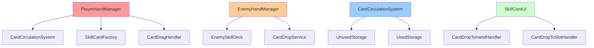
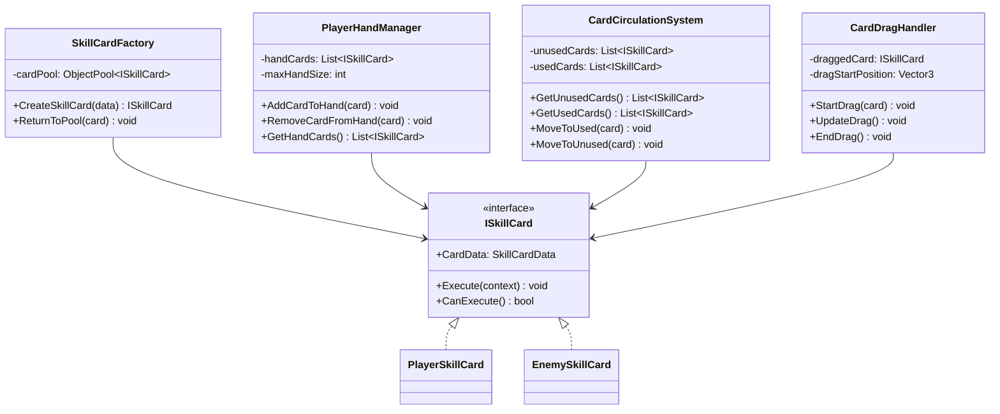
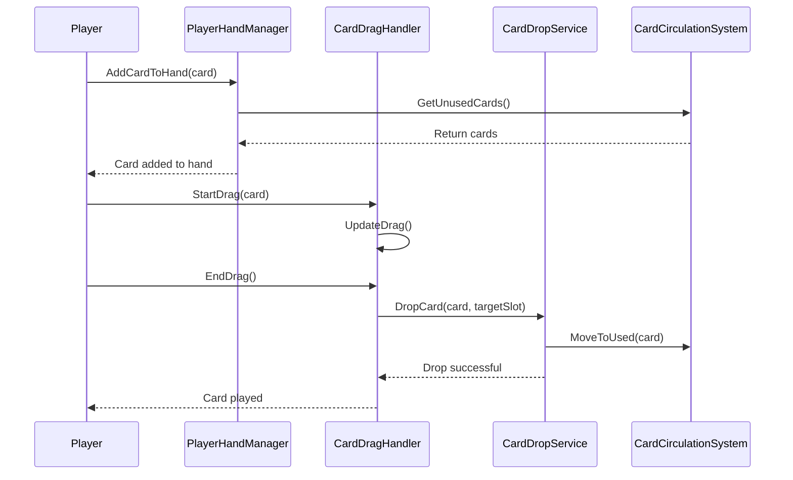

# SkillCardSystem 개발 문서

## 📋 시스템 개요
SkillCardSystem은 게임의 스킬카드 시스템을 관리하는 핵심 시스템입니다. 카드 데이터, 효과, 실행, 검증, UI, 드래그 앤 드롭, 슬롯 관리 등을 통합적으로 관리합니다.

## 🏗️ 폴더 구조
```
SkillCardSystem/
├── Core/             # 핵심 로직 (2개 파일)
├── Data/             # 카드 데이터 (2개 파일)
├── Deck/             # 덱 관리 (3개 파일)
├── Effect/           # 효과 구현 (4개 파일)
├── Factory/          # 팩토리 패턴 (3개 파일)
├── Interface/        # 인터페이스 (8개 파일)
├── Manager/          # 매니저 클래스 (3개 파일)
├── Runtime/          # 런타임 로직 (5개 파일)
├── Service/          # 서비스 클래스 (3개 파일)
├── Slot/             # 슬롯 시스템 (8개 파일)
├── UI/               # UI 관련 (3개 파일)
├── DragDrop/         # 드래그 앤 드롭 (4개 파일)
└── Validator/        # 검증기 (1개 파일)
```

## 📁 주요 컴포넌트

### Core 폴더 (2개 파일)
- **PlayerSkillCard.cs**: 플레이어 스킬카드 기본 클래스
- **EnemySkillCard.cs**: 적 스킬카드 기본 클래스

### Data 폴더 (2개 파일)
- **SkillCardData.cs**: 스킬카드 데이터 (ScriptableObject)
- **PlayerSkillCard.cs**: 플레이어 스킬카드 데이터

### Deck 폴더 (3개 파일)
- **PlayerSkillDeck.cs**: 플레이어 스킬 덱
- **EnemySkillDeck.cs**: 적 스킬 덱
- **PlayerSkillCardEntry.cs**: 플레이어 스킬카드 엔트리

### Effect 폴더 (4개 파일)
- **BleedEffectCommand.cs**: 출혈 효과 명령
- **DamageEffectSO.cs**: 데미지 효과 데이터
- **GuardEffectSO.cs**: 방어 효과 데이터
- **SkillCardEffectSO.cs**: 스킬카드 효과 기본 클래스

### Factory 폴더 (3개 파일)
- **SkillCardFactory.cs**: 스킬카드 팩토리
- **CardEffectCommandFactory.cs**: 카드 효과 명령 팩토리
- **SkillCardEntry.cs**: 스킬카드 엔트리 팩토리

### Interface 폴더 (8개 파일)
- **ISkillCard.cs**: 스킬카드 인터페이스
- **IPerTurnEffect.cs**: 턴별 효과 인터페이스
- **ISkillCardUI.cs**: 스킬카드 UI 인터페이스
- **IPlayerHandManager.cs**: 플레이어 핸드 관리 인터페이스
- **IEnemyHandManager.cs**: 적 핸드 관리 인터페이스
- **ICardCirculationSystem.cs**: 카드 순환 시스템 인터페이스
- **ICardDropValidator.cs**: 카드 드롭 검증 인터페이스
- **ICardExecutionContext.cs**: 카드 실행 컨텍스트 인터페이스

### Manager 폴더 (3개 파일)
- **PlayerHandManager.cs**: 플레이어 핸드 관리
- **EnemyHandManager.cs**: 적 핸드 관리
- **CardCirculationSystem.cs**: 카드 순환 시스템

### Service 폴더 (3개 파일)
- **CardExecutionContextProvider.cs**: 카드 실행 컨텍스트 제공
- **PlayerCardReplacementHandler.cs**: 플레이어 카드 교체 처리
- **CardPlacementService.cs**: 카드 배치 서비스

### UI 폴더 (3개 파일)
- **SkillCardUI.cs**: 스킬카드 UI
- **SkillCardUIFactory.cs**: 스킬카드 UI 팩토리
- **PlayerHandCardSlotUI.cs**: 플레이어 핸드 카드 슬롯 UI

### DragDrop 폴더 (4개 파일)
- **CardDragHandler.cs**: 카드 드래그 처리
- **CardDropService.cs**: 카드 드롭 서비스
- **CardDropToHandHandler.cs**: 핸드로 카드 드롭 처리
- **CardDropToSlotHandler.cs**: 슬롯으로 카드 드롭 처리

## 🎯 주요 기능

### 1. 카드 데이터 관리
- **ScriptableObject**: 카드 데이터를 에셋으로 관리
- **런타임 인스턴스**: 게임 중 동적 생성/수정

### 2. 효과 시스템
- **모듈화된 효과**: 각 효과를 독립적인 모듈로 구현
- **효과 실행**: 효과의 순차적 실행 및 결과 처리

### 3. 덱 관리
- **덱 구성**: 플레이어/적 덱 구성 및 관리
- **카드 드로우**: 덱에서 카드 드로우

### 4. 핸드 관리
- **플레이어 핸드**: 플레이어 카드 핸드 관리
- **적 핸드**: 적 카드 핸드 관리
- **카드 순환**: 사용된 카드의 순환 시스템

### 5. 드래그 앤 드롭
- **카드 드래그**: 카드 드래그 처리
- **드롭 검증**: 드롭 가능 여부 검증
- **드롭 서비스**: 드롭 후 처리

## 🔧 사용 방법

### 기본 사용법
```csharp
// 스킬카드 생성
var card = SkillCardFactory.Instance.CreateSkillCard(cardData);

// 플레이어 핸드에 카드 추가
PlayerHandManager.Instance.AddCardToHand(card);

// 카드 드래그 시작
CardDragHandler.Instance.StartDrag(card);

// 카드 드롭
CardDropService.Instance.DropCard(card, targetSlot);
```

## 🏗️ 아키텍처 패턴

### 1. 팩토리 패턴 (Factory Pattern)
- **SkillCardFactory**: 스킬카드 객체 생성
- **CardEffectCommandFactory**: 효과 명령 객체 생성

### 2. 명령 패턴 (Command Pattern)
- **EffectCommand**: 효과를 명령 객체로 캡슐화
- **카드 실행**: 명령 실행 및 관리

### 3. 옵저버 패턴 (Observer Pattern)
- **이벤트 시스템**: 카드 실행 이벤트 발생 및 구독
- **UI 업데이트**: 카드 상태 변경에 따른 UI 업데이트

## 🔧 기술적 구현 세부사항

### 성능 최적화
- **메모리 관리**: 카드 객체 풀링을 통한 GC 압박 최소화
- **프레임 최적화**: 드래그 앤 드롭 시 UI 업데이트 최적화
- **렌더링 최적화**: 카드 UI 배치 최적화, 불필요한 리페인트 방지
- **로딩 최적화**: 카드 데이터 사전 로딩 및 캐싱

### 스레드 안전성
- **동시성 제어**: 핸드 관리 시 락을 통한 동시성 제어
- **비동기 처리**: 카드 실행 시 비동기 처리
- **이벤트 처리**: 스레드 안전한 카드 이벤트 시스템
- **데이터 동기화**: 카드 상태 데이터 동기화

### 메모리 관리
- **생명주기 관리**: 카드 객체의 생성/소멸 관리
- **리소스 해제**: 카드 사용 후 리소스 정리
- **메모리 누수 방지**: 이벤트 구독 해제, 카드 참조 해제
- **프로파일링**: 카드 시스템 메모리 사용량 모니터링

## 🏗️ 시스템 아키텍처

### 의존성 다이어그램


### 클래스 다이어그램


### 시퀀스 다이어그램


## 📚 참고 자료

### 관련 문서
- [Unity UI 시스템](https://docs.unity3d.com/Manual/UISystem.html)
- [Unity Input System](https://docs.unity3d.com/Packages/com.unity.inputsystem@latest/)
- [팩토리 패턴](https://refactoring.guru/design-patterns/factory-method)


