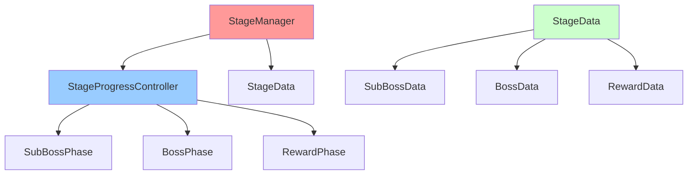
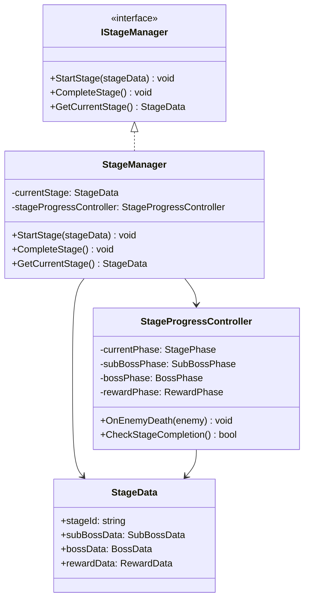
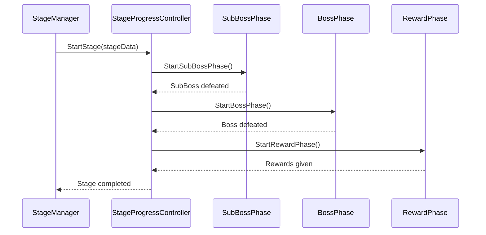

# StageSystem 개발 문서

## 📋 시스템 개요
StageSystem은 게임의 스테이지 진행을 관리하는 시스템입니다. 각 스테이지는 SubBoss와 Boss로 구성되며, 스테이지 완료 시 보상과 함께 다음 스테이지로 진행됩니다. 적 캐릭터 스폰과 함께 적 카드를 대기 슬롯에 직접 생성하는 기능을 제공합니다.

### 최근 변경(요약)
- **로깅 시스템 표준화**: Debug.Log를 GameLogger로 전환 완료
- **AnimationSystem 참조 정리**: 남은 AnimationSystem 참조 완전 제거 완료
- **적 카드 직접 생성 시스템**: `StageManager`에서 적 카드를 `WAIT_SLOT_4`에 직접 생성
- **적 핸드 시스템 제거**: 적 핸드 매니저 없이 대기 슬롯에서 직접 관리
- **타입 안전성 강화**: `ICharacterData`를 `EnemyCharacterData`로 캐스팅하여 안전한 프로퍼티 접근
- **의존성 주입 확장**: `ITurnCardRegistry`, `ISkillCardFactory` 의존성 추가

## 🏗️ 폴더 구조
```
StageSystem/
├── Manager/          # 스테이지 매니저 (2개 파일)
├── Interface/        # 스테이지 인터페이스 (3개 파일)
├── Factory/          # 스테이지 팩토리 (1개 파일)
└── Data/             # 스테이지 데이터 (2개 파일)
```

## 📁 주요 컴포넌트

### Manager 폴더 (2개 파일)
- **StageManager.cs**: 스테이지 전체 관리
- **StageProgressController.cs**: 스테이지 진행 관리

### Interface 폴더 (3개 파일)
- **IStageManager.cs**: 스테이지 매니저 인터페이스
- **IStageProgressController.cs**: 스테이지 진행 컨트롤러 인터페이스
- **IStageDataFactory.cs**: 스테이지 데이터 팩토리 인터페이스

### Factory 폴더 (1개 파일)
- **StageDataFactory.cs**: 스테이지 데이터 생성 팩토리

### Data 폴더 (2개 파일)
- **StageData.cs**: 스테이지 데이터 (ScriptableObject)
- **StageRewardData.cs**: 스테이지 보상 데이터

## 🎯 주요 기능

### 1. 스테이지 구성
- **SubBoss + Boss**: 각 스테이지는 SubBoss와 Boss로 구성
- **스테이지 진행**: SubBoss → Boss 순서로 진행
- **스테이지 완료**: Boss 처치 시 스테이지 완료

### 2. 스테이지 관리
- **현재 스테이지**: 현재 진행 중인 스테이지 추적
- **스테이지 상태**: 진행 중, 완료, 실패 등 상태 관리
- **스테이지 전환**: 스테이지 간 전환 처리

### 3. 보상 시스템
- **스테이지 완료 보상**: 스테이지 완료 시 보상 지급
- **보상 데이터**: ScriptableObject 기반 보상 설정
- **보상 적용**: 보상 지급 및 적용

### 4. 진행 관리
- **적 처치 추적**: 적 처치 시 진행 상황 업데이트
- **스테이지 완료 조건**: 스테이지 완료 조건 확인
- **다음 스테이지**: 다음 스테이지로 자동 진행

## 🔧 사용 방법

### 기본 사용법
```csharp
// StageManager를 통한 스테이지 관리
StageManager stageManager = FindObjectOfType<StageManager>();
stageManager.StartSubBossPhase();
stageManager.StartBossPhase();
stageManager.CompleteStage();

// StageProgressController를 통한 스테이지 진행 관리
StageProgressController progressController = FindObjectOfType<StageProgressController>();
progressController.StartStage();
progressController.OnEnemyDeath(enemyCharacter);

// StageDataFactory를 통한 스테이지 데이터 생성
EnemyCharacterData subBoss = Resources.Load<EnemyCharacterData>("Enemies/SubBoss");
EnemyCharacterData boss = Resources.Load<EnemyCharacterData>("Enemies/Boss");
StagePhaseData stageData = StageDataFactory.CreateBossRushStage(subBoss, boss, "보스 러시", 1);

// 보상 데이터 생성
StageRewardData rewardData = StageDataFactory.CreateDefaultRewards(true, true, true);
stageManager.SetCurrentRewards(rewardData);
stageManager.GiveSubBossRewards();
stageManager.GiveBossRewards();
stageManager.GiveStageCompletionRewards();
```

### 적 카드 직접 생성 시스템 사용법 (신규)
```csharp
// StageManager에서 적 스폰과 함께 카드 생성
public IEnumerator SpawnNextEnemyCoroutine()
{
    // 적 캐릭터 스폰
    var result = spawnerManager.SpawnEnemy(enemyData);
    if (result.IsSuccess)
    {
        // 적 캐릭터 등록
        RegisterEnemy(result.Enemy);
        
        // 적 카드를 WAIT_SLOT_4에 직접 생성
        SpawnEnemyCardToWaitSlot4(result.Enemy);
    }
}

// 적 카드 직접 생성 메서드
private void SpawnEnemyCardToWaitSlot4(IEnemyCharacter enemy)
{
    // EnemyCharacterData로 캐스팅하여 EnemyDeck에 접근
    if (!(enemy?.CharacterData is EnemyCharacterData enemyData) || enemyData.EnemyDeck == null)
    {
        Debug.LogWarning("[StageManager] 적 스킬 덱이 없습니다.");
        return;
    }

    // 적 덱에서 랜덤 카드 선택
    var enemyDeck = enemyData.EnemyDeck;
    var randomEntry = enemyDeck.GetRandomEntry();
    
    if (randomEntry?.definition == null)
    {
        Debug.LogWarning("[StageManager] 적 덱에서 카드를 선택할 수 없습니다.");
        return;
    }

    // 적 카드 생성
    var enemyCard = cardFactory.CreateFromDefinition(
        randomEntry.definition,
        Owner.Enemy,
        enemyData.CharacterName
    );

    // WAIT_SLOT_4에 카드 등록
    turnCardRegistry.RegisterCard(
        CombatSlotPosition.WAIT_SLOT_4,
        enemyCard,
        null, // UI는 나중에 생성
        SlotOwner.ENEMY
    );
}
```

## 📊 주요 클래스 및 메서드

### StageManager 클래스
- **StartSubBossPhase()**: 준보스 단계 시작
- **StartBossPhase()**: 보스 단계 시작
- **CompleteStage()**: 스테이지 완료
- **FailStage()**: 스테이지 실패
- **IsSubBossPhase()**: 준보스 단계 여부 확인
- **IsBossPhase()**: 보스 단계 여부 확인
- **IsStageCompleted()**: 스테이지 완료 여부 확인
- **GetCurrentStageNumber()**: 현재 스테이지 번호 조회
- **GiveSubBossRewards()**: 준보스 보상 지급
- **GiveBossRewards()**: 보스 보상 지급
- **GiveStageCompletionRewards()**: 스테이지 완료 보상 지급
- **SetCurrentRewards(StageRewardData rewards)**: 현재 보상 데이터 설정
- **GetCurrentRewards()**: 현재 보상 데이터 조회
- **SpawnEnemyCardToWaitSlot4(IEnemyCharacter enemy)**: 적 카드를 WAIT_SLOT_4에 직접 생성 (신규)
- **CurrentPhase**: 현재 스테이지 단계 (프로퍼티)
- **ProgressState**: 현재 스테이지 진행 상태 (프로퍼티)
- **IsSubBossDefeated**: 준보스 처치 여부 (프로퍼티)
- **IsBossDefeated**: 보스 처치 여부 (프로퍼티)

### StageProgressController 클래스
- **StartStage()**: 스테이지 시작 (준보스부터 시작)
- **OnEnemyDeath(IEnemyCharacter enemy)**: 적 사망 시 호출

### StageDataFactory 클래스
- **CreateDefaultRewards(bool hasSubBossRewards, bool hasBossRewards, bool hasCompletionRewards)**: 기본 보상 데이터 생성

### 데이터 클래스
- **StagePhaseState**: 스테이지 단계 상태 열거형 (None, SubBoss, Boss, Completed)
- **StageProgressState**: 스테이지 진행 상태 열거형 (NotStarted, SubBossBattle, BossBattle, Completed, Failed)
- **StageRewardData**: 스테이지 보상 데이터 (RewardItem, RewardCurrency)

### 인터페이스
- **IStagePhaseManager**: 스테이지 단계별 관리 인터페이스
- **IStageRewardManager**: 스테이지 보상 관리 인터페이스

## 🏗️ 아키텍처 패턴

### 1. 매니저 패턴 (Manager Pattern)
- **StageManager**: 스테이지 전체 관리
- **StageProgressController**: 스테이지 진행 관리

### 2. 팩토리 패턴 (Factory Pattern)
- **StageDataFactory**: 스테이지 데이터 생성 및 관리

### 3. 데이터 기반 설계 (Data-Driven Design)
- **ScriptableObject**: 스테이지 데이터를 에셋으로 관리
- **런타임 인스턴스**: 게임 중 동적 생성/수정

### 4. 이벤트 기반 아키텍처 (Event-Driven Architecture)
- **스테이지 이벤트**: 스테이지 진행 관련 이벤트 발생
- **보상 이벤트**: 보상 지급 이벤트 발생

## 🎮 게임 플로우

### 스테이지 진행 플로우
1. **스테이지 시작**: StageManager가 스테이지 시작
2. **SubBoss 전투**: SubBoss와 전투
3. **Boss 전투**: Boss와 전투
4. **스테이지 완료**: Boss 처치 시 스테이지 완료
5. **보상 지급**: 스테이지 완료 보상 지급
6. **다음 스테이지**: 다음 스테이지로 진행

### 스테이지 완료 조건
- **SubBoss 처치**: SubBoss 처치 완료
- **Boss 처치**: Boss 처치 완료
- **모든 적 처치**: 스테이지 내 모든 적 처치

## 🔧 기술적 구현 세부사항

### 성능 최적화
- **메모리 관리**: 스테이지 데이터 사전 로딩 및 캐싱
- **프레임 최적화**: 스테이지 전환 시 프레임 블로킹 방지
- **로딩 최적화**: 비동기 스테이지 로딩
- **리소스 관리**: 스테이지별 리소스 효율적 관리

### 스레드 안전성
- **동시성 제어**: 스테이지 상태 변경 시 락을 통한 동시성 제어
- **비동기 처리**: async/await 패턴을 통한 비동기 스테이지 처리
- **이벤트 처리**: 스레드 안전한 스테이지 이벤트 시스템
- **데이터 동기화**: 스테이지 상태 데이터 동기화

### 메모리 관리
- **생명주기 관리**: 스테이지 객체의 생성/소멸 관리
- **리소스 해제**: 스테이지 완료 시 리소스 정리
- **메모리 누수 방지**: 이벤트 구독 해제, 스테이지 참조 해제
- **프로파일링**: 스테이지 시스템 메모리 사용량 모니터링

## 🏗️ 시스템 아키텍처

### 의존성 다이어그램


### 클래스 다이어그램


### 시퀀스 다이어그램


## 📚 참고 자료

### 관련 문서
- [Unity 씬 관리](https://docs.unity3d.com/Manual/Scenes.html)
- [Unity 씬 전환](https://docs.unity3d.com/Manual/SceneManagement.html)
- [스테이지 설계](https://docs.unity3d.com/Manual/LevelDesign.html)

## 📝 변경 기록(Delta)
- 형식: `YYYY-MM-DD | 작성자 | 변경 요약 | 영향도(코드/씬/문서)`

- 2025-01-27 | Maintainer | StageSystem 개발 문서 초기 작성 | 문서
- 2025-01-27 | Maintainer | 실제 폴더 구조 반영 및 파일 수 정정 | 문서
- 2025-01-27 | Maintainer | 실제 코드 분석 기반 주요 클래스 및 메서드 정보 추가 | 문서
- 2025-01-27 | Maintainer | 적 카드 직접 생성 시스템 구현, 타입 안전성 강화, 의존성 주입 확장 완료 | 코드/문서
