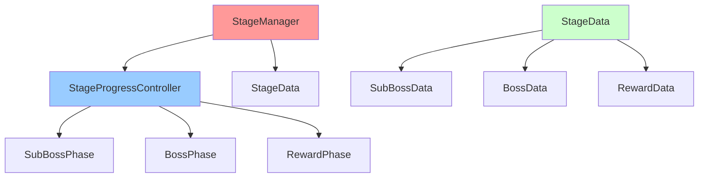
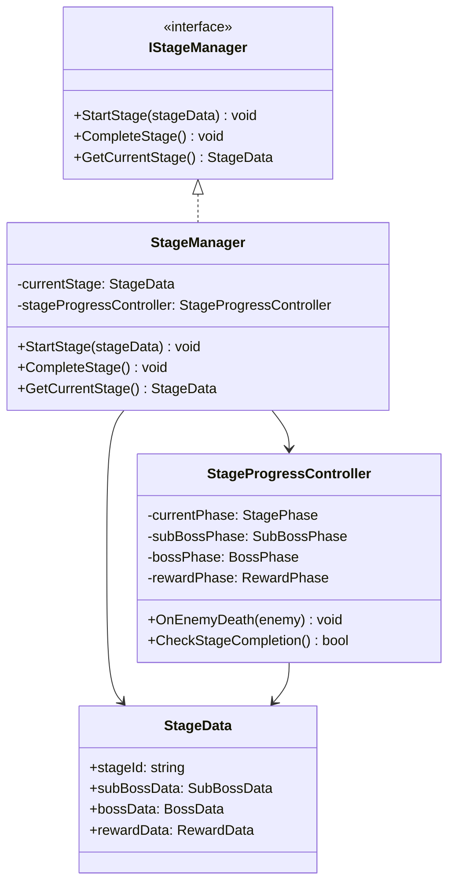
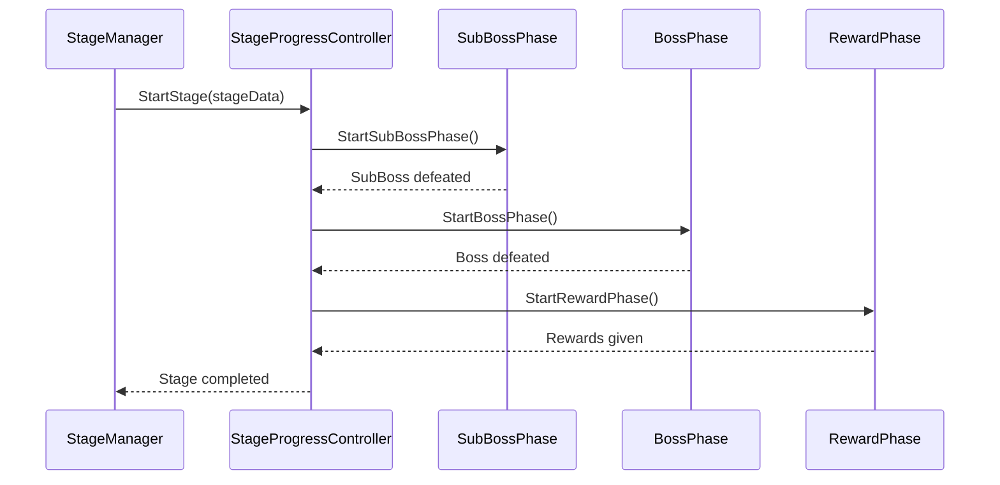

# StageSystem 개발 문서

## 📋 시스템 개요
StageSystem은 게임의 스테이지 진행을 관리하는 시스템입니다. 각 스테이지는 SubBoss와 Boss로 구성되며, 스테이지 완료 시 보상과 함께 다음 스테이지로 진행됩니다.

## 🏗️ 폴더 구조
```
StageSystem/
├── Manager/          # 스테이지 매니저 (2개 파일)
├── Interface/        # 스테이지 인터페이스 (3개 파일)
├── Factory/          # 스테이지 팩토리 (1개 파일)
└── Data/             # 스테이지 데이터 (2개 파일)
```

## 📁 주요 컴포넌트

### Manager 폴더 (2개 파일)
- **StageManager.cs**: 스테이지 전체 관리
- **StageProgressController.cs**: 스테이지 진행 관리

### Interface 폴더 (3개 파일)
- **IStageManager.cs**: 스테이지 매니저 인터페이스
- **IStageProgressController.cs**: 스테이지 진행 컨트롤러 인터페이스
- **IStageDataFactory.cs**: 스테이지 데이터 팩토리 인터페이스

### Factory 폴더 (1개 파일)
- **StageDataFactory.cs**: 스테이지 데이터 생성 팩토리

### Data 폴더 (2개 파일)
- **StageData.cs**: 스테이지 데이터 (ScriptableObject)
- **StageRewardData.cs**: 스테이지 보상 데이터

## 🎯 주요 기능

### 1. 스테이지 구성
- **SubBoss + Boss**: 각 스테이지는 SubBoss와 Boss로 구성
- **스테이지 진행**: SubBoss → Boss 순서로 진행
- **스테이지 완료**: Boss 처치 시 스테이지 완료

### 2. 스테이지 관리
- **현재 스테이지**: 현재 진행 중인 스테이지 추적
- **스테이지 상태**: 진행 중, 완료, 실패 등 상태 관리
- **스테이지 전환**: 스테이지 간 전환 처리

### 3. 보상 시스템
- **스테이지 완료 보상**: 스테이지 완료 시 보상 지급
- **보상 데이터**: ScriptableObject 기반 보상 설정
- **보상 적용**: 보상 지급 및 적용

### 4. 진행 관리
- **적 처치 추적**: 적 처치 시 진행 상황 업데이트
- **스테이지 완료 조건**: 스테이지 완료 조건 확인
- **다음 스테이지**: 다음 스테이지로 자동 진행

## 🔧 사용 방법

### 기본 사용법
```csharp
// 스테이지 시작
StageManager.Instance.StartStage(stageData);

// 스테이지 진행 확인
StageProgressController.Instance.CheckProgress();

// 스테이지 완료
StageManager.Instance.CompleteStage();

// 다음 스테이지로 진행
StageManager.Instance.ProceedToNextStage();
```

### 스테이지 데이터 생성
```csharp
// StageDataFactory를 통한 스테이지 데이터 생성
var stageData = StageDataFactory.Instance.CreateStageData(
    stageId: "Stage_001",
    subBossData: subBossData,
    bossData: bossData,
    rewardData: rewardData
);
```

### 스테이지 진행 이벤트
```csharp
// 적 처치 시 진행 업데이트
StageProgressController.Instance.OnEnemyDeath(enemy);

// 스테이지 완료 이벤트 구독
StageManager.Instance.OnStageCompleted += OnStageCompletedHandler;
```

## 🏗️ 아키텍처 패턴

### 1. 매니저 패턴 (Manager Pattern)
- **StageManager**: 스테이지 전체 관리
- **StageProgressController**: 스테이지 진행 관리

### 2. 팩토리 패턴 (Factory Pattern)
- **StageDataFactory**: 스테이지 데이터 생성 및 관리

### 3. 데이터 기반 설계 (Data-Driven Design)
- **ScriptableObject**: 스테이지 데이터를 에셋으로 관리
- **런타임 인스턴스**: 게임 중 동적 생성/수정

### 4. 이벤트 기반 아키텍처 (Event-Driven Architecture)
- **스테이지 이벤트**: 스테이지 진행 관련 이벤트 발생
- **보상 이벤트**: 보상 지급 이벤트 발생

## 🎮 게임 플로우

### 스테이지 진행 플로우
1. **스테이지 시작**: StageManager가 스테이지 시작
2. **SubBoss 전투**: SubBoss와 전투
3. **Boss 전투**: Boss와 전투
4. **스테이지 완료**: Boss 처치 시 스테이지 완료
5. **보상 지급**: 스테이지 완료 보상 지급
6. **다음 스테이지**: 다음 스테이지로 진행

### 스테이지 완료 조건
- **SubBoss 처치**: SubBoss 처치 완료
- **Boss 처치**: Boss 처치 완료
- **모든 적 처치**: 스테이지 내 모든 적 처치

## 🔧 기술적 구현 세부사항

### 성능 최적화
- **메모리 관리**: 스테이지 데이터 사전 로딩 및 캐싱
- **프레임 최적화**: 스테이지 전환 시 프레임 블로킹 방지
- **로딩 최적화**: 비동기 스테이지 로딩
- **리소스 관리**: 스테이지별 리소스 효율적 관리

### 스레드 안전성
- **동시성 제어**: 스테이지 상태 변경 시 락을 통한 동시성 제어
- **비동기 처리**: async/await 패턴을 통한 비동기 스테이지 처리
- **이벤트 처리**: 스레드 안전한 스테이지 이벤트 시스템
- **데이터 동기화**: 스테이지 상태 데이터 동기화

### 메모리 관리
- **생명주기 관리**: 스테이지 객체의 생성/소멸 관리
- **리소스 해제**: 스테이지 완료 시 리소스 정리
- **메모리 누수 방지**: 이벤트 구독 해제, 스테이지 참조 해제
- **프로파일링**: 스테이지 시스템 메모리 사용량 모니터링

## 🏗️ 시스템 아키텍처

### 의존성 다이어그램


### 클래스 다이어그램


### 시퀀스 다이어그램


## 📚 참고 자료

### 관련 문서
- [Unity 씬 관리](https://docs.unity3d.com/Manual/Scenes.html)
- [Unity 씬 전환](https://docs.unity3d.com/Manual/SceneManagement.html)
- [스테이지 설계](https://docs.unity3d.com/Manual/LevelDesign.html)

